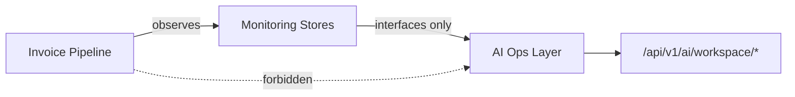

# BridgeEDI — AI Operational Data Contract

**Status:** Source of truth for Phase 9+  
**Audience:** Platform engineers, AI feature authors, security reviewers  
**Scope:** Workspace-scoped **operational intelligence**. Existing global adaptive query / dashboard AI / SAT invoice AI paths are **out of scope** and must remain untouched.

This document defines what the AI Operational Intelligence layer may read, what it must never touch, and the security boundaries that keep AI **outside** the invoice processing pipeline.

---

## 0. Boundary principle

| Layer | Owns | Must not do |
|-------|------|-------------|
| **Invoice Pipeline** | Authenticate → validate → map → submit → ERP | Call AI, wait on AI, or branch on AI recommendations |
| **Monitoring (Phase 8)** | Timelines, events, metrics, alerts | Expose production invoice row contents to AI |
| **AI Operational Intelligence (Phase 9)** | Summaries, analytics, recommendations from monitoring facts | Join pipeline mid-flight; query SAT/EDI invoice tables; bypass workspace isolation |

**Hard rule:** AI is a **consumer** of monitoring. It is never a pipeline stage collaborator that can alter outcomes.

---

## 1. Data AI may access

All access is through **monitoring / operational interfaces** (never raw ORM against invoice processing tables).

| Source | Origin | Allowed fields (illustrative) |
|--------|--------|-------------------------------|
| Pipeline Events | `pipeline_events` via TimelineStore | stage, status, message, duration_ms, attempt, error_code, occurred_at, correlation_id, customer_id, country_code |
| Pipeline Timelines | `pipeline_timelines` | status, current_stage, retry_count, latency_ms, failure_reason, failed_stage, government_reference, erp_reference, started_at, completed_at, adapter_name, document_type |
| Pipeline Metrics | `pipeline_metrics` | name, value, unit, tags, recorded_at, correlation_id |
| Alert History | `alert_history` | alert_type, severity, title, message, channel, delivered, created_at |
| Workspace Statistics | `MonitoringDashboard.summary` / `ai_facts` | counts, success_rate, average_processing_time, top_errors |
| ERP Status | Derived from alerts (`erp_unavailable`) + timeline `erp_reference` / `failed_stage=erp_update` | Aggregates only |
| Government Status | Derived from alerts (`government_unavailable`) + government_reference / submit failures | Aggregates only |
| Processing Performance | latency metrics + timeline latency_ms | averages, percentiles (workspace-scoped) |
| Retry Statistics | timeline.retry_count + metrics tags | totals, distributions |
| Success Rates | completed vs failed counts | percentages |

Canonical AI-readable cards already produced by monitoring:

- `workspace_monitoring_summary`
- `pipeline_transaction` (`TransactionTimeline.to_ai_fact()`)

---

## 2. Data AI must never access

| Forbidden | Reason |
|-----------|--------|
| `zodiac_invoice_success_edi` / `zodiac_invoice_failed_edi` (and related production invoice tables) | Processing system of record — not an AI source |
| CFDI / XML / PDF payloads, certificate private material | Sensitive document content |
| Raw SAP business documents beyond monitoring refs | ERP connector domain |
| Government request/response bodies beyond monitoring summary fields | Connector domain |
| Workspace secret refs (`vault:`, `env:`, auth secrets) | Credential material |
| Other workspaces’ facts without explicit cross-workspace authorization | Tenancy |
| Live pipeline `PipelineExecution` / in-memory stage outputs mid-run | Would couple AI into processing |
| Global schema NL→SQL over all tables (`/api/query/adaptive`) from this layer | Different product surface; remains separate |

---

## 3. Workspace isolation rules

1. Every AI Ops query declares an **active workspace** (`customer_id`).
2. The authenticated principal must pass `require_workspace_access` for that workspace.
3. Workspace setting `ai_scoped=true` is required (`assert_ai_workspace_scope`); if false → 403.
4. Result sets are filtered to `customer_id = active workspace` at the data-source boundary.
5. **Cross-workspace** analytics (e.g. “which customer has the highest failure rate?”):
   - Allowed only when the user is an **admin**, and
   - The caller sets an explicit authorization flag (`authorize_cross_workspace=true`), and
   - Each included workspace is independently authorized (admin + existing customer).
6. Non-admin users never receive another workspace’s correlation IDs, alerts, or metrics — unauthorized probes return **404** (same IDOR posture as Workspace API).

---

## 4. Security boundaries

| Control | Requirement |
|---------|-------------|
| Authentication | Required on all AI Ops endpoints (except health probe) |
| Authorization | Workspace membership or admin; plus `ai_scoped` |
| Injection | AI Ops does not execute caller-supplied SQL against operational DBs |
| Pipeline coupling | No imports of pipeline stage handlers for business decisions; no writes to pipeline tables |
| Monitoring coupling | Read via `OperationalDataSource` protocol only |
| Secrets | Never load vault/env secret values into AI prompts or responses |
| Feature flag | `ENABLE_AI_OPS_API` deployment kill switch |
| Existing AI | `/api/query/*`, dashboard AI, `sap_sql_agent` remain unchanged |

---

## 5. Data retention

| Store | Guidance |
|-------|----------|
| Monitoring tables (events, timelines, metrics, alerts) | Platform retention policy (ops); AI reads whatever monitoring retains |
| AI Ops query audit log | Retain request metadata (who/when/workspace/question class) ≥ 90 days recommended; **no** document payloads |
| Recommendations | Ephemeral (computed on read) unless a future phase adds persistence |
| Cross-workspace admin comparisons | Same retention as underlying monitoring rows |

AI Ops **does not** introduce a second copy of invoice documents.

---

## 6. Audit requirements

Every AI Ops request that returns analytics or recommendations must emit an audit record containing:

| Field | Example |
|-------|---------|
| `timestamp` | ISO-8601 UTC |
| `principal_id` | User id |
| `workspace_id` | Active customer_id (or list if cross-workspace) |
| `action` | `summary` / `analytics` / `recommendations` / `ask` |
| `question_class` | Normalized intent (e.g. `failures_today`) when applicable |
| `cross_workspace` | boolean |
| `correlation_ids_touched` | Optional count or sample — not full invoice bodies |

Audit sinks: structured application logs at minimum. Persistence to a dedicated table is optional and out of scope for Phase 9 unless added later.

---

## 7. Supported operational questions (Phase 9)

Answerable from monitoring facts (workspace-scoped unless admin + explicit cross-workspace):

- What failed today?
- Which customer has the highest failure rate? *(admin + cross-workspace)*
- Average processing time?
- Top validation failures?
- Government outages?
- ERP delays?
- Most active workspace? *(admin + cross-workspace)*
- Retry statistics?
- What changed in the last 24 hours?

Recommendations are **derived rules** over those facts (e.g. high retry rate → check government/ERP health), not autonomous pipeline actions.

---

## 8. Non-goals (Phase 9)

1. Rewriting `sap_sql_agent` or global adaptive query.
2. Making AI a pipeline stage or gating submission on AI output.
3. Querying production invoice tables for “intelligence.”
4. Sending real email/Slack from recommendations (alerts remain Phase 8 framework).
5. Phase 10 hardening suite ownership (covered separately).

---

## 9. Compliance checklist for new AI code

- [ ] Depends only on `app/core/ai` + monitoring interfaces (+ workspace security helpers)
- [ ] No new reads of invoice success/failed EDI tables
- [ ] Workspace scope enforced before any fact load
- [ ] Cross-workspace requires admin + explicit flag
- [ ] Pipeline packages not modified for AI business logic
- [ ] Existing `/api/query/*` and dashboard AI unchanged
