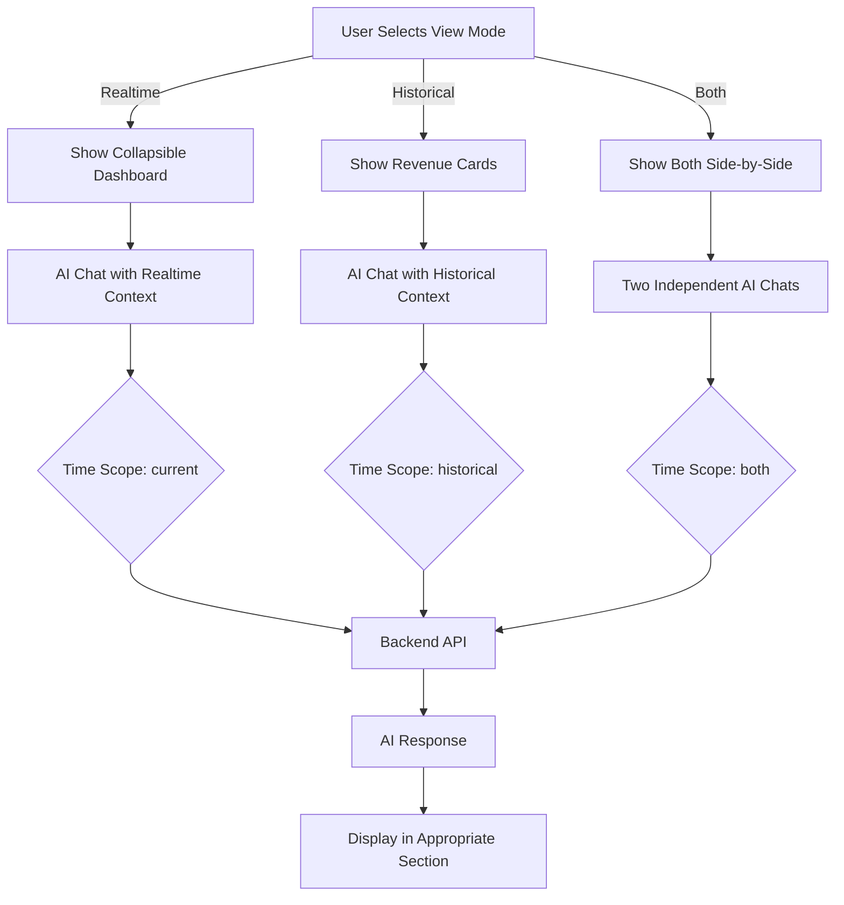

# AI Generative Page - New Structure Guide

**Date:** March 20, 2026  
**Status:** ✅ IMPLEMENTED

---

## Quick Overview

The AI Generative page now has **one unified page** with **three view modes** instead of two separate tabs:

| Mode | Shows | Use Case |
|------|-------|----------|
| **Realtime** | Current operational data (invoices, SAT docs) | Monitor active processes, check failures, see live status |
| **Historical** | Migrated data (1994-2010) | Analyze trends, forecast, compare periods |
| **Both** | Side-by-side comparison (desktop) or stacked (mobile) | Compare realtime vs historical patterns simultaneously |

---

## View Mode Selector (Radio Buttons)

Located in the header, replaces the old tab system:

```
┌─────────────────────────────────────────────────┐
│ [● Realtime] [○ Historical] [○ Both]           │
└─────────────────────────────────────────────────┘
```

**How it works:**
- Single click switches the entire page layout
- No modal popups or extra steps
- Time scope is automatically set based on selection
- Chat history is preserved when switching modes

---

## Mode 1: Realtime View

### Layout

```
┌──────────────────────────────────────────────────────────┐
│ 📊 Realtime Data - Current Operations                   │
├──────────────────────────────────────────────────────────┤
│ ▼ Dashboard Overview                   [⟳] [^]          │
│   ┌─────────┬─────────┬─────────┬──────────┐           │
│   │Docs: 240│Valid:210│Conv:180 │Success:75%│           │
│   └─────────┴─────────┴─────────┴──────────┘           │
│   ┌────────────────┬────────────────┐                   │
│   │ Inbound (SAT)  │ Outbound      │                    │
│   │ • Total: 45    │ • Funnel steps│                    │
│   │ • In SAP: 40   │ • Top customers│                   │
│   │ • Pending: 5   │               │                    │
│   └────────────────┴────────────────┘                   │
├──────────────────────────────────────────────────────────┤
│ 💬 AI Chat - Realtime Analysis                          │
│   [Failed invoices] [SAT status] [Top customers]...     │
│   USER: Show failed invoices                            │
│   AI: Here are the failed invoices...                   │
└──────────────────────────────────────────────────────────┘
```

### Features
- Collapsible dashboard (click header to expand/collapse)
- Live operational metrics
- Realtime context only (no historical data mixed in)
- Time scope automatically set to "current"
- Days selector: 7/30/90 days

---

## Mode 2: Historical View

### Layout

```
┌──────────────────────────────────────────────────────────┐
│ 📈 Historical Data - 1994-2010 Migrated Data            │
├──────────────────────────────────────────────────────────┤
│ Historical Analysis & Forecasting                        │
│   ┌──────────────┬──────────────┬──────────────┐        │
│   │Current Period│Previous Period│Revenue Change│        │
│   │$2.5M  ↑+15% │$2.1M          │+18.9%        │        │
│   └──────────────┴──────────────┴──────────────┘        │
├──────────────────────────────────────────────────────────┤
│ ┌──────────┬──────────┬────────────────────────┐        │
│ │By Customer│By Country│ 💬 AI Trend Analysis  │        │
│ │• Cust A   │• USA     │ [Forecast] [Compare]  │        │
│ │• Cust B   │• Mexico  │ [Anomalies] [Drivers] │        │
│ │• Cust C   │• Canada  │                       │        │
│ │           │          │ USER: Forecast revenue│        │
│ │           │          │ AI: Based on trends...│        │
│ └──────────┴──────────┴────────────────────────┘        │
└──────────────────────────────────────────────────────────┘
```

### Features
- Historical data only (1994-2010)
- Revenue trend analysis
- Quick action buttons for common queries
- Time scope automatically set to "historical"
- Days selector: 90/180/365 days

---

## Mode 3: Both View (Comparison)

### Desktop Layout (> 1024px)

```
┌────────────────────────────────────────────────────────────────┐
│ [● Both Mode]    [30d▼] Realtime  [90d▼] Historical   [⟳]    │
├────────────────────────────┬───────────────────────────────────┤
│ 📊 Realtime Analysis      │ 📈 Historical Analysis           │
│ Current Operations         │ 1994-2010 Migrated Data          │
├────────────────────────────┼───────────────────────────────────┤
│ ▼ Dashboard Overview       │ Revenue Trend Cards              │
│   [KPIs...]                │   [Current] [Previous] [Change]  │
│   [Inbound] [Outbound]     │                                  │
│                            │                                  │
│ 💬 AI Chat (Realtime)      │ 💬 AI Chat (Historical)         │
│   [Realtime prompts]       │   [Quick actions]               │
│   [Chat messages...]       │   [Chat messages...]            │
│                            │                                  │
└────────────────────────────┴───────────────────────────────────┘
```

### Mobile Layout (< 1024px)

```
┌─────────────────────────────────────┐
│ [● Both] [30d▼][90d▼] [⟳]          │
├─────────────────────────────────────┤
│ 📊 Realtime Analysis               │
│ Current Operations                  │
├─────────────────────────────────────┤
│ ▸ Dashboard Overview (collapsed)   │
│                                     │
│ 💬 AI Chat (Realtime)              │
│   [Chat messages...]               │
│                                     │
├═════════════════════════════════════┤ ← 4px separator
│ 📈 Historical Analysis             │
│ 1994-2010 Migrated Data            │
├─────────────────────────────────────┤
│ Revenue Trend Cards                │
│   [Current] [Previous] [Change]    │
│                                     │
│ 💬 AI Chat (Historical)            │
│   [Quick actions]                  │
│   [Chat messages...]               │
└─────────────────────────────────────┘
```

### Features
- **Desktop:** Side-by-side columns (equal width)
- **Mobile:** Vertically stacked with visual separator
- **Independent:** Each section operates separately
- **Dual day selectors:** Control each section's time range independently
- **Time scope:** Automatically set to "both"
- **Context keys:** Filtered per section (realtime gets realtime context, historical gets historical context)

---

## Key Behavioral Changes

### Before → After

| Behavior | Before | After |
|----------|--------|-------|
| **Mode Selection** | Tab pills (2 options) | Radio buttons (3 options) |
| **Data Mixing** | Could mix realtime & historical | Never mixes unless "Both" selected |
| **Time Scope** | Modal popup every query | Auto-determined, no modal |
| **Layout** | Same layout for both tabs | Different optimized layout per mode |
| **Dashboard KPIs** | Always visible | Collapsible (saves space) |
| **Comparison** | Not possible | Both mode enables side-by-side |
| **Mobile UX** | Same as desktop | Optimized stacked layout |
| **Context Keys** | All keys always | Filtered per mode/section |

---

## Data Flow Architecture



---

## Context Key Filtering Logic

```typescript
getContextKeys(mode, section) {
  if (mode === 'realtime' || (mode === 'both' && section === 'realtime')) {
    return ['stats', 'failed_summary', 'top_customers', 'inbound_summary', 'process_flow'];
  }
  if (mode === 'historical' || (mode === 'both' && section === 'historical')) {
    return ['business_summary'];
  }
  return ALL_KEYS; // Both mode, non-specific
}
```

**Benefits:**
- Realtime queries don't get polluted with historical business data
- Historical queries focus on revenue/trends without live operational noise
- Both mode allows each section to use its appropriate context

---

## Responsive Breakpoints

| Breakpoint | Width | Layout | Dashboard | Days Selector |
|------------|-------|--------|-----------|---------------|
| **Mobile** | < 640px | Single column | Collapsed by default | Single |
| **Tablet** | 640-1024px | Single column | Collapsible | Single or dual |
| **Desktop** | > 1024px | Both mode: 2 columns | Collapsible | Dual in Both mode |

---

## Visual Themes

| Data Type | Color | Border | Icon | Badge |
|-----------|-------|--------|------|-------|
| **Realtime** | Blue (#3b82f6) | 4px left border | Activity | blue-100 |
| **Historical** | Indigo/Purple (#6366f1) | 4px left border | BarChart3 | indigo-100 |
| **Both** | Mixed | Separator on mobile | GitBranch | N/A |

---

## User Workflow Examples

### Scenario 1: Check Failed Invoices (Realtime)
1. Select "Realtime" mode (default)
2. See dashboard overview with metrics
3. Click "Failed invoices" prompt
4. AI analyzes current failed invoices with realtime context
5. Response shows recent failures with actionable insights

### Scenario 2: Forecast Revenue (Historical)
1. Select "Historical" mode
2. See revenue trend cards (current, previous, change %)
3. Click "Forecast" quick action
4. AI analyzes historical patterns from 1994-2010
5. Response shows forecasted revenue for next period

### Scenario 3: Compare Patterns (Both)
1. Select "Both" mode
2. See side-by-side layout (desktop) or stacked (mobile)
3. Ask realtime question on left: "Show current failed invoices"
4. Ask historical question on right: "What were typical failure rates in 2005?"
5. Compare both responses to identify if current failures are normal or anomaly

---

## API Integration

### Time Scope Mapping

```javascript
const scopeMap = {
  realtime: 'current',     // → API receives time_scope: 'current'
  historical: 'historical', // → API receives time_scope: 'historical'
  both: 'both'             // → API receives time_scope: 'both'
};
```

### Context Keys Sent

**Realtime Mode:**
```json
{
  "context_keys": ["stats", "failed_summary", "top_customers", "inbound_summary", "process_flow"],
  "time_scope": "current",
  "days": 30
}
```

**Historical Mode:**
```json
{
  "context_keys": ["business_summary"],
  "time_scope": "historical",
  "days": 90
}
```

**Both Mode (Realtime Section):**
```json
{
  "context_keys": ["stats", "failed_summary", "top_customers", "inbound_summary", "process_flow"],
  "time_scope": "both",
  "days": 30
}
```

**Both Mode (Historical Section):**
```json
{
  "context_keys": ["business_summary"],
  "time_scope": "both",
  "days": 90
}
```

---

## Conclusion

The AI Generative page now provides:
1. **Clear separation** between data types
2. **Flexible viewing options** (single or comparison)
3. **Improved UX** with immediate query execution
4. **Better organization** with collapsible sections
5. **Responsive design** optimized for all devices
6. **Contextually appropriate** AI responses per section

**Status:** Ready to use! Start the frontend and navigate to `/dashboard/ai` to see the new structure.

---

**How to Test:**

```bash
# Start backend (if not running)
cd zodiac-api
python -m uvicorn app.server:app --reload --port 8000

# Start frontend
cd zodiac-front
npm run dev

# Navigate to
http://localhost:3000/dashboard/ai
```

**What to verify:**
1. Three radio buttons appear in header
2. Clicking each mode changes the page layout
3. Realtime shows collapsible dashboard
4. Historical shows revenue cards
5. Both shows side-by-side on desktop
6. Both shows stacked on mobile
7. AI queries work in all three modes
8. No time scope modal appears
9. Context is appropriate per mode

---

**Implementation Complete!** 🎉
