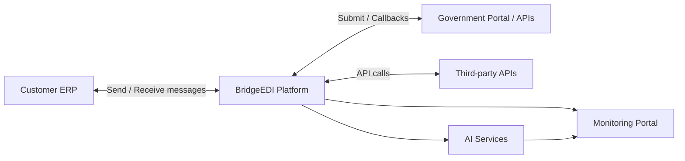
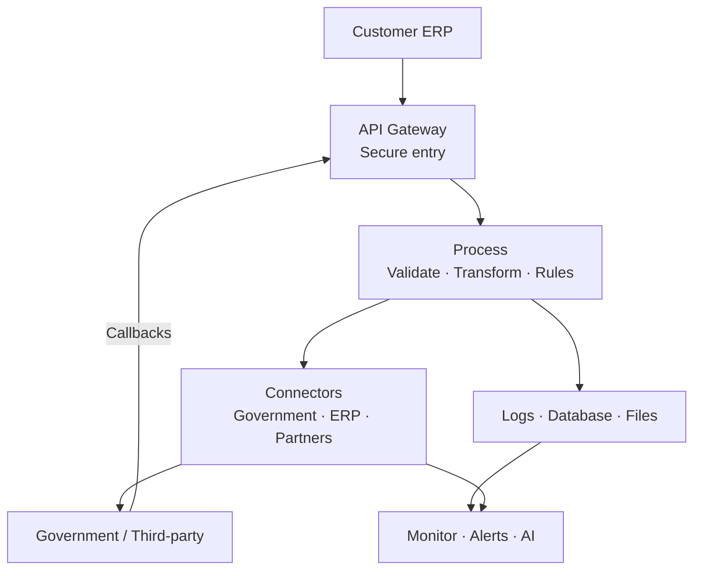

# BridgeEDI — Integration Architecture (Client Draft)

**Platform:** BridgeEDI  
**Purpose:** Suggested architecture for ERP ↔ Government / Third-party integration  

---

## 1. One-line pitch

**BridgeEDI sits between the customer ERP and external systems** (government portals, partner APIs).  
It sends and receives messages, calls APIs, transforms data, monitors everything, and uses AI to explain failures.

---

## 2. Simple architecture diagram



### What is inside BridgeEDI (simple)



---

## 3. How a transaction works (quick)

```text
Customer ERP
    ↓
BridgeEDI (receive + validate + transform)
    ↓
Government / Partner API
    ↓
BridgeEDI (response + update ERP)
    ↓
Monitoring + Audit + Alerts
```

**If it fails:** retry → log → notify user.

---

## 4. What BridgeEDI does

| Capability | Meaning |
|------------|---------|
| Send / receive messages | Talk to ERP and partners |
| Call APIs | Government + third-party |
| Receive webhooks | Async status callbacks |
| Transform & validate | ERP format ↔ external format |
| Monitor | See success, failure, latency |
| Audit | Full trail of every request |
| AI assist | Explain failures, search in plain language |

---

## 5. AI role (simple)

AI helps operations — it does **not** replace the integration.

- “Why did this fail?”
- “Show failed submissions today”
- Alerts when error rates go up
- Short ops reports

---

## 6. Why this approach

- One platform instead of many point-to-point links  
- ERP does not need to know government API details  
- Secure, logged, retryable  
- Easy to add more customers / agencies later  

---

*BridgeEDI — Integration. Visibility. Trust.*  
*Draft for discussion — not a final build plan.*
