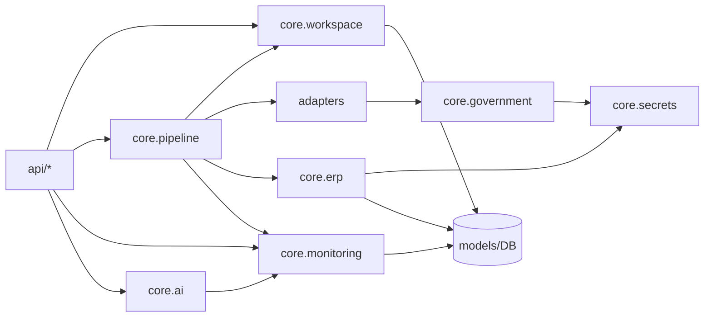

# BridgeEDI Enterprise v1.0 — Engineering Review

**Role:** Senior architect / production release review  
**Date:** 2026-08-02  
**Baseline:** Release Candidate v1.0 (`RELEASE_NOTES_v1.0.md`, `FINAL_GO_LIVE_VALIDATION.md`)  
**Constraint:** No features, no redesign, SAT/V1/V2 untouched  
**Test evidence:** `python -m unittest discover -s app/tests -p "test_*.py"` → **250 OK**  

---

## 1. Executive Summary

BridgeEDI Enterprise v1.0 is an **additive** platform layer over a stable Mexico SAT production core. The enterprise packages (`workspace`, `pipeline`, `adapters`, `erp`, `government`, `secrets`, `monitoring`, `ai`) are **cohesive, directionally correct, and covered by automated tests**. Dual-path coexistence (legacy vs pipeline) is intentional, not accidental bypass debt.

This review found **no high-severity code defects requiring immediate behavior changes**. One layering smell (`core.workspace.guards` → `api.auth`) and known scale/ops gaps are **deferred**. No production code was modified in this review pass.

### Overall rating

# Good

| Dimension | Rating |
|-----------|--------|
| Code quality | Good |
| Architecture consistency | Good |
| Performance (pilot scale) | Good / Acceptable at HA scale |
| Security | Good (Conditional on ops hardening) |
| Maintainability | Good |
| Production confidence | **82 / 100** |

**Future work should be customer-specific** (country adapters, ERP endpoints, deployments), not platform redesign.

---

## 2. Internal Dependency Graph

### 2.1 Intended enterprise flow

### 2.2 Verified dependency direction (source)

| From | To | Allowed? | Evidence |
|------|-----|----------|----------|
| `api` → `core.*`, `adapters` | Yes | Router mounts + imports |
| `pipeline` → `adapters`, `erp`, `monitoring`, `workspace` | Yes | `hooks.py`, orchestrator |
| `adapters` → `core.government` | Yes | `mx_cfdi`, `sample_gst` |
| `adapters` → `core.pipeline` | **No** (verified absent) | Grep clean |
| `ai` → `monitoring` only | Yes | `datasource.py` |
| `ai` → `pipeline` / invoice models | **No** (verified absent) | Grep + tests |
| `erp` / `government` → `secrets` | Yes | Connectors |
| `workspace.guards` → `api.auth` | **Smell** | `guards.py` L11 — FastAPI DI convenience |
| `mx_cfdi.submit` → `sap_api_client` | **Intentional MX** | Adapter docstring + PR1 skip policy |

### 2.3 Ownership

| Concern | Owner package |
|---------|----------------|
| Tenant access | `core.workspace` |
| Stage orchestration | `core.pipeline` |
| Country rules | `adapters.*` |
| Outbound ERP HTTP | `core.erp` |
| Outbound gov HTTP / stamp | `core.government` |
| Credential resolution | `core.secrets` |
| Timelines / alerts | `core.monitoring` |
| Ops Q&A | `core.ai` (read-only on monitoring) |
| Legacy Mexico SAT | `api/sat*`, `services/*` — **frozen** |

---

## 3. Code Quality Assessment — **Good**

| Check | Finding |
|-------|---------|
| Duplicated enterprise helpers | Low — shared secrets/resolver, monitoring sinks |
| Duplicated models/schemas | Workspace/ERP/adapter models single-sourced under `models/workspace.py` |
| Naming | Consistent `customer_id` / workspace_id equality; stage enums clear |
| Exception handling | Structured `SecretResolutionError`; ERP/Gov typed errors; pipeline `NotImplementedError` → SKIP |
| Logging | Alert/secret paths avoid logging resolved secrets (spot-check) |
| Validation | Pydantic secret-ref prefixes on workspace upserts |
| Dead / unreachable | Intentional stubs (email/Slack alerts, unconfigured secret schemes) labeled |
| Circular imports | Residual `ZodiacUser` partial-init **warning** on some imports — non-fatal; deferred |
| Unnecessary abstractions | Enterprise DI (`PlatformServices`) justified; no new frameworks recommended |

---

## 4. Architecture Assessment — **Good**

### Consistency with established flow

Opt-in path: **Workspace → Pipeline → Adapter → (Government) → Confirmation → ERP → Monitoring → AI Ops** is implemented via orchestrator stages + sinks.

### Unintentional bypass?

| Path | Assessment |
|------|------------|
| Legacy SAT/V1/V2 outside pipeline | **Documented dual-world** — not a defect |
| MX adapter calling SAP in submit | **Documented Pattern A**; mitigated by `erp_update_mode` |
| AI Ops reading invoices | **Blocked** by design + tests |
| Dashboard Adaptive Query | **Separate product surface** — not AI Ops; access must stay admin-controlled |

### Import / layering debt

1. **`core.workspace.guards` depends on `api.auth.get_current_user`**  
   - Impact: core → api edge for FastAPI Depends  
   - Fix (deferred): move auth dependency protocol to `core` or keep Depends only in `api`  
   - Risk of fix: medium churn — **do not change in RC freeze**

---

## 5. Performance Assessment — **Good (pilot)**

| Area | Observation | Action |
|------|-------------|--------|
| Registry lookup | In-memory dict; O(1) | None |
| Adapter creation | Fresh instance per resolve (by design) | Acceptable |
| Workspace resolve | Few keyed queries | Fine for pilot |
| ERP/Gov HTTP | 30s timeout; gov retries ≤3 | Bound by network |
| Monitoring writes | Soft-fail; per-event DB | Watch under load |
| AI Ops | Aggregates over monitoring | Not on invoice critical path |
| Startup | Adapter bootstrap + optional create_all | Low |
| N+1 in pipeline DI | Not observed | — |
| HA / queue | No durable workers | **Scale debt** — not pilot blocker |

**No performance code changes** — no proven bottleneck at pilot volume.

---

## 6. Security Assessment — **Good**

| Control | Status | Evidence |
|---------|--------|----------|
| Authentication | Pass | JWT `get_current_user` on enterprise APIs |
| Authorization / tenancy | Pass | `require_workspace_access`, isolation tests |
| Secrets in config | Pass | Ref prefixes; plaintext rejected |
| Secrets at runtime | Pass | Resolver; unresolved vault not sent as token |
| Secrets in logs | Pass (spot-check) | No password/token log patterns in monitoring/secrets |
| CORS | Pass | Allowlist; `CORS_ALLOW_ALL` gated |
| AI Ops boundary | Pass | Import forbidden tests |
| Input validation | Pass | Pydantic on workspace/pipeline bodies |
| SQL injection (enterprise path) | Pass | ORM keyed filters |
| App rate limiting | **Gap** | Edge WAF required — ops |
| Default SECRET_KEY if unset | **Ops risk** | Must set in production env |

**No security code changes in this review** — issues are configuration/ops, not missing enterprise controls.

---

## 7. Maintainability Assessment — **Good**

| Factor | Notes |
|--------|-------|
| Package cohesion | High in `core/*` and `adapters/*` |
| Coupling | Low except guards→auth and MX→sap_api_client (justified) |
| Class/function size | Orchestrator/stages large but staged; MX adapter large (façade over legacy) — **refactor only if changing MX** |
| Complexity hotspots | `adaptive_query.py`, MX adapter, legacy process services — **out of enterprise freeze scope** |
| Docs | Canonical release/ops set good; historical MD sprawl remains |

**Recommended refactoring (post-pilot, not now):**

1. Extract auth dependency from `core.workspace.guards` into `api` layer  
2. Archive historical `TEST_*.md` into `docs/archive/`  
3. When volume grows: durable pipeline outbox/workers (Task 10.4 class)  

Avoid cosmetic renames of stable SAT/V1/V2.

---

## 8. Production Safety — **Good**

| Topic | Assessment |
|-------|------------|
| Retries | Gov + pipeline transport policies present |
| Idempotency | Gov header + ERP outbox keys |
| Soft degradation | Monitoring persist failures do not kill pipeline |
| Startup | Non-fatal startup wrapper; adapters registered; config posture logged |
| Config validation | `DEPLOY_ENV` STAGING/PRODUCTION checks |
| Rollback | Feature flags (`ENABLE_PIPELINE_API`, workspace flags) |
| Transactions | Outbox/monitoring commits localized; soft rollback on alert persist fail |
| Graceful shutdown | Platform-default (uvicorn) — acceptable for RC |

---

## 9. Testing Review — **Good**

| Metric | Value |
|--------|-------|
| `app/tests` modules | 17 |
| Tests executed | **250 OK** |
| Enterprise areas covered | Workspace, pipeline, adapters, ERP skip, gov, secrets, monitoring, AI Ops, pilot E2E, readiness |

| Gap | Severity |
|-----|----------|
| Few frontend unit tests | Low for RC |
| Live ERP/Gov integration | Staging manual |
| Some intentional exception noise in logs during tests | Cosmetic |

**No test removals** — coverage is meaningful; duplicates across onboarding/pilot are complementary, not brittle clones.

---

## 10. Technical Debt (engineering view)

Aligned with [`TECHNICAL_DEBT.md`](TECHNICAL_DEBT.md):

| ID | Item | Priority for platform freeze |
|----|------|------------------------------|
| TD-01 | Dual processing worlds | Accept / document |
| TD-02 | MX ERP-in-submit | Mitigated (`erp_update_mode`) |
| TD-03 | No pipeline DLQ/workers | Post-pilot |
| TD-04 | In-memory status_tracker | Before multi-instance SAT scale |
| TD-05 | No app RL/CB | Edge now |
| — | `guards` → `api.auth` coupling | Cleanup later |
| — | Doc sprawl | Cleanup later |

---

## 11. Issues Fixed

| Issue | Action |
|-------|--------|
| None in this review pass | **No code changes** — no clear low-risk defect justified a behavior-touching edit |

*(Prior RC work already addressed: startup adapters, ready probe, `API_DEBUG` default, webhook alerts, `.env.example`, release docs.)*

---

## 12. Issues Deferred

| Issue | Why deferred |
|-------|--------------|
| Move `get_current_user` out of `core.workspace.guards` | Layering cleanup; risk of DI regressions |
| Circular import warning on model init | Non-fatal; needs careful import graph work |
| Email/Slack alert channels | Ops product decision |
| Durable queue / CB / app rate limit | Scale features — out of RC freeze |
| Mass markdown archive | Housekeeping PR, not engineering freeze |
| MX submit pure Gov-first redesign | **Forbidden** — would redesign architecture |

---

## 13. Recommended Refactoring (future only)

1. **Auth boundary cleanup** — FastAPI deps live only under `api/`  
2. **Monitoring write batching** — if DB write volume becomes a measured bottleneck  
3. **Pipeline workers + DLQ** — when second customer or volume warrants  
4. **Doc archive** — move superseded TEST/FIX notes  

Do **not** refactor SAT/V1/V2 or force legacy onto pipeline.

---

## 14. Production Confidence Score — **82 / 100**

| Component | Score | Weight |
|-----------|-------|--------|
| Enterprise architecture correctness | 90 | 25% |
| Test evidence | 88 | 20% |
| Security controls in code | 85 | 20% |
| Ops/deploy readiness | 75 | 15% |
| Scale/HA readiness | 60 | 10% |
| Codebase hygiene / docs | 70 | 10% |

**Weighted ≈ 82** → confidence for **controlled single-customer pilot**.  
Full multi-tenant HA confidence would require clearing deferred scale items.

---

## 15. Final Verdict

# Good

BridgeEDI Enterprise **v1.0 is an appropriate engineering baseline**. The platform is suitable for customer-specific implementations (new adapters, ERP integrations, deployments) without further platform redesign.

**Conditions for production traffic remain operational** (migrations, secrets, edge RL, sandbox ERP/Gov) as stated in `FINAL_GO_LIVE_VALIDATION.md` — not engineering redesign conditions.

---

*Engineering baseline freeze. Future PRs: customer adapters and integrations unless a production defect is proven.*
