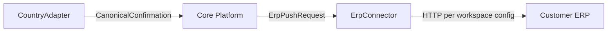
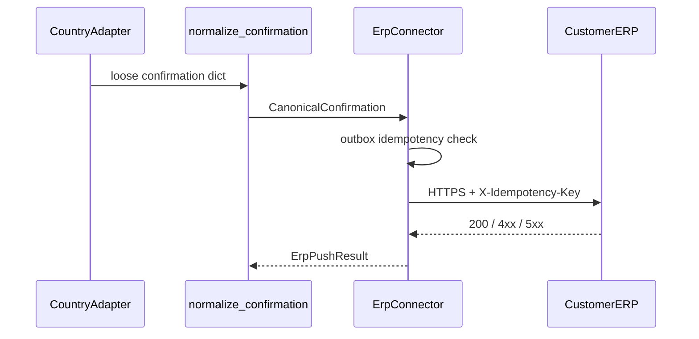

# BridgeEDI — ERP Integration Contract

**Status:** Source of truth for Phase 6+  
**Audience:** Platform engineers, country-adapter authors, ERP integration owners  
**Scope:** Opt-in Invoice Processing Pipeline (`app/core/pipeline`). Existing `/api/v1/sat/*` routes are **out of scope** and keep their current confirmation persistence.

This document is the boundary between the **Country Adapter Framework** and **ERP integrations**.

---

## Boundary principle

```text
Country Adapter  →  CanonicalConfirmation  →  Core Platform  →  ErpPushRequest  →  ERP Connector  →  Customer ERP
```

| Side | Must not know |
|------|----------------|
| **ERP Connector** | Whether the source country was Mexico, India, Germany, UAE, or any future country. No `if country == …` control flow. |
| **Country Adapter** | Whether the ERP is SAP, Oracle, Dynamics, or another system. No vendor-specific HTTP clients inside adapters. |

`country_code` may appear on DTOs only as **opaque audit metadata**. It must never be used as a switch inside the ERP Connector.



---

## 1. What every Country Adapter returns

Adapters already return stage outcomes through `StageResult` and write payloads into `AdapterContext.outputs`. For the ERP round-trip, the **only required handoff** after government/target submit is:

```text
receive_confirmation(raw_response) → CanonicalConfirmation  (or a dict that normalizes to it)
```

| Stage | ERP relevance |
|-------|----------------|
| `parse` … `format` | Not consumed by the ERP Connector |
| `submit` | Produces an opaque raw response |
| `receive_confirmation` | **Required** — produces CanonicalConfirmation |
| `update_erp` | Default defers to Core; adapters must not embed ERP-vendor logic |

Country-private fields that an ERP must not interpret go in `extensions` (see §2). The connector **ignores** `extensions` and `raw_response` when building the outbound ERP payload body, except that `raw_response` may be forwarded as an opaque blob if the workspace config opts in.

---

## 2. Standard confirmation model

### `CanonicalConfirmation`

| Field | Type | Required | Description |
|-------|------|----------|-------------|
| `correlation_id` | string (UUID) | yes | Pipeline run id |
| `customer_id` | string | yes | Workspace id (`workspace_id == customer_id`) |
| `document_id` | string \| null | no | Platform-internal document id when known |
| `external_document_number` | string \| null | no | Government / partner acknowledgement number |
| `status` | `DocumentStatus` | yes | See §4 |
| `accepted` | bool | yes | Whether the target endpoint accepted the document |
| `received_at` | string (ISO-8601) | yes | When confirmation was normalized |
| `idempotency_key` | string | yes | Stable key for ERP push (see §7) |
| `country_code` | string \| null | no | Opaque audit metadata only |
| `raw_response` | any | no | Opaque original response; not interpreted by connector logic |
| `extensions` | object | no | Country-private keys; **ignored** by the ERP Connector |

### Field mapping from today’s adapters

| Legacy / adapter field | Canonical field |
|------------------------|-----------------|
| `document_number` (Mexico façade) | `external_document_number` |
| `ack_number` (sample GST) | `external_document_number` |
| `accepted` / `success` | `accepted` |
| `irn`, `mode`, nested SAP keys | `extensions` or left inside `raw_response` |

Core provides `normalize_confirmation(...)` so loosely shaped dicts still become a `CanonicalConfirmation` without country-specific branches in the connector.

---

## 3. Standard error model

### `ErpError`

| Field | Type | Description |
|-------|------|-------------|
| `error_code` | string | Stable machine code (below) |
| `message` | string | Human-readable summary |
| `retryable` | bool | Whether the platform may retry the push |
| `http_status` | int \| null | Upstream HTTP status when applicable |
| `details` | object \| null | Non-sensitive diagnostic context |

### Stable error codes

| Code | Retryable | Meaning |
|------|-----------|---------|
| `ERP_NOT_CONFIGURED` | no | Workspace has no active ERP connection |
| `ERP_AUTH_FAILED` | no | Auth rejected (401/403) |
| `ERP_REJECTED` | no | ERP business rejection (4xx except auth) |
| `ERP_TIMEOUT` | **yes** | Timeout talking to ERP |
| `ERP_UPDATE_FAILED` | **yes** | Transport / 5xx / unexpected failure |
| `ERP_DUPLICATE` | no | Idempotent replay of an already-successful push (treated as success at the connector) |
| `ERP_INVALID_PAYLOAD` | no | Confirmation could not be normalized / missing required fields |

Pipeline retry alignment (see [`app/core/pipeline/retry.py`](zodiac-api/app/core/pipeline/retry.py)): retryable set includes `ERP_UPDATE_FAILED`, `TIMEOUT`, `TRANSIENT`, and `ERP_TIMEOUT`.

---

## 4. Standard document status model

### `DocumentStatus`

Platform-owned lifecycle for a pipeline document:

```text
RECEIVED → VALIDATED → SUBMITTED → ACCEPTED | REJECTED
                              ↓
                         ERP_PENDING → ERP_ACKNOWLEDGED | ERP_FAILED
```

| Status | Set by | Meaning |
|--------|--------|---------|
| `RECEIVED` | Platform | Document accepted into the pipeline |
| `VALIDATED` | Adapter validate success | Country validation passed |
| `SUBMITTED` | Adapter submit attempted | Sent to government/target |
| `ACCEPTED` | Adapter confirmation | Target accepted |
| `REJECTED` | Adapter confirmation | Target rejected |
| `ERP_PENDING` | ERP Connector | Push started |
| `ERP_ACKNOWLEDGED` | ERP Connector | ERP accepted the confirmation |
| `ERP_FAILED` | ERP Connector | Push failed after retries or non-retryable error |

Adapters report accept/reject only. The ERP Connector advances `ERP_*` statuses. Country-specific statuses (e.g. SAT `SAP_SENT`) remain inside legacy SAT tables and are not part of this contract.

---

## 5. ERP Connector interface

```text
ErpConnector.push_confirmation(request: ErpPushRequest) -> ErpPushResult
ErpConnector.health_check(connection) -> bool   # optional probe
```

### `ErpPushRequest`

| Field | Description |
|-------|-------------|
| `customer_id` | Workspace |
| `connection_key` | Which `workspace_erp_connections` row (`primary` by default) |
| `confirmation` | `CanonicalConfirmation` |
| `callback_url` / `base_url` | From workspace ERP config |
| `auth_type` | `none` \| `basic` \| `bearer` \| … (workspace) |
| `client_id_ref` / `client_secret_ref` | Secret **references** only |
| `extra_config` | Opaque workspace ERP extras |

### `ErpPushResult`

| Field | Description |
|-------|-------------|
| `success` | bool |
| `status` | `DocumentStatus` (`ERP_ACKNOWLEDGED` or `ERP_FAILED`) |
| `error` | `ErpError` \| null |
| `http_status` | int \| null |
| `response_body` | opaque \| null |
| `idempotency_key` | echo of the key used |
| `duplicate` | true if short-circuited from a prior SUCCESS outbox row |

There are **no** country-specific methods on `ErpConnector`. Vendor differences are expressed only through per-workspace HTTP configuration.

The pipeline collaborator `ErpUpdater.update(execution, confirmation)` is a thin adapter that builds `ErpPushRequest` from the workspace + normalized confirmation and calls `push_confirmation`.

---

## 6. How retries work

Retries are a **platform** responsibility, not a country or ERP-vendor concern.

1. The orchestrator runs the `erp_update` stage with a transport retry policy (e.g. max 3 attempts, exponential backoff).
2. A failed push raises / returns an error whose `error_code` is classified:
   - **Retry:** `ERP_UPDATE_FAILED`, `ERP_TIMEOUT`, `TIMEOUT`, `TRANSIENT`
   - **Do not retry:** `ERP_REJECTED`, `ERP_AUTH_FAILED`, `ERP_INVALID_PAYLOAD`, `ERP_DUPLICATE`, `ERP_NOT_CONFIGURED`
3. Each attempt increments the outbox `attempt_count`.
4. Exhausted retries leave the document in `ERP_FAILED` and surface `ERP_UPDATE_FAILED` (or the last specific code) on the pipeline result.

Country adapters must not implement their own ERP retry loops.

---

## 7. How idempotency is handled

### Key derivation

```text
idempotency_key = confirmation.idempotency_key
               OR sha256(customer_id + ":" + correlation_id + ":erp_push")
```

### Behaviour

1. Before HTTP, the connector looks up `erp_push_outbox` by `idempotency_key`.
2. If a row exists with `status=SUCCESS`, return success immediately with `duplicate=true` (`ERP_DUPLICATE` may be recorded in details; the stage still **succeeds**).
3. Otherwise upsert a `PENDING` row, POST to the ERP with header:
   ```http
   X-Idempotency-Key: <idempotency_key>
   ```
4. On success → `SUCCESS` / `ERP_ACKNOWLEDGED`. On failure → `FAILED` / `ERP_FAILED` and allow platform retry when retryable.

This prevents double-posting when the orchestrator retries or when the same correlation id is replayed.

---

## 8. How acknowledgements are normalized

1. **Adapter layer** — `receive_confirmation(raw)` maps the government/partner response into a confirmation dict (or structured object) using country rules.
2. **Core normalizer** — `normalize_confirmation(value, *, customer_id, correlation_id, country_code?)` produces a `CanonicalConfirmation`:
   - Reads aliases: `external_document_number`, `document_number`, `ack_number`, `sap_document_number`
   - Sets `accepted` from `accepted` or `success`
   - Sets `status` to `ACCEPTED` or `REJECTED`
   - Fills `idempotency_key` if missing
   - Puts unrecognized keys into `extensions` when converting from a flat dict
3. **ERP Connector** — consumes only `CanonicalConfirmation` fields listed in §2; never branches on `country_code`.



---

## Implementation mapping (Phase 6)

| Contract concept | Code location |
|------------------|---------------|
| DTOs | `app/core/erp/models.py` |
| Normalization | `app/core/erp/normalize.py` |
| Connector | `app/core/erp/connector.py` |
| Outbox | `app/core/erp/outbox.py` + `migrations/phase6_erp_outbox.sql` |
| Pipeline hook | `app/core/erp/hooks.py` → `PlatformServices.erp_updater` |

---

## 9. ERP ownership clarification (pilot)

This section records **who owns the customer ERP write** so operators do not configure a double send. It does not change `/api/v1/sat/*`.

### Two egress patterns

| Pattern | Who writes to customer ERP | Typical country |
|---------|----------------------------|-----------------|
| **A — Submit-time ERP** | Country adapter `submit()` (e.g. Mexico façade → `sap_api_client`) | Mexico CFDI (already stamped; no live government HTTP) |
| **B — Confirmation-time ERP** | Platform `erp_update` stage → `WorkspaceErpUpdater` → `HttpErpConnector` | Sample GST / future countries that submit to government first |

### Mexico (pattern A)

1. Government path: documents arrive **already stamped**. `AlreadyStampedGovernmentConnector` is the government port; it is **not** a live SAT/PAC client.  
2. Adapter `submit()` sends the formatted payload to **SAP** (legacy façade). That **is** the primary ERP write.  
3. Pipeline `erp_update` must **not** perform a second business write when submit already fulfilled ERP, unless the workspace explicitly opts in (`erp_update_mode=always`).

### Canonical / government-first countries (pattern B)

1. Adapter `submit()` uses **Government Connector** only.  
2. `receive_confirmation` builds `CanonicalConfirmation`.  
3. Platform `erp_update` owns the ERP push via the HTTP connector + outbox.

### Workspace policy (`erp_update_mode`)

Stored in `workspace_settings.flags` (JSON), optional:

| Value | Behaviour |
|-------|-----------|
| *(absent)* / `auto` | Skip `erp_update` HTTP when confirmation marks `erp_fulfilled_in_submit=true` |
| `skip_if_submit_did_erp` | Same as `auto` (explicit) |
| `always` | Always run `HttpErpConnector` when an ERP connection exists (secondary webhook / dual system) |
| `never` | Always skip platform ERP push (stage skipped) |

Adapters signal submit-time fulfilment by setting on the confirmation dict (and/or `AdapterContext.metadata`):

```text
erp_fulfilled_in_submit: true
```

The ERP Connector remains country-agnostic: it only sees the skip decision in `WorkspaceErpUpdater`, never `if country == "MX"`.

### Legacy SAT

`/api/v1/sat/*` and invoice V1/V2 continue to use their existing SAP paths and are **out of scope** for this policy.

---

## Non-goals

- Changing `/api/v1/sat/*` confirmation storage (`sap_document_number`, etc.)
- Vendor-specific connector subclasses for Oracle/Dynamics in Phase 6 (generic HTTP only)
- Government API hardening (Phase 7)
- Replacing `customer_delivery_service.py`
- Forcing Mexico through live government HTTP to satisfy a generic diagram
