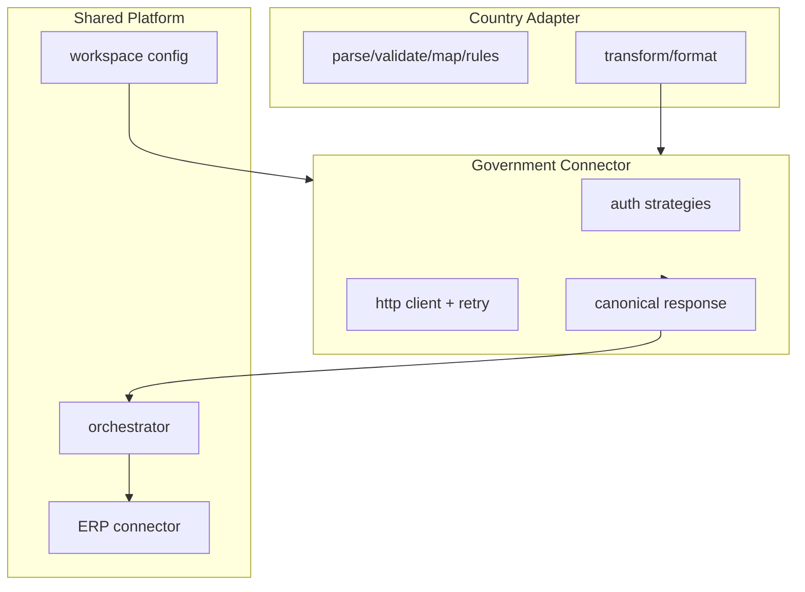

# BridgeEDI — Government Connector Contract

**Status:** Source of truth for Phase 7+  
**Audience:** Platform engineers, country-adapter authors  
**Scope:** Opt-in pipeline and future country adapters. Existing `/api/v1/sat/*` routes are **out of scope**.

This document is the boundary between **Country Adapter business logic** and **government / authority communication**.

---

## 0. Analysis of the current codebase (Phase 7 gate)

| Location | What it does today | Belongs to |
|----------|-------------------|------------|
| `app/utils/cfdi_parser.py` | Parses already-stamped CFDI XML; SAT namespaces are XML only | **Country Adapter** (Mexico) |
| `app/services/sat_processor.py` | Validate / persist CFDI; no HTTP to SAT | **Country Adapter** + platform storage |
| `app/services/sap_api_client.py` | HTTP to customer SAP | **ERP Connector** (Phase 6), not government |
| `app/adapters/mx_cfdi/adapter.py` `submit()` | Delegates to `sap_client` | **ERP path** via adapter façade (legacy); not a government call |
| `app/adapters/sample_gst/connector.py` | Mock ack + optional `httpx` POST | **Should move to Government Connector** |
| Workspace `endpoint_url_ref` / `auth_secret_ref` | Per-country endpoint config | **Shared platform** (Workspace) |

### Finding: Mexico has no live government submission

Mexico CFDI documents arrive **already stamped** (UUID / TimbreFiscalDigital in the uploaded XML). There is **no** PAC timbrado, cancelación, or consulta HTTP integration in the repository. Phase 7 therefore:

- Does **not** invent a SAT/PAC client for Mexico.
- Provides `MockGovernmentConnector` / `AlreadyStampedGovernmentConnector` for tests and for Mexico’s “no government HTTP” reality.
- Moves sample GST’s HTTP/mock path behind the shared Government Connector.



---

## Boundary principle

| Side | Owns | Must not do |
|------|------|-------------|
| **Country Adapter** | Document format, validation, mapping, business rules, formatting into a **CanonicalGovernmentRequest** | Direct HTTP, auth headers, retries, endpoint URLs, TLS cert loading |
| **Government Connector** | Auth, HTTP, retries, idempotency headers, latency logging, response normalization | Country business rules, ERP pushes, knowing SAP vs Oracle |
| **Shared Platform** | Workspace config, orchestrator sequencing, ERP connector, monitoring sinks | Country-specific government payload shapes |

---

## 1. GovernmentConnector interface

```text
GovernmentConnector.submit(request: CanonicalGovernmentRequest) -> CanonicalGovernmentResponse
GovernmentConnector.cancel(request: CanonicalGovernmentRequest) -> CanonicalGovernmentResponse
GovernmentConnector.status(request: CanonicalGovernmentRequest) -> CanonicalGovernmentResponse
GovernmentConnector.download(request: CanonicalGovernmentRequest) -> CanonicalGovernmentResponse
GovernmentConnector.health() -> GovernmentHealthResult
```

All methods are **async** in the Python implementation (network-bound).  
Adapters call these methods only; they never construct `httpx` clients for government traffic.

---

## 2. Canonical request

Every Country Adapter converts its formatted document into a **CanonicalGovernmentRequest** before calling the connector.

| Field | Type | Required | Description |
|-------|------|----------|-------------|
| `correlation_id` | string | yes | Pipeline correlation id |
| `customer_id` | string | yes | Workspace id |
| `country_code` | string | yes | Opaque audit metadata (not used for control flow inside shared HTTP) |
| `operation` | `submit` \| `cancel` \| `status` \| `download` | yes | |
| `submission_id` | string | yes | Idempotent submission id (adapter- or platform-generated) |
| `document_type` | string \| null | no | Adapter document type |
| `payload` | any | yes | Wire body (JSON object, XML string, bytes) |
| `content_type` | string | no | Default `application/json` |
| `government_reference` | string \| null | no | Prior IRN / UUID / ack for status/cancel/download |
| `metadata` | object | no | Non-auth hints (e.g. sandbox vs production selection key) |
| `extensions` | object | no | Country-private; ignored by auth/HTTP core |

Endpoint URL and credentials are **not** on the request — they come from workspace government config injected into the connector at construction time.

---

## 3. Canonical response

### `GovernmentStatus`

| Status | Meaning |
|--------|---------|
| `ACCEPTED` | Authority accepted the operation |
| `REJECTED` | Permanent business rejection |
| `PENDING` | Accepted for async processing |
| `RETRY` | Transient failure; platform may retry |
| `FAILED` | Exhausted / non-classified failure |
| `UNKNOWN` | Unparseable upstream response |

### `CanonicalGovernmentResponse`

| Field | Type | Description |
|-------|------|-------------|
| `status` | `GovernmentStatus` | |
| `accepted` | bool | Convenience: true iff `ACCEPTED` or `PENDING` |
| `government_reference` | string \| null | Authority reference (IRN, UUID, ack number, …) |
| `submission_id` | string | Echo of request submission id |
| `correlation_id` | string | Echo of correlation id |
| `message` | string \| null | Human-readable summary |
| `raw_response` | any | Opaque upstream body |
| `timestamp` | string (ISO-8601) | When normalized |
| `http_status` | int \| null | |
| `retryable` | bool | |
| `error_code` | string \| null | Stable platform code when failed |
| `latency_ms` | float \| null | |
| `extensions` | object | |

---

## 4. Authentication

The connector hides all authentication from the adapter. Strategies (selected via workspace `auth_type`):

| Strategy | Workspace fields | Behaviour |
|----------|------------------|-----------|
| `none` | — | No auth header |
| `api_key` | `auth_secret_ref`, optional header name in `extra_config` | `X-API-Key` / configured header |
| `bearer` / `jwt` | `auth_secret_ref` | `Authorization: Bearer …` |
| `basic` | `client_id_ref` + `auth_secret_ref` (or ERP-style refs) | HTTP Basic |
| `oauth2` | token URL + client refs in `extra_config` | Client-credentials token then Bearer |
| `mtls` | cert/key refs in `extra_config` | Client TLS cert on HTTP client |
| `certificate` | alias of mTLS / PEM refs | Same as mTLS |

Secret **values** are resolved only inside the connector (Phase 7 resolves literal non-`vault:` test tokens; production vault resolution remains a future secret-service hook). Adapters never see plaintext secrets.

---

## 5. Retry policy

| Class | Examples | Retry? |
|-------|----------|--------|
| Retryable | Timeout, network error, 5xx, government unavailable, `RETRY` status | Yes |
| Permanent | 401/403, 4xx business reject, `REJECTED` | No |

- Backoff: exponential (`initial_delay * multiplier^attempt`, capped), same spirit as pipeline `TRANSPORT_RETRY`.
- Max attempts configurable on the connector (default 3).
- After exhaustion → `FAILED` with `retryable=false`.
- Dead-letter compatible: final `CanonicalGovernmentResponse` is structured so Phase 8/outbox can persist it without re-parsing HTTP.

Country adapters must **not** implement government retry loops; the connector (and/or orchestrator stage retry) owns that.

---

## 6. Idempotency

| Dimension | Use |
|-----------|-----|
| `submission_id` | Primary idempotency key sent as `X-Idempotency-Key` |
| `correlation_id` | Pipeline trace |
| `customer_id` / workspace | Tenancy |
| `country_code` | Audit only |
| `government_reference` | For status/cancel/download of prior submits |

Duplicate detection: optional in-memory / future outbox keyed by `(customer_id, submission_id)`. A second `submit` with the same key after `ACCEPTED` returns the prior canonical response with `extensions.duplicate=true`.

---

## 7. Logging

Every government call logs (structured fields, no secrets):

| Field | |
|-------|--|
| `correlation_id` | |
| `customer_id` / workspace | |
| `country_code` | audit |
| `operation` | submit/cancel/status/download |
| `endpoint` | redacted host/path |
| `http_status` | |
| `status` | canonical |
| `latency_ms` | |
| `retry_count` | |
| `submission_id` | |
| `government_reference` | when present |

Request/response bodies are logged at DEBUG only and must never include resolved secrets.

---

## 8. Workspace configuration

From `workspace_adapter_config` (+ `extra_config`):

| Config | Purpose |
|--------|---------|
| `endpoint_url_ref` | Production (or single) government URL / ref |
| `extra_config.sandbox_url` / `sandbox_url_ref` | Sandbox endpoint |
| `extra_config.environment` | `sandbox` \| `production` |
| `auth_type` | Strategy key (§4) |
| `auth_secret_ref` | Secret reference |
| `extra_config` cert/oauth fields | mTLS / OAuth2 |

**No hardcoded government endpoints** in adapter or connector defaults for production countries. Mock connector uses no network.

---

## 9. Implementation mapping (Phase 7)

| Contract concept | Code |
|------------------|------|
| Interface + DTOs | `app/core/government/base.py`, `response.py` |
| HTTP connector | `app/core/government/connector.py` |
| Auth strategies | `app/core/government/auth.py` |
| Shared HTTP | `app/core/government/http_client.py` |
| Retry | `app/core/government/retry.py` |
| Normalization | `app/core/government/normalization.py` |
| Health | `app/core/government/health.py` |
| Mock / already-stamped | `MockGovernmentConnector`, `AlreadyStampedGovernmentConnector` |
| Workspace factory | `app/core/government/factory.py` |

### Adapter integration rules

- **sample_gst:** `submit()` builds `CanonicalGovernmentRequest` and calls `GovernmentConnector.submit()`; local `httpx` removed from the adapter package.
- **mx_cfdi:** Does **not** gain a live SAT client. Government interaction for stamped CFDIs is represented by `AlreadyStampedGovernmentConnector` when a government operation is requested; pipeline `submit()` may continue to target SAP (ERP) as today — that remains outside this contract.

---

## Non-goals

- Rewriting `/api/v1/sat/*` or inventing PAC timbrado for Mexico
- Replacing the Phase 6 ERP connector
- Changing the orchestrator stage plan
- Full vault/KMS secret resolution (hook only)
