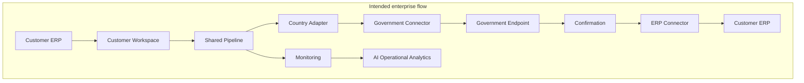
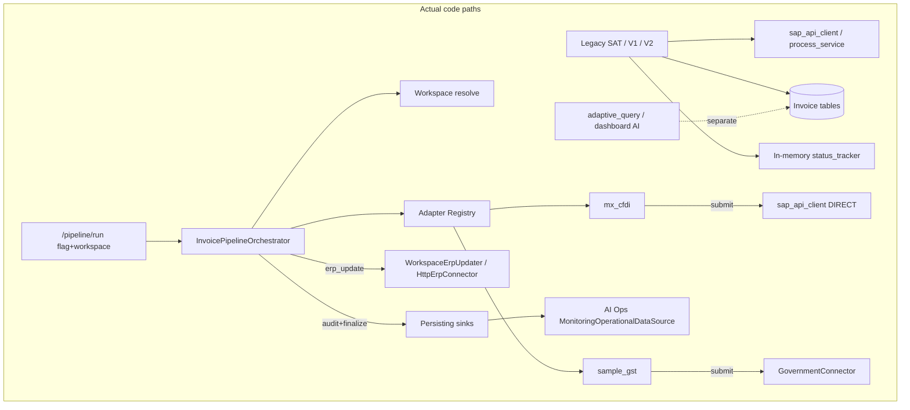

# BridgeEDI — Final Enterprise Architecture Audit

**Classification:** Technical leadership / client architecture review  
**Method:** Source-code verification (implementation is source of truth)  
**Scope:** `zodiac/zodiac-api`, `zodiac/zodiac-front`, migrations, ops docs, enterprise tests  
**Date:** 2026-08-02  
**Auditor role:** Principal Enterprise Software Architect / Solution Architect / Technical Lead / Senior Code Reviewer  

**Finding taxonomy used throughout:**

| Label | Meaning |
|-------|---------|
| **VERIFIED** | Confirmed in source code |
| **PARTIALLY VERIFIED** | Present but incomplete, dual-path, or unevenly applied |
| **NOT IMPLEMENTED** | Absent in code |
| **DOCUMENTATION ONLY** | Claimed in docs; not backed by matching implementation |
| **RECOMMENDATION** | Improvement; not a defect against frozen architecture |

**Production code was not modified for this audit.**

---

## 1. Executive Summary

BridgeEDI has successfully delivered an **additive enterprise platform layer** (Phases 2–10) beside a large, production Mexico/SAT/SAP system. The intended multi-tenant, country-neutral pipeline architecture is largely **real in code** for the **opt-in** path (`/api/v1/pipeline/*`), with workspace isolation, adapter registry, government connector (sample path), ERP updater + outbox, monitoring, and AI Ops that consumes monitoring only.

The critical architectural truth for leadership:

1. **Two processing worlds coexist.** Legacy V1/V2/SAT/SAP paths remain the primary production invoice engine and **do not** go through the shared pipeline, country adapter orchestration, or Phase 8 monitoring by default.  
2. **Mexico adapter violates the pure “submit → Government → confirm → ERP” ideal** by design of current reality: CFDI is already stamped; `MxCfdiAdapter.submit` calls `sap_api_client` (ERP) directly, while `AlreadyStampedGovernmentConnector` is available but **not used in submit**.  
3. **AI Ops (Phase 9) correctly stays outside invoice processing.** A separate global Adaptive Query / dashboard AI stack still exists and is **not** workspace-scoped.  
4. **Production readiness is Conditional GO (pilot)** — secrets resolution, rate limiting, circuit breakers, durable pipeline queue/DLQ, and multi-instance SAT status tracking remain open.

**Final recommendation:** **CONDITIONAL GO — controlled pilot only** (see §20).

---

## 2. System Overview

### 2.1 Runtime surfaces (VERIFIED)

Mounted in `app/server.py`:

| Surface | Prefix / path | Role |
|---------|---------------|------|
| Auth | `/api/v1` auth router | JWT login / users |
| Invoices V1 | `/api/v1/invoices` | Legacy processing |
| Invoices V2 | `/api/v1/invoices` (v2 router) | V2 path |
| SAT family | `/api/v1/sat*`, canonical, merge, mapping | Mexico CFDI production |
| Customers / certificates / supplier tokens | `/api/v1/...` | Tenancy & certs |
| Dashboard + Adaptive Query | `/api/v1/dashboard`, `/api/query/*` | BI / global AI |
| Workspace | `/api/v1/workspace` | Phase 2 |
| Pipeline | `/api/v1/pipeline` | Phase 4 (flagged) |
| Monitoring | `/api/v1/monitoring` | Phase 8 |
| AI Ops | `/api/v1/ai` | Phase 9 |

Frontend: Next.js `zodiac-front` with workspace shell tabs (overview, invoices, SAT, monitoring, AI Ops, settings).

### 2.2 Intended vs implemented dependency graph





### 2.3 Module dependency summary (VERIFIED)

| From | To | Coupling |
|------|-----|----------|
| `core/pipeline` | `adapters` registry/base, `workspace`, `erp`, `monitoring` | DI / protocols — country-neutral |
| `adapters/mx_cfdi` | `services.sap_api_client`, SAT processor utilities, optional gov connector | **Legacy ERP coupling in submit** |
| `adapters/sample_gst` | `core/government` | Clean |
| `core/ai` | `core/monitoring`, `core/workspace` security | Clean — no invoice models |
| `api/adaptive_query` | SQL agents / schema | **Parallel AI world** |
| Legacy invoices/SAT | process_service, status_tracker, sap_api_client | Unchanged production core |

---

## 3. Architecture Review

| Principle | Status | Evidence |
|-----------|--------|----------|
| Additive enterprise layer | **VERIFIED** | New routers; SAT not replaced (`server.py` still loads sat + invoices) |
| Pipeline country-neutral | **VERIFIED** | No country string branches in `core/pipeline/{orchestrator,stages,hooks}.py` |
| AI not in processing path | **VERIFIED** for AI Ops; **PARTIALLY VERIFIED** platform-wide (global adaptive AI remains) |
| Monitoring observes pipeline | **VERIFIED** | Audit per stage + finalize; monitoring stage emits |
| Government before ERP (canonical) | **PARTIALLY VERIFIED** | True for sample_gst; Mexico submit→SAP first |
| Single ERP abstraction | **PARTIALLY VERIFIED** | Pipeline `erp_update` uses core ERP; Mexico `submit` bypasses it |

### Architecture drift (highest severity)

| # | Drift | Severity |
|---|-------|----------|
| D1 | Legacy SAT/V1/V2 bypass shared pipeline entirely | High (expected transitional; document clearly) |
| D2 | `MxCfdiAdapter.submit` → SAP, not Government Connector | High vs ideal diagram; **matches Mexico already-stamped FACT** |
| D3 | Potential **double ERP contact** on full MX pipeline run: submit→SAP then `erp_update`→HttpErpConnector if workspace ERP configured | Medium |
| D4 | `stage_ai_event` → `LoggingAiEventSink` only; does not feed Monitoring/AI Ops | Low–Medium |
| D5 | Global Adaptive Query not under AI Ops contract | Medium (product boundary confusion) |

---

## 4. Workspace Review (Phase 2)

| Check | Status | Code reference |
|-------|--------|----------------|
| Isolation helper | **VERIFIED** | `app/core/workspace/context.py` — `user_can_access_customer`, `require_workspace_access` |
| Non-admin unauthorized → 404 | **VERIFIED** | Same file; IDOR hardening |
| Workspace API scoped | **VERIFIED** | `app/api/workspace.py` uses `resolve_workspace` / `require_workspace_access` |
| Monitoring scoped | **VERIFIED** | `app/api/monitoring.py` |
| AI Ops scoped | **VERIFIED** | `app/core/ai/security.py` → `authorize_workspace` |
| Pipeline scoped | **VERIFIED** | `WorkspaceContextResolver.resolve` → `resolve_workspace(..., require_access=True)` in `hooks.py` |
| Cross-tenant denied in tests | **VERIFIED** | `app/tests/test_workspace_access.py`, `test_workspace_isolation.py` |
| Secret refs on write | **VERIFIED** | `app/schemas/workspace.py` + `is_valid_secret_ref` |
| Runtime secret resolution | **NOT IMPLEMENTED** (prod) | `LiteralSecretResolver` leaves `vault:`/`env:` unresolved (`government/auth.py`) |

**Verdict:** Workspace tenancy for BridgeEDI APIs is solid. Legacy invoice/SAT routes use older customer filters and are outside the new workspace package — treat as separate hardening track.

---

## 5. Pipeline Review (Phase 4)

### 5.1 Stage plan (VERIFIED)

`app/core/pipeline/stages.py` → `default_stage_plan()`:

1. authenticate  
2. resolve_workspace  
3. resolve_adapter  
4. parse → validate → map → business_rules → transform → format  
5. submit (skip dry-run)  
6. receive_confirmation (skip dry-run)  
7. erp_update (skip dry-run, `TRANSPORT_RETRY`)  
8. monitoring (`always_run`)  
9. ai_event (`always_run`)

### 5.2 Neutrality & gates (VERIFIED)

| Check | Status |
|-------|--------|
| No country conditionals in pipeline package | **VERIFIED** |
| Deployment flag `ENABLE_PIPELINE_API` default false | **VERIFIED** — `api/pipeline.py` |
| Workspace `pipeline_enabled` gate | **VERIFIED** — resolve_workspace stage |
| DI `PlatformServices` | **VERIFIED** — `hooks.py` |
| Observer finalize without mutating result | **VERIFIED** — `orchestrator._observe_complete` |

### 5.3 Gaps

| Gap | Status |
|-----|--------|
| Per-stage timeouts | **NOT IMPLEMENTED** |
| Durable async outbox/worker for pipeline | **NOT IMPLEMENTED** (Task 10.4) |
| Legacy SAT calling orchestrator | **NOT IMPLEMENTED** (by design additive) |

---

## 6. Adapter Review (Phases 3 & 5)

| Check | Status | Evidence |
|-------|--------|----------|
| `CountryAdapter` contract | **VERIFIED** | `app/adapters/base.py` |
| Registry + bootstrap | **VERIFIED** | `registry.py`, `bootstrap.py` |
| New country without editing other adapters | **VERIFIED** | Register new factory; pipeline untouched |
| Bootstrap edit required to register | **PARTIALLY VERIFIED** | Intentional registration point |
| Mexico façade / parity tests | **VERIFIED** | `mx_cfdi/adapter.py`, `test_mx_cfdi_adapter_parity.py` |
| Sample GST proves second country | **VERIFIED** | `adapters/sample_gst/*`, `test_sample_gst_adapter.py` |
| Pipeline imports sample_gst | **VERIFIED** — does not | Architecture tests |

**Mexico submit (VERIFIED):**

```384:407:zodiac/zodiac-api/app/adapters/mx_cfdi/adapter.py
    async def submit(self, ctx: AdapterContext) -> StageResult:
        ...
        from ...services.sap_api_client import sap_client
        ...
        response = await sap_client.send_json_to_sap_with_session(...)
```

Government connector accessor exists (`AlreadyStampedGovernmentConnector`) but is **not** called from `submit`.

---

## 7. ERP Review (Phase 6)

| Check | Status | Evidence |
|-------|--------|----------|
| Core ERP abstraction | **VERIFIED** | `app/core/erp/` — `HttpErpConnector`, normalize, outbox |
| Pipeline uses core updater | **VERIFIED** | `stages.stage_update_erp` → `WorkspaceErpUpdater.update` |
| Outbox idempotency | **VERIFIED** | `models/erp_outbox.py`, `migrations/phase6_erp_outbox.sql` |
| Adapter default `update_erp` | **VERIFIED** | Base returns NOT_IMPLEMENTED; pipeline prefers DI updater |
| Mexico bypass of ERP connector on submit | **VERIFIED** | Direct `sap_api_client` |
| Production secret resolution for ERP | **PARTIALLY VERIFIED** | Refs stored; connector auth incomplete for vault refs |

**Verdict:** ERP connector is real for the pipeline confirmation→ERP stage. It is **not** the only ERP egress; Mexico submit remains a second path.

---

## 8. Government Connector Review (Phase 7)

| Check | Status | Evidence |
|-------|--------|----------|
| Connector implementations | **VERIFIED** | `Mock`, `AlreadyStamped`, `Http` in `core/government/connector.py` |
| Sample GST uses connector | **VERIFIED** | `sample_gst/connector.py` → `gov.submit` |
| No httpx in adapters package | **VERIFIED** | httpx in `core/government/http_client.py` |
| Every adapter uses connector for submit | **PARTIALLY VERIFIED** | sample_gst yes; mx_cfdi submit does not |
| Live Mexico SAT/PAC HTTP | **NOT IMPLEMENTED** | Correct for already-stamped CFDI |
| Durable gov outbox | **NOT IMPLEMENTED** | In-memory duplicate cache on connector |
| Secret resolver | **PARTIALLY VERIFIED** | `LiteralSecretResolver` does not resolve refs |

---

## 9. Monitoring Review (Phase 8)

| Check | Status | Evidence |
|-------|--------|----------|
| Per-stage audit | **VERIFIED** | `orchestrator._audit` → `services.audit.record` |
| Persisting defaults | **VERIFIED** | `PlatformServices.__post_init__` → monitoring bundle |
| Finalize metrics/alerts | **VERIFIED** | `PersistingMonitoringSink.finalize_pipeline_result` |
| Soft-fail on audit/finalize | **VERIFIED** | try/except in orchestrator / sinks |
| Soft-fail on `monitoring.emit` in stage | **PARTIALLY VERIFIED** | Emit exceptions can fail the monitoring stage |
| Trace by correlation_id | **VERIFIED** | `pipeline_timelines` / `pipeline_events` |
| Legacy SAT monitored by Phase 8 | **NOT IMPLEMENTED** | Only pipeline opt-in path |
| Alert channels email/Slack | **NOT IMPLEMENTED** | Log + stubs |

---

## 10. AI Review (Phase 9)

| Check | Status | Evidence |
|-------|--------|----------|
| AI Ops consumes monitoring only | **VERIFIED** | `MonitoringOperationalDataSource` imports only `core/monitoring` |
| AI Ops does not query invoice tables | **VERIFIED** | No invoice model imports under `core/ai`; enforced by `test_ai_ops` / readiness tests |
| AI Ops not in pipeline business stages | **VERIFIED** | Separate API; pipeline does not call AI Ops |
| `stage_ai_event` feeds AI Ops | **NOT IMPLEMENTED** | Default `LoggingAiEventSink` logs only |
| Global Adaptive Query workspace-scoped | **NOT IMPLEMENTED** | `api/adaptive_query.py` optional auth, no workspace gate |
| Prompt injection surface (AI Ops) | **VERIFIED** low | Rule-based classifier in `core/ai/query.py` |
| Contract document | **VERIFIED** | `AI_OPERATIONAL_DATA_CONTRACT.md` aligns with AI Ops code |

**Important distinction for clients:**  
“AI never in invoice processing” is **true for AI Ops**. It is **not** a claim that the platform has no other AI (dashboard / adaptive SQL remain).

---

## 11. Security Review

| Topic | Status | Notes |
|-------|--------|-------|
| Authentication (JWT) | **PARTIALLY VERIFIED** | `api/auth.py`; ensure prod `SECRET_KEY` |
| API keys | **PARTIALLY VERIFIED** | `api_key_auth.py`; allow-list exists |
| Authorization / workspace | **VERIFIED** | BridgeEDI APIs |
| Secrets at rest in workspace config | **VERIFIED** refs only on schema | Runtime resolve **NOT IMPLEMENTED** |
| Certificates | **PARTIALLY VERIFIED** | Existing cert APIs; out of BridgeEDI core |
| SQL injection (adaptive) | **PARTIALLY VERIFIED** | Guardrails exist in legacy AI tests; not AI Ops |
| Command injection | **VERIFIED** low risk on new core | No shelling in core pipeline/ai |
| Path traversal | **PARTIALLY VERIFIED** | Legacy upload paths — outside this audit depth |
| Rate limiting | **NOT IMPLEMENTED** | Comment only in `supplier_tokens.py` |
| CORS | **VERIFIED** | `server.py` honors `CORS_ORIGINS`; `CORS_ALLOW_ALL` escape |
| Audit logging | **PARTIALLY VERIFIED** | Pipeline audit + AI Ops log audit; not durable AI audit table |
| Cross-workspace AI | **VERIFIED** | Admin + explicit flag in `AiOpsSecurity` |

---

## 12. Scalability Review

| Load scenario | Assessment |
|---------------|------------|
| 100 users | **Feasible** on current API+Postgres |
| 1,000 users | **Feasible** with pool tuning; watch legacy AI/dashboard |
| 10,000 users | **At risk** without horizontal strategy for in-memory `status_tracker` (`services/status_tracker.py`) |
| 100,000 invoices | **At risk** on sync pipeline + no worker queue; need Task 10.4 outbox/workers |
| Multiple countries | **Architecture ready** via registry; ops/secrets incomplete |
| Multiple ERPs | **PARTIALLY VERIFIED** — workspace connections + generic HTTP connector |
| Multiple governments | **PARTIALLY VERIFIED** — connector framework; durability/auth gaps |

### Bottlenecks (VERIFIED / inferred from code)

1. In-memory SAT `status_tracker` — multi-instance incorrectness.  
2. Synchronous pipeline HTTP to ERP/Gov in request path.  
3. Monitoring DB commit per stage/event (overhead; soft-fail).  
4. No rate limit — abuse amplification.  
5. Manual migrations — missing tables degrade silently.

---

## 13. Performance Review

| Topic | Status |
|-------|--------|
| Pipeline avoids LLM | **VERIFIED** |
| Monitoring must not fail business outcome | **PARTIALLY VERIFIED** (audit/finalize soft; emit less so) |
| Indexes on new tables | **VERIFIED** in phase SQL migrations |
| Caching for new path | **NOT IMPLEMENTED** (not required for correctness) |
| Timeouts | **PARTIALLY VERIFIED** (~30s ERP/Gov HTTP) |

---

## 14. Testing Review

### Present under `app/tests` (VERIFIED)

| Area | Files |
|------|-------|
| Workspace | `test_workspace_access.py`, `test_workspace_isolation.py` |
| Adapters | `test_adapter_registry.py`, `test_mx_cfdi_adapter_parity.py`, `test_sample_gst_adapter.py` |
| Pipeline | `test_pipeline_orchestrator.py`, `test_pipeline_api.py` |
| ERP | `test_erp_connector.py`, `test_erp_contract_models.py` |
| Government | `test_government_connector.py` |
| Monitoring | `test_monitoring.py` |
| AI Ops | `test_ai_ops.py` |
| Prod readiness | `test_production_readiness.py` |

Last measured enterprise discovery run: **208 tests OK**.

### Missing / weak coverage (RECOMMENDATION)

| Gap | Priority |
|-----|----------|
| End-to-end staging SAT→SAP with real DB | P0 |
| Pipeline + MX dual ERP path integration test | P0 |
| Secret resolver integration tests | P0 |
| Load / soak tests | P1 |
| Legacy route workspace isolation matrix | P1 |
| Frontend e2e for workspace isolation | P2 |
| Circuit breaker / DLQ (n/a until built) | — |

---

## 15. Documentation Review

| Document | vs code | Notes |
|----------|---------|-------|
| Phase 2–10 implementation logs | **Mostly aligned** | Accurate additive framing |
| `AI_OPERATIONAL_DATA_CONTRACT.md` | **Aligned** with AI Ops | Does not govern adaptive_query |
| Ideal architecture diagrams (ERP→Gov→ERP) | **PARTIALLY outdated** for Mexico submit | Docs sometimes imply all adapters use Gov then ERP; Mexico submit→SAP is FACT |
| `PRODUCTION_READINESS_CHECKLIST.md` / ops guides | **Aligned** | Match Phase 10 code |
| `database.py` comment about create_all in server | **DOCUMENTATION ONLY / stale** | `create_all_tables` not called from `server.py` |
| Task 10.4 outbox workers | **DOCUMENTATION ONLY** | Not implemented |

---

## 16. Technical Debt

1. Dual ERP egress (Mexico `sap_api_client` submit + pipeline `HttpErpConnector`).  
2. Legacy monolith size (`dashboard.py`, `process_service.py`) vs thin enterprise core.  
3. In-memory status tracker and gov idempotency cache.  
4. `LiteralSecretResolver` unsuitable for production credentials.  
5. `stage_ai_event` unused as AI Ops feed (dead-ish capability).  
6. Bootstrap registration as manual code edit (acceptable; consider entry-point plugins later).  
7. Alert channel stubs.  
8. Global AI vs AI Ops naming collision for stakeholders.

---

## 17. Risks

| Risk | Likelihood | Impact | Mitigation |
|------|------------|--------|------------|
| Cross-tenant leak on legacy routes | Med | Critical | Extend isolation audits beyond BridgeEDI APIs |
| Prod secrets in `extra_config` / unresolved refs | High if rushed | Critical | Block go-live until resolver (Task 10.5) |
| Double SAP push on MX pipeline | Med | High | Integration test; skip erp_update or submit when redundant |
| Multi-instance SAT status loss | High at scale | High | Sticky sessions short-term; durable status long-term |
| Ops blind on legacy path | High | Med | Do not claim Phase 8 covers SAT until wired |
| Adaptive Query data overexposure | Med | High | Keep admin-only; do not market as workspace AI |

---

## 18. Recommended Improvements

Ordered for value vs risk (no redesign of frozen components):

1. **P0** — Production secret resolver + TLS verify for ERP/Gov.  
2. **P0** — Explicit Mexico pipeline policy: document/test submit vs `erp_update` interaction.  
3. **P0** — Apply migrations in all envs; readiness check for required tables.  
4. **P1** — Edge rate limiting / WAF.  
5. **P1** — Durable pipeline outbox + workers + DLQ (Task 10.4).  
6. **P1** — Soft-fail wrap around `monitoring.emit` / `ai_events.emit`.  
7. **P1** — Optional: wire `AiEventSink` to monitoring facts (still not processing).  
8. **P2** — Clarify product naming: “AI Ops” vs “Adaptive Intelligence”.  
9. **P2** — Plugin registration for adapters without editing bootstrap.  
10. **P2** — Persist AI Ops audit trail.

---

## 19. Production Readiness

| Gate area | Status |
|-----------|--------|
| Architecture freeze respected | **VERIFIED** |
| Enterprise unit tests | **VERIFIED** (208 OK) |
| Ops pack / checklist | **VERIFIED** present |
| CORS hardening | **VERIFIED** |
| Secrets runtime | **NOT READY** |
| Rate limit / CB / DLQ | **NOT READY** |
| Staging E2E sign-off | **EXTERNAL** (not proven in this audit) |
| Pilot feature-flag posture | **READY** if pipeline off by default |

Official gate: `PRODUCTION_READINESS_CHECKLIST.md`.

---

## 20. Final Go / No-Go Recommendation

### **CONDITIONAL GO — Pilot Only**

| Approve | Do not approve yet |
|---------|-------------------|
| Single pilot customer workspace | Broad multi-customer pipeline enablement |
| Legacy Mexico SAT/SAP production path (as today) | Claiming full diagram compliance for Mexico submit→Gov→ERP |
| Monitoring + AI Ops on **pipeline** traffic | Claiming AI Ops covers SAT invoice tables |
| Pipeline API enabled only after staging dry-run | Production vault-less ERP/Gov credentials |
| Feature-flag rollback as primary escape | Horizontal scale of in-memory SAT status |

### Conditions to upgrade to full GO

1. Secret resolver production-complete and tested.  
2. Mexico pipeline ERP double-write policy tested and accepted.  
3. Migrations automated or checklist-enforced with readiness probe.  
4. Edge rate limiting live.  
5. Load test baselines recorded.  
6. Security sign-off on legacy + BridgeEDI isolation.  
7. On-call trained on `docs/operations/RUNBOOKS.md`.

---

## Appendix A — Phase verification scorecard

| Phase | Theme | Score |
|-------|-------|-------|
| 2 | Workspace | **VERIFIED** (runtime secrets partial) |
| 3 | Country adapters | **VERIFIED** (MX gov unused in submit) |
| 4 | Pipeline | **VERIFIED** (opt-in; no durable queue) |
| 5 | Second adapter | **VERIFIED** |
| 6 | ERP connector | **PARTIALLY VERIFIED** (bypass on MX submit) |
| 7 | Government connector | **PARTIALLY VERIFIED** (sample yes; MX submit no) |
| 8 | Monitoring | **VERIFIED** for pipeline; not legacy |
| 9 | AI Ops | **VERIFIED**; global AI separate |
| 10 | Prod readiness | **PARTIALLY VERIFIED** — Conditional GO |

---

## Appendix B — Key source anchors

| Concern | Path |
|---------|------|
| Workspace isolation | `app/core/workspace/context.py` |
| Pipeline stages | `app/core/pipeline/stages.py` |
| Orchestrator audit/observe | `app/core/pipeline/orchestrator.py` |
| Platform DI | `app/core/pipeline/hooks.py` |
| MX SAP submit | `app/adapters/mx_cfdi/adapter.py` → `submit` |
| Sample GST gov submit | `app/adapters/sample_gst/connector.py` |
| ERP updater | `app/core/erp/hooks.py` → `WorkspaceErpUpdater` |
| Gov secret resolver | `app/core/government/auth.py` → `LiteralSecretResolver` |
| Monitoring sinks | `app/core/monitoring/sinks.py` |
| AI Ops datasource | `app/core/ai/datasource.py` |
| CORS | `app/server.py` |
| Status tracker | `app/services/status_tracker.py` |
| Router mount map | `app/server.py` |

---

*End of audit. This document should be treated as the authoritative architecture verification snapshot as of the audit date; subsequent code changes require a delta review.*
