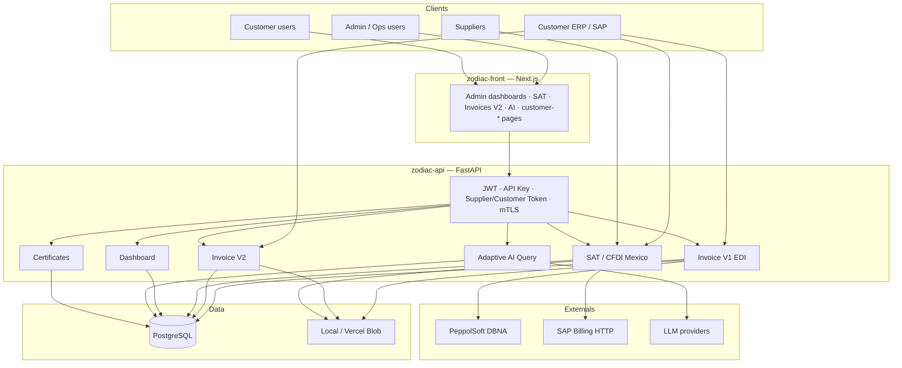
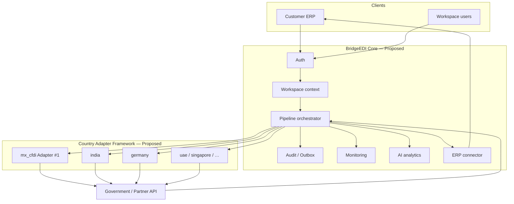
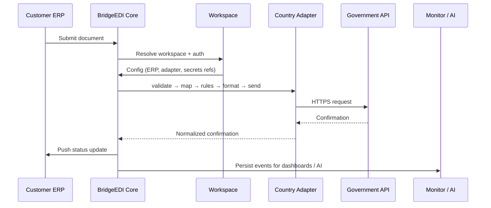

# 01 — System Architecture

**Product:** BridgeEDI (codebase: Zodiac)  
**Audience:** Engineers, solution architects  
**Status:** Architecture reference — distinguishes **Current (implemented)** vs **Proposed (roadmap)**  
**Related:** [`IMPLEMENTATION_ROADMAP.md`](../../IMPLEMENTATION_ROADMAP.md) · [`IMPLEMENTATION_TASKS.md`](../../IMPLEMENTATION_TASKS.md)

---

## 1. Purpose

BridgeEDI is an invoice / EDI / tax-document **middleware platform**. It sits between customer ERP systems and external destinations (government/tax endpoints, partner networks, or ERP billing APIs).

This document describes:

| Layer | Today | Target |
|-------|-------|--------|
| Core platform | FastAPI + Next.js + PostgreSQL | Same — extended with thin orchestration |
| Customer isolation | `customer_id` + user assignment | Formal **Customer Workspace** |
| Country logic | Mexico SAT/CFDI as dedicated stack | **Country Adapter** framework |
| AI | NL analytics over DB | Workspace-scoped operational AI |
| Scale | In-process background tasks | Durable outbox / workers (proposed) |

---

## 2. Overall Architecture

### 2.1 Current (implemented)



**FACT:** Three parallel invoice paths exist today — V1 (EDI/PeppolSoft), V2 (validate/convert/delivery stub), and Mexico SAT/CFDI → SAP. There is no formal adapter registry or workspace product shell yet.

### 2.2 Proposed (roadmap)



**Proposed:** New traffic for multi-country customers flows Core → Adapter → Government → Confirmation → ERP. Existing V1/V2/SAT URLs remain for current customers ([Roadmap — Backward Compatibility](../../IMPLEMENTATION_ROADMAP.md)).

---

## 3. Core Platform

### Current

| Component | Location | Role |
|-----------|----------|------|
| API entry | `zodiac-api/app/server.py` | FastAPI app, CORS, router mounts |
| DB session | `app/database.py` | SQLAlchemy + PostgreSQL `DATABASE_URL` |
| Config | `app/config/config.py` | Env, blob storage, LLM keys |
| Portal | `zodiac-front` | Next.js App Router + Tailwind |

### Proposed

Thin **Core** package (`app/core/`) owning:

- Workspace context resolution  
- Pipeline orchestration  
- Durable outbox / retry (later phases)  
- Generic ERP confirmation connector  

Core does **not** own country mapping/validation/rules/format — those stay in adapters.

---

## 4. Shared Services

| Service area | Current implementation | Shared vs country-specific |
|--------------|------------------------|----------------------------|
| Authentication | JWT, API keys, tokens, mTLS | **Shared** |
| File storage | `file_service` — local or Vercel Blob | **Shared** |
| Certificates | `certificate_*` services + API | **Shared** |
| Format conversion (X12/EDIFACT/UBL/…) | `format_router`, utils converters | **Shared utilities** (not a “country”) |
| PeppolSoft send | `external_api_service` | Partner connector (V1) — keep; not MX tax authority |
| Dashboard metrics | `api/dashboard.py` | **Shared** shell; workspace filter **proposed** |
| AI SQL / charts | adaptive query, `sap_sql_agent`, chart generators | **Shared** engine; **workspace scope proposed** |
| SAT parse/merge/SAP transform | `sat_*`, `sap_transformer`, `sap_api_client` | **Mexico-specific** (becomes Adapter #1 façade) |

---

## 5. Customer Workspace

### Current

- `Customer` (`zodiac_customers`) + `UserCustomer` assignments  
- Customer-user UI: `/customer-invoices`, `/customer-sat-documents`  
- Isolation via JWT role + backend `*ForCustomerUser` filters  
- **No** first-class `workspace_id` product entity  

### Proposed

Each customer gets an exclusive workspace with:

| Capability | Proposed home |
|------------|---------------|
| Own ERP connection | `workspace_erp_connections` |
| Own credentials / secret refs | Config + vault/env |
| Own enabled adapters | `workspace_adapter_config` |
| Own monitoring views | Workspace UI + filtered dashboard |
| Own AI analytics | Adaptive “workspace mode” |
| Own transaction history | Pipeline/outbox tables |

See [03_CUSTOMER_ONBOARDING.md](03_CUSTOMER_ONBOARDING.md) and Roadmap § Customer Workspace Design.

---

## 6. Country Adapters

### Current

Mexico CFDI is a **dedicated module set** (`/api/v1/sat/*` + services). It is the de facto country vertical but not an interface.

### Proposed

```text
adapters/
  base.py          # Protocol
  registry.py      # Strategy + DI
  mx_cfdi/         # Adapter #1 — façade over existing SAT/SAP
  <country>/       # Future: mapping, validation, rules, formatting, connector
```

Adapter owns only: mapping, validation, business rules, formatting, government API, country config.  
See [04_COUNTRY_ADAPTER_FRAMEWORK.md](04_COUNTRY_ADAPTER_FRAMEWORK.md).

---

## 7. AI

**Current:** Generative AI over operational and SAP-shaped Postgres tables (`/api/query/adaptive`, dashboard AI chat, charts).  

**Principle (meeting + roadmap):** AI does **not** replace invoice processing. It **consumes** platform operational data for analytics, failure insight, and reporting — scoped per workspace when enabled.

Details: [07_AI_ARCHITECTURE.md](07_AI_ARCHITECTURE.md).

---

## 8. Monitoring

**Current:** Dashboard V2 inbound/outbound/business/failed; certificate health; in-memory V1 status tracker.  

**Proposed:** Correlation-ID transaction timeline per workspace; optional durable outbox; alert hooks.  

Details: [06_DEPLOYMENT_AND_SCALABILITY.md](06_DEPLOYMENT_AND_SCALABILITY.md).

---

## 9. Security

| Control | Current | Proposed |
|---------|---------|----------|
| JWT / RBAC | Yes | Extend workspace membership checks |
| API keys / tokens | Yes | Per-workspace keys where needed |
| mTLS / certificates | Yes | Reuse for ERP/gov channels |
| Secrets | Mixed env + some hardcoded outbound URLs/creds (**FACT**) | Vault/env refs for **new** connectors; dedicated hardening for legacy clients |
| Tenant isolation | Partial (`customer_id`) | Explicit workspace guards + leak tests |

---

## 10. ERP Integration

| Direction | Current | Proposed |
|-----------|---------|----------|
| Inbound invoice XML | V1 `/sap/process`, V2 `/sap/receive` | Reuse + workspace-aware intake |
| Outbound to SAP (MX) | `SAPAPIClient` billing POST | Via `MxCfdiAdapter.send` (façade) |
| Confirmation → ERP | Stored on merge records; V2 delivery **stub** | Core **ERP connector** (new) |

---

## 11. Government APIs

| Item | Status |
|------|--------|
| Mexico live SAT.gov / PAC timbrado | **Not found** in repo |
| Practical MX “outbound” today | SAP billing integration after CFDI processing |
| PeppolSoft | Partner EDI network (V1) |
| New customer government HTTP API | **Proposed** — specs required ([Task 0.3](../../IMPLEMENTATION_TASKS.md)) |

---

## 12. Layer Interaction (Proposed Target Flow)



---

## 13. Compatibility Posture

| Traffic | Behavior |
|---------|----------|
| Existing V1 / V2 / SAT clients | **Unchanged** |
| New multi-country customers | Opt-in Core + Adapter pipeline |
| MX Adapter #1 | Façade over existing services — no rewrite required to start |

Implementation sequencing: [IMPLEMENTATION_TASKS.md](../../IMPLEMENTATION_TASKS.md) Phases 2–4 first (workspace + façade), then new country (Phase 5) when specs arrive.

---

*Document: `docs/architecture/01_SYSTEM_ARCHITECTURE.md`*
