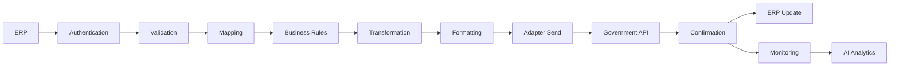
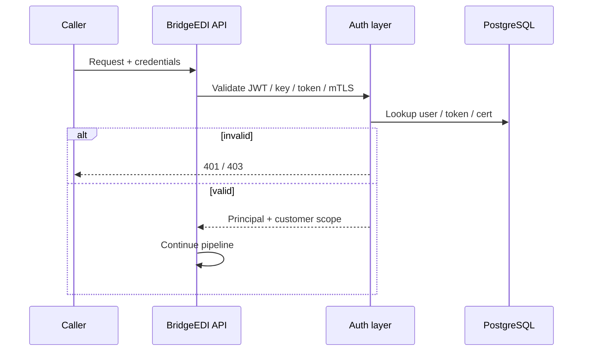
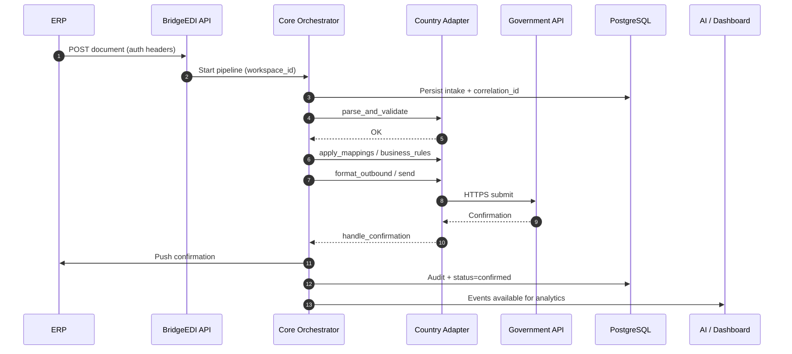
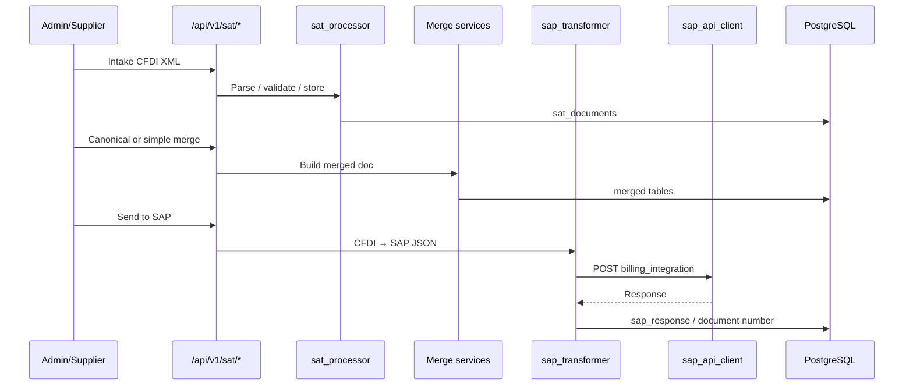

# 02 — Invoice Processing Pipeline

**Audience:** Engineers, solution architects  
**Related:** [01_SYSTEM_ARCHITECTURE.md](01_SYSTEM_ARCHITECTURE.md) · [IMPLEMENTATION_ROADMAP.md](../../IMPLEMENTATION_ROADMAP.md) · [IMPLEMENTATION_TASKS.md](../../IMPLEMENTATION_TASKS.md)

This document traces how an invoice moves through BridgeEDI.  
It presents the **proposed end-to-end target flow** (meeting) and maps each stage to **what exists today** vs **what is proposed**.

---

## 1. Target End-to-End Flow

```text
ERP
 → BridgeEDI
 → Authentication
 → Validation
 → Mapping
 → Business Rules
 → Transformation
 → Formatting
 → Country Adapter (send)
 → Government API
 → Government Response
 → ERP Update
 → Monitoring
 → AI Analytics
```



---

## 2. Two Realities: Current Paths vs Target Pipeline

### 2.1 Current — three parallel paths (FACT)

| Path | Entry | Processing | Outbound |
|------|-------|------------|----------|
| **A — V1** | `/api/v1/invoices/process`, `/sap/process`, `/api/process` | `process_service` → `format_router` | PeppolSoft (`external_api_service`) |
| **B — V2** | `/api/v1/invoices-v2/upload`, `/sap/receive` | validate → convert | `customer_delivery_service` (**stub**) |
| **C — MX SAT** | `/api/v1/sat/intake`, supplier intake | parse → merge → SAP JSON | `sap_api_client` → SAP billing |

Closest to the meeting flow today: **Path C** (CFDI → transform → HTTP → store confirmation).  
Generic “government endpoint + push confirmation to ERP” for arbitrary countries is **Proposed**.

### 2.2 Proposed — unified Core + Adapter pipeline

New/opt-in traffic uses Core orchestrator + country adapter hooks. Existing paths stay mounted and unchanged.

---

## 3. Stage-by-Stage Specification

For each stage: **Purpose** · **Current** · **Proposed** · **Files** · **Services** · **Database** · **Configuration** · **Errors / Retry / Logging**

---

### Stage 0 — ERP submit

| | |
|--|--|
| **Purpose** | Customer ERP (or supplier/admin) delivers a document into BridgeEDI |
| **Current** | Multipart/XML upload via SAT, V1, or V2 SAP receive endpoints |
| **Proposed** | Same channels + workspace pipeline intake API |
| **Responsible files** | `api/sat.py`, `api/invoices.py`, `api/invoices_v2.py`; **New (proposed):** `api/workspace.py` / pipeline routes |
| **Services** | Upload handlers; `file_service.save_file_to_storage` |
| **Database** | `sat_documents`, `v2_invoice_documents`, V1 success/failed tables |
| **Configuration** | Auth method; customer/workspace id; storage mode (`USE_BLOB_STORAGE`) |
| **Error handling** | HTTP 4xx on auth/validation of upload; persist failed rows where applicable |
| **Retry** | Client re-submit; V2 has reprocess endpoints; durable outbox **proposed** for new pipeline |
| **Logging** | API request logs; SAT/V2 status fields |

---

### Stage 1 — Authentication

| | |
|--|--|
| **Purpose** | Prove caller identity and authorize workspace access |
| **Current** | JWT (`api/auth.py`), API keys (`api_key_auth.py`), supplier token, customer token, mTLS (`middleware/mtls_auth.py`, `delivery_auth.py`) |
| **Proposed** | Same mechanisms + workspace membership guard |
| **Files** | Auth modules above; **New:** `core/workspace/context.py`, `guards.py` |
| **Services** | Token validators; certificate validation |
| **Database** | `zodiac_users`, `supplier_tokens`, `customer_tokens`, `customer_certificates`, `user_customers` |
| **Configuration** | `SECRET_KEY`, token TTLs, IP allow-lists, cert trust |
| **Error handling** | 401/403; no processing without auth |
| **Retry** | N/A (client must re-authenticate) |
| **Logging** | Auth failures; cert validation results |



---

### Stage 2 — Validation

| | |
|--|--|
| **Purpose** | Ensure document is structurally and fiscally acceptable |
| **Current MX** | `CFDIParser`, `sat_processor` validation, receiver RFC allow-lists (`CustomerReceiverRfc`) |
| **Current V2** | `InvoiceV2ValidationService` |
| **Current V1** | XML / X12 / EDIFACT validators via `format_router` path |
| **Proposed** | `adapter.parse_and_validate(payload)` — country-specific rules inside adapter |
| **Files** | `utils/cfdi_parser.py`, `services/sat_processor.py`, V2 validation services; **New:** `adapters/<cc>/validation/` |
| **Database** | Status columns on document tables; validation error payloads |
| **Configuration** | Country schemas; RFC lists; customer `validation_fields` |
| **Error handling** | Mark document failed/invalid; return actionable errors to UI/API |
| **Retry** | After correction (V2 correction/cache paths exist); adapter may allow re-validate |
| **Logging** | Validation error codes/messages on document + API response |

---

### Stage 3 — Mapping

| | |
|--|--|
| **Purpose** | Map parties, accounts, tax ids, GL codes to target system fields |
| **Current MX** | `SATSupplierAccountMapping`, logic in `sap_transformer` / mapping services |
| **Proposed** | `adapter.apply_mappings(ctx)` using workspace/country mapping config |
| **Files** | `sat_supplier_mapping_service.py`, `sap_transformer.py`; **New:** `adapters/<cc>/mapping/` |
| **Database** | `sat_supplier_account_mapping`; **Proposed:** `workspace_adapter_config` mapping JSON |
| **Configuration** | Per-customer RFC→GL maps; country field maps |
| **Error handling** | Fail if required mapping missing |
| **Retry** | After mapping config update |
| **Logging** | Mapping miss events |

---

### Stage 4 — Business Rules

| | |
|--|--|
| **Purpose** | Accept/reject/merge/dedupe per country fiscal rules |
| **Current MX** | Simple/canonical merge services; duplicate/period checks |
| **Proposed** | `adapter.apply_business_rules(ctx)` — **not** shared across countries |
| **Files** | `sat_canonical_merge_service.py`, `sat_simple_merge` services; **New:** `adapters/<cc>/rules/` |
| **Database** | `sat_canonical_merged`, `sat_simple_merged` |
| **Configuration** | Merge mode selection; country rule flags |
| **Error handling** | Business reject with reason codes |
| **Retry** | Only if rule config or source data corrected |
| **Logging** | Rule decisions on merge/document records |

---

### Stage 5 — Transformation

| | |
|--|--|
| **Purpose** | Convert internal document model toward outbound shape |
| **Current MX** | CFDI domain → intermediate structures inside processor/transformer |
| **Proposed** | Part of adapter pipeline before `format_outbound` |
| **Files** | `sap_transformer.py`, SAT services |
| **Database** | Merged document rows holding transformed fields |
| **Configuration** | Target system profile (SAP vs gov schema) |
| **Error handling** | Transform exceptions → failed status |
| **Retry** | Re-run transform after fix |
| **Logging** | Transform errors + payload size/metrics |

---

### Stage 6 — Formatting

| | |
|--|--|
| **Purpose** | Produce exact wire format (JSON/XML/EDI) required by endpoint |
| **Current MX** | SAP billing JSON via `sap_transformer` |
| **Current V1** | X12/EDIFACT/XML embed via converters |
| **Proposed** | `adapter.format_outbound(ctx)` |
| **Files** | `sap_transformer.py`, `utils/xml_to_*`, `format_router.py` |
| **Database** | Converted file paths / blob paths; merge JSON columns |
| **Configuration** | Customer `target_format` (V1/V2); adapter format profile |
| **Error handling** | Format failure blocks send |
| **Retry** | Safe to retry format (idempotent) |
| **Logging** | Format path chosen; output artifact location |

---

### Stage 7 — Country Adapter send

| | |
|--|--|
| **Purpose** | Invoke the country-specific outbound connector |
| **Current** | Implicit: SAT routers call `SAPAPIClient` / `sap_send_all` |
| **Proposed** | `adapter.send(ctx)` registered in AdapterRegistry |
| **Files** | `sap_api_client.py`, `sap_send_all.py`; **New:** `adapters/mx_cfdi/adapter.py`, `adapters/registry.py` |
| **Database** | SAP send status columns on SAT/merge tables |
| **Configuration** | Endpoint URL, auth, timeouts (**today partly hardcoded — FACT**; **proposed** secret refs) |
| **Error handling** | Capture HTTP errors on document; surface in UI (SAP send tabs) |
| **Retry** | Manual send-all / re-send; **proposed** automated retry via outbox |
| **Logging** | Request/response stored (`sap_response` fields) |

---

### Stage 8 — Government API

| | |
|--|--|
| **Purpose** | External authority or mandated partner accepts the document |
| **Current** | No live SAT.gov PAC client found; MX posts to **SAP billing** HTTP API; V1 posts to **PeppolSoft** |
| **Proposed** | Per-country government REST/HTTP connector from client OpenAPI |
| **Files** | `sap_api_client.py`, `external_api_service.py`; **New:** `adapters/<cc>/connector/` |
| **Database** | Confirmation fields on documents |
| **Configuration** | Base URL, OAuth/API key/mTLS, document-type routes |
| **Error handling** | Map remote error codes to platform status |
| **Retry** | Backoff; respect idempotency keys (**proposed**) |
| **Logging** | Correlation ID; sanitized response body |

---

### Stage 9 — Government response / confirmation

| | |
|--|--|
| **Purpose** | Normalize accept/reject into platform status |
| **Current MX** | `sap_document_number` / `sap_response` on merge records |
| **Proposed** | `adapter.handle_confirmation(ctx)` → canonical confirmation DTO |
| **Files** | SAP send services; **New:** adapter confirmation handlers |
| **Database** | Status + confirmation payload columns; **proposed** `pipeline_transactions` |
| **Configuration** | Success criteria mapping |
| **Error handling** | Reject path updates monitor + notifies |
| **Retry** | Do not double-accept; idempotent handle |
| **Logging** | Confirmation event for AI/monitor |

---

### Stage 10 — ERP update

| | |
|--|--|
| **Purpose** | Push confirmation back so ERP reflects final status |
| **Current** | Confirmation primarily **stored in BridgeEDI**; V2 `send-to-customer` is a **stub**; no generic ERP callback service |
| **Proposed** | Core `erp/connector.py` using `workspace_erp_connections` |
| **Files** | **New:** `app/core/erp/connector.py`; leave `customer_delivery_service.py` stub intact |
| **Database** | ERP push attempts / idempotency keys (**proposed**) |
| **Configuration** | ERP callback URL, auth, field mapping |
| **Error handling** | Retry with DLQ (**proposed**); surface in monitoring |
| **Retry** | Required for reliability |
| **Logging** | Push success/failure events |

---

### Stage 11 — Monitoring

| | |
|--|--|
| **Purpose** | Ops visibility: throughput, failures, latency |
| **Current** | `/api/v1/dashboard/*` V2 panels; SAT UI status; in-memory V1 `status_tracker` |
| **Proposed** | Workspace timeline + correlation ID; alerts |
| **Files** | `api/dashboard.py`; frontend Dashboard V2 / SAT tabs; **New:** pipeline monitor APIs |
| **Database** | Existing invoice/SAT tables; **proposed** outbox/event tables |
| **Configuration** | Feature flags for workspace monitoring |
| **Error handling** | Failed invoice analysis endpoints exist for V2 |
| **Retry** | Ops-triggered reprocess where APIs exist |
| **Logging** | Dashboard aggregates from DB |

---

### Stage 12 — AI analytics

| | |
|--|--|
| **Purpose** | Analyze operational outcomes — **not** execute the invoice pipeline |
| **Current** | `/api/query/adaptive`, dashboard AI chat, charts over DB |
| **Proposed** | Workspace-scoped AI reading pipeline events + customer transactions |
| **Files** | `api/adaptive_query.py`, `sap_sql_agent.py`, `ai_chart_generator.py`, Intelligence UI |
| **Database** | Operational tables + **proposed** AI event projections |
| **Configuration** | LLM keys, `AI_CONTEXT_SOURCE` |
| **Error handling** | Query failures returned to chat; no mutation of gov payloads |
| **Retry** | User re-asks; thread store may reuse snapshots |
| **Logging** | Chat threads (`ai_chat_threads` / turns) |

Details: [07_AI_ARCHITECTURE.md](07_AI_ARCHITECTURE.md).

---

## 4. Sequence — Proposed Happy Path



---

## 5. Sequence — Current Mexico SAT → SAP (FACT)



**Gap vs target:** ERP update after confirmation is not a generic push service; government endpoint for new countries is not this SAP URL.

---

## 6. Error & Retry Overview

| Stage | Current retry | Proposed retry |
|-------|---------------|----------------|
| Auth | Re-auth | Same |
| Validate/Map/Rules | Fix data/config; reprocess APIs (V2/SAT) | Same + adapter re-entry |
| Send | Manual SAP send-all / UI retry | Outbox with backoff + DLQ |
| ERP push | N/A (gap) | Idempotent retries |
| V1 status | In-memory tracker (lost on restart/multi-instance) | Keep for V1; new pipeline uses DB |

---

## 7. Cross-References

- Adapter hooks: [04_COUNTRY_ADAPTER_FRAMEWORK.md](04_COUNTRY_ADAPTER_FRAMEWORK.md)  
- Config knobs: [05_CONFIGURATION_ARCHITECTURE.md](05_CONFIGURATION_ARCHITECTURE.md)  
- More diagrams: [08_SEQUENCE_DIAGRAMS.md](08_SEQUENCE_DIAGRAMS.md)  
- Task breakdown: Phases 3–6 in [IMPLEMENTATION_TASKS.md](../../IMPLEMENTATION_TASKS.md)

---

*Document: `docs/architecture/02_INVOICE_PROCESSING_PIPELINE.md`*
