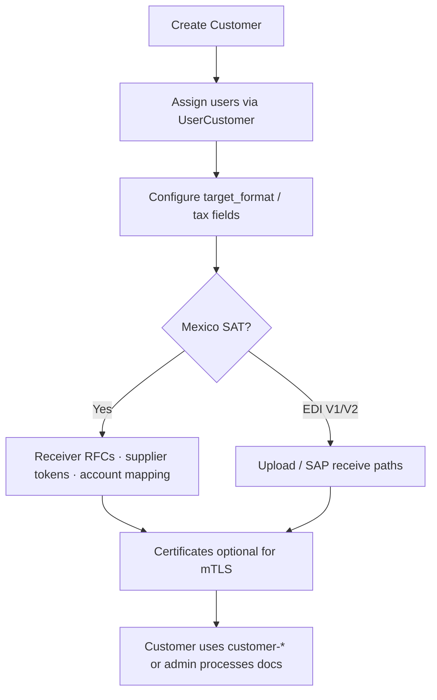
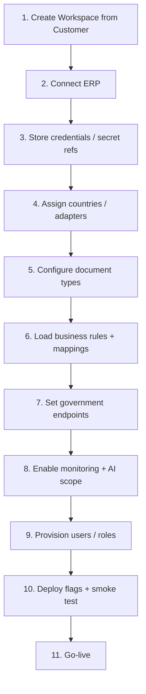

# 03 — Customer Onboarding

**Audience:** Solution architects, delivery engineers, onboarding leads  
**Related:** [01_SYSTEM_ARCHITECTURE.md](01_SYSTEM_ARCHITECTURE.md) · [05_CONFIGURATION_ARCHITECTURE.md](05_CONFIGURATION_ARCHITECTURE.md) · [IMPLEMENTATION_ROADMAP.md](../../IMPLEMENTATION_ROADMAP.md)

This guide explains how a **brand-new customer** joins BridgeEDI.  
It separates **what you can do today** with existing APIs/UI from the **proposed workspace onboarding** in the roadmap.

---

## 1. Goal

Give the customer an **exclusive space** to run their transactions — their ERP, credentials, country adapters, monitoring, and AI — without mixing demo/ops data from other scenarios (meeting requirement).

---

## 2. Current Onboarding (Implemented)

Today, “onboarding” is operational setup around **Customer** records, not a formal Workspace product.

| Step | How today | APIs / UI |
|------|-----------|-----------|
| Create customer | Admin | `/api/v1/customers`, `/customers` page |
| Assign users | Admin | `/api/v1/customer-users`, `/customer-users` |
| Formats | `Customer.target_format` | Customer CRUD |
| Mexico RFCs | `CustomerReceiverRfc` | SAT-related admin |
| Supplier intake | Supplier tokens | `/admin/supplier-tokens` |
| GL mapping | Account mapping | `/admin/account-mapping` |
| Certificates | Issue/download certs | `/api/v1/certificates`, Settings flows |
| Customer portal | Limited | `/customer-invoices`, `/customer-sat-documents` |

**Limits (FACT):** No workspace settings entity; no per-customer government endpoint registry; AI not strictly workspace-scoped; V2 delivery to customer ERP is a stub.

---

## 3. Proposed Onboarding (Roadmap)

---

## 4. Step-by-Step Onboarding Flow (Proposed)

### Step 1 — Workspace creation

| | |
|--|--|
| **Action** | Create workspace seeded from `Customer` (`workspace_id` may equal `customer_id` initially) |
| **Current** | Create `Customer` only |
| **Proposed** | Insert `workspace_settings` row; feature flag `workspace_enabled` |
| **Owner** | BridgeEDI admin / delivery |

### Step 2 — ERP connection

| | |
|--|--|
| **Action** | Register ERP base URL, auth type, inbound receive method, confirmation callback |
| **Current** | Implicit via shared SAP receive endpoints / process APIs |
| **Proposed** | `workspace_erp_connections` table (see [05](05_CONFIGURATION_ARCHITECTURE.md)) |
| **Inputs needed** | ERP OpenAPI or sample requests for submit + status update |

### Step 3 — Credentials

| | |
|--|--|
| **Action** | Store secret **references** (env/vault keys), not raw secrets in git |
| **Current** | Env vars; some outbound creds historically in code (**security hardening task**) |
| **Proposed** | Per-workspace secret refs for ERP + government |
| **Also** | Issue mTLS customer certificates if channel requires |

### Step 4 — Country assignment

| | |
|--|--|
| **Action** | Enable one or more country adapters for this workspace |
| **Current** | Mexico available if SAT features configured; not modeled as adapter list |
| **Proposed** | `workspace_adapter_config` with `country_code` list |

### Step 5 — Adapter selection

| | |
|--|--|
| **Action** | Registry resolves `mx_cfdi`, `india`, etc. |
| **Current** | N/A — SAT routers are fixed |
| **Proposed** | `AdapterRegistry.get(country_code)` ([04](04_COUNTRY_ADAPTER_FRAMEWORK.md)) |

### Step 6 — Document types

| | |
|--|--|
| **Action** | Declare which 3–4 document types the government endpoint accepts |
| **Current** | CFDI-oriented SAT documents; V1/V2 format paths |
| **Proposed** | Per-adapter document-type strategies + sample fixtures |

### Step 7 — Business rules & mapping

| | |
|--|--|
| **Action** | Load country rules and field/GL/party maps for this customer |
| **Current MX** | Supplier account mapping UI + merge modes |
| **Proposed** | Versioned mapping/rules config in DB or adapter config files referenced by workspace |

### Step 8 — Government endpoints

| | |
|--|--|
| **Action** | Base URL, auth, timeouts, callback/webhook if async |
| **Current** | SAP billing URL for MX path; PeppolSoft for V1 |
| **Proposed** | Endpoint config per adapter instance on workspace |

### Step 9 — Monitoring

| | |
|--|--|
| **Action** | Enable workspace dashboards, alerts, correlation IDs |
| **Current** | Global/admin Dashboard V2; customer sees limited SAT/invoice lists |
| **Proposed** | Workspace monitoring UI + filtered metrics |

### Step 10 — AI

| | |
|--|--|
| **Action** | Enable AI assistant bound to workspace data only |
| **Current** | Admin Intelligence / adaptive query (broader schema visibility risk) |
| **Proposed** | Workspace mode with forced tenant predicates ([07](07_AI_ARCHITECTURE.md)) |

### Step 11 — User management

| | |
|--|--|
| **Action** | Create users; assign to workspace; set roles (admin ops vs customer user) |
| **Current** | `UserCustomer`, `is_customer_user`, `is_admin` |
| **Proposed** | Same primitives + workspace RBAC extensions if needed |

### Step 12 — Deployment

| | |
|--|--|
| **Action** | Enable feature flags in staging → pilot → production |
| **Current** | Standard deploy of zodiac-api / zodiac-front |
| **Proposed** | Flag: `WORKSPACE_PIPELINE_ENABLED`, per-workspace enablement; rollback = disable flag |

### Step 13 — Acceptance smoke

1. Auth as workspace user  
2. Submit sample document  
3. Observe validate → send → confirmation  
4. Confirm ERP callback received  
5. Confirm monitor + AI see **only** this workspace’s data  

---

## 5. RACI (Suggested)

| Activity | Customer | BridgeEDI delivery | Engineering |
|----------|----------|--------------------|-------------|
| ERP API specs | R | C | C |
| Government API specs | R / gov partner | C | C |
| Workspace setup | C | R | A |
| Adapter build (new country) | C | A | R |
| Mapping/rules content | R | A | C |
| Security review | C | A | R |
| Go-live sign-off | A | R | C |

R = Responsible, A = Accountable, C = Consulted

---

## 6. Onboarding Checklist (Printable)

**Current-capable**

- [ ] Customer record created  
- [ ] Users assigned  
- [ ] Formats / RFCs / tokens / certs as needed  
- [ ] MX mapping (if Mexico)  
- [ ] Smoke intake on staging  

**Proposed workspace-ready**

- [ ] Workspace settings row  
- [ ] ERP connection + secret refs  
- [ ] Adapter(s) enabled  
- [ ] Document types + samples loaded  
- [ ] Government endpoint configured  
- [ ] Monitoring + AI scoped  
- [ ] Feature flag on for pilot only  
- [ ] Isolation test passed (no cross-customer data)  

---

## 7. Timeline Note (Meeting)

Direct integrations historically ~**10 days**. Platform onboarding should **not** inflate the same integration scope once adapter scaffolding exists: delivery focuses on **config + country adapter + ERP callback**, not rebuilding auth/portal/AI.

See [IMPLEMENTATION_TASKS.md](../../IMPLEMENTATION_TASKS.md) Phase 2 (workspace) and Phase 5 (new country).

---

*Document: `docs/architecture/03_CUSTOMER_ONBOARDING.md`*
