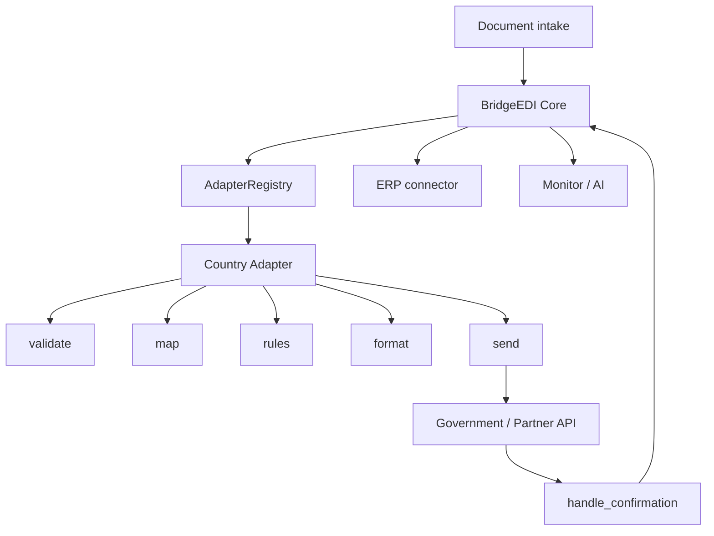
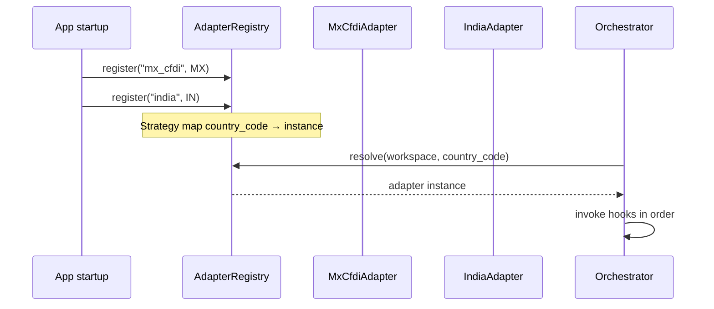
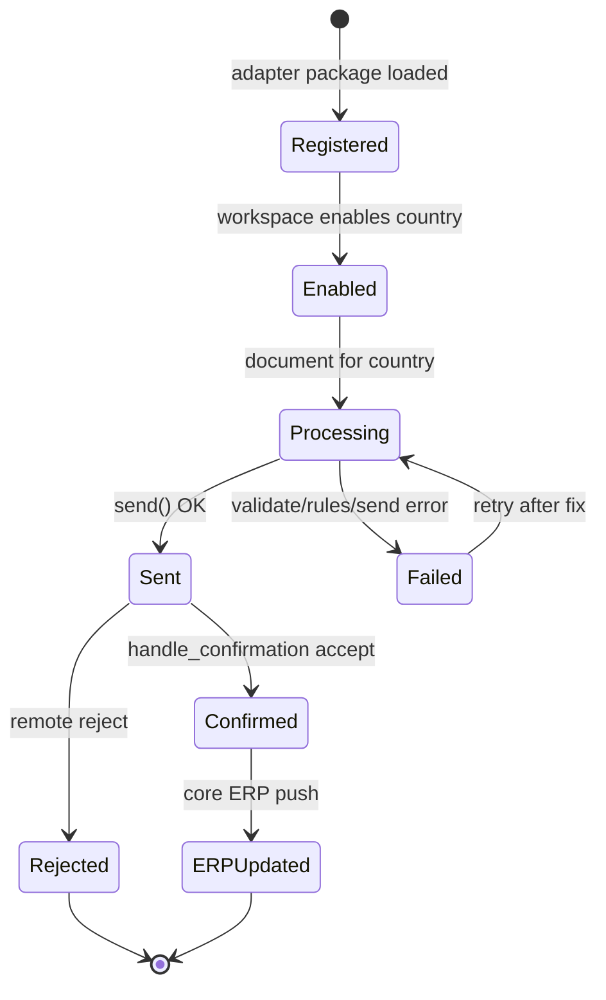
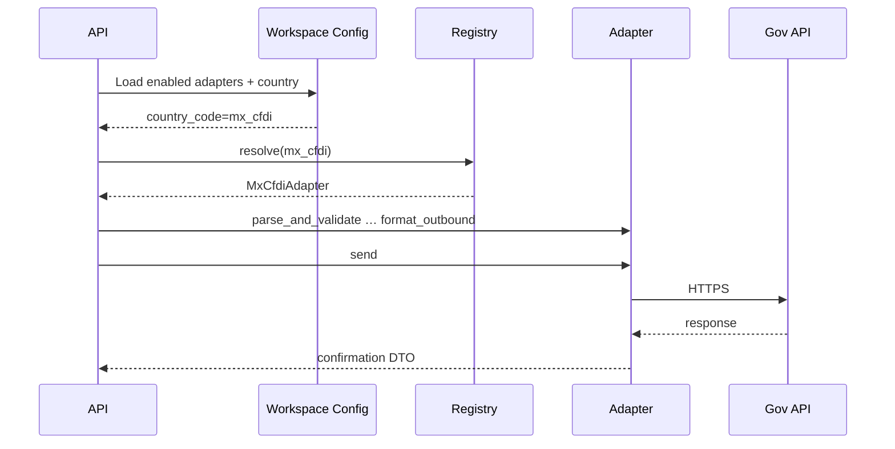

# 04 — Country Adapter Framework

**Audience:** Engineers, solution architects  
**Related:** [01_SYSTEM_ARCHITECTURE.md](01_SYSTEM_ARCHITECTURE.md) · [02_INVOICE_PROCESSING_PIPELINE.md](02_INVOICE_PROCESSING_PIPELINE.md) · [IMPLEMENTATION_ROADMAP.md](../../IMPLEMENTATION_ROADMAP.md) · [IMPLEMENTATION_TASKS.md](../../IMPLEMENTATION_TASKS.md) Phases 3–5

---

## 1. Why Adapters Exist

BridgeEDI must support **many countries** without forking the platform.

| Without adapters | With adapters |
|------------------|---------------|
| Copy-paste SAT/Mexico logic per country | Shared Core + isolated country packages |
| Risk of breaking existing customers | New country = new package + config |
| Unclear ownership of rules | Rules/mappings/endpoints stay country-local |

**Meeting rule:** Each country gets a **separate module adapter** (pipeline). Mapping, validation, business rules, formatting, and endpoint integration are country-specific and **must not** be reused across countries. Shared platform owns auth, orchestration, storage, retry, audit, monitoring, AI.

---

## 2. How They Work



**Patterns**

| Pattern | Use |
|---------|-----|
| Adapter | Country package implements protocol |
| Strategy | Select adapter by `country_code` |
| DI / Registry | Core depends on protocol, not concrete classes |
| Façade | `MxCfdiAdapter` calls existing SAT/SAP services |

---

## 3. Current vs Proposed

| Topic | Current (FACT) | Proposed |
|-------|----------------|----------|
| Mexico | Dedicated `/api/v1/sat/*` + services | Becomes **Adapter #1** via façade |
| Interface | None | `CountryAdapter` protocol |
| Registry | None | `AdapterRegistry` |
| New country | Would require parallel stack | Clone `adapters/<cc>/` layout |
| Existing SAT URLs | Production | **Remain** for backward compatibility |

---

## 4. Mexico CFDI as Adapter #1

### Extraction policy (safe)

1. **Façade first** — `MxCfdiAdapter` delegates to `sat_processor`, merge services, `sap_transformer`, `sap_api_client`.  
2. **Opt-in pipeline** — new Core routes may call the façade; `/api/v1/sat/*` stays primary for current clients.  
3. **Physical move optional/later** — relocating `sat_*` files under `adapters/mx_cfdi/` is **P3** and forbidden until golden tests + sign-off ([Task 3.3](../../IMPLEMENTATION_TASKS.md)).

### Concern → existing code map

| Adapter concern | Existing implementation |
|-----------------|-------------------------|
| Validation | `CFDIParser`, `sat_processor` |
| Mapping | Supplier/GL mapping, transformer |
| Business rules | Simple/canonical merge |
| Formatting | SAP JSON output |
| Endpoint | `SAPAPIClient` / `sap_send_all` |
| Configuration | RFCs, account mapping, SAP URL/creds |

**Note:** Today’s outbound for MX is **SAP billing HTTP**, not a live SAT.gov PAC client (not found in repo).

---

## 5. Folder Structure

### Proposed

```text
zodiac-api/app/
  adapters/
    base.py                 # Protocol + context types
    registry.py             # Registration / resolve
    mx_cfdi/
      adapter.py            # Façade (Adapter #1)
      config.py
    india/                  # Example future
      mapping/
      validation/
      rules/
      formatting/
      connector/
      config.py
    germany/
    uae/
    singapore/

  core/
    pipeline/orchestrator.py
    workspace/
    erp/connector.py
```

### Current (do not dismantle)

```text
app/api/sat*.py
app/services/sat_*.py
app/services/sap_transformer.py
app/services/sap_api_client.py
app/utils/cfdi_parser.py
app/models/sat_*.py
```

---

## 6. Adapter Interface (Proposed)

```text
CountryAdapter
  parse_and_validate(payload) -> ValidationResult
  apply_mappings(ctx) -> ctx
  apply_business_rules(ctx) -> ctx
  format_outbound(ctx) -> OutboundPayload
  send(ctx) -> SendResult
  handle_confirmation(ctx) -> Confirmation
  get_config_schema() -> JSONSchema
```

`push_to_erp` is preferably implemented in **Core ERP connector**, with the adapter supplying field mapping for the confirmation DTO — avoids duplicating HTTP/retry in every country.

---

## 7. Registration



Registration is additive: missing country → clear configuration error, not a fallback to Mexico rules.

---

## 8. Configuration

Per workspace + country:

| Key | Purpose |
|-----|---------|
| `country_code` | Registry key |
| `enabled` | Feature toggle |
| `endpoint_url` / secret refs | Government connector |
| `document_types` | Allowed types |
| `mapping_ref` | Pointer to mapping config |
| `rules_version` | Rule pack version |

Storage: prefer DB `workspace_adapter_config` + secret refs in env/vault ([05](05_CONFIGURATION_ARCHITECTURE.md)).

---

## 9. Validation · Mapping · Rules · Formatting · Connector

| Hook | Responsibility | Isolation rule |
|------|----------------|----------------|
| Validation | Schema, tax ids, mandatory fields | Country-only |
| Mapping | Parties, GL, product codes | Country-only (+ customer overlays) |
| Business rules | Accept/reject/merge/dedupe | Country-only — **no cross-import** |
| Formatting | Wire payload | Country-only |
| Government connector | HTTP/mTLS/OAuth call | Shared HTTP utilities OK; URLs/auth country-specific |

Shared OK: HTTP client with retry policy, audit writer, file storage, correlation ID generator.

---

## 10. Lifecycle Diagram



---

## 11. How Future Countries Are Added

1. Receive OpenAPI, auth, 3–4 document samples ([Task 0.3](../../IMPLEMENTATION_TASKS.md)).  
2. Scaffold `adapters/<cc>/` (clone layout — not Mexico rules).  
3. Implement hooks + connector.  
4. Register in `AdapterRegistry`.  
5. Enable on pilot workspace config.  
6. Golden tests + isolation tests.  
7. Production flag.

**Do not** subclass Mexico business rules. **Do** reuse Core orchestration and shared HTTP/audit helpers.

---

## 12. Sequence — Adapter Selection & Execution



---

## 13. Compatibility Guarantees

- Existing SAT/V1/V2 routes stay.  
- Adapter #1 starts as a **façade**, not a rewrite.  
- New countries never require edits to Mexico rule code.  
- Physical file moves are optional and late.

---

*Document: `docs/architecture/04_COUNTRY_ADAPTER_FRAMEWORK.md`*
