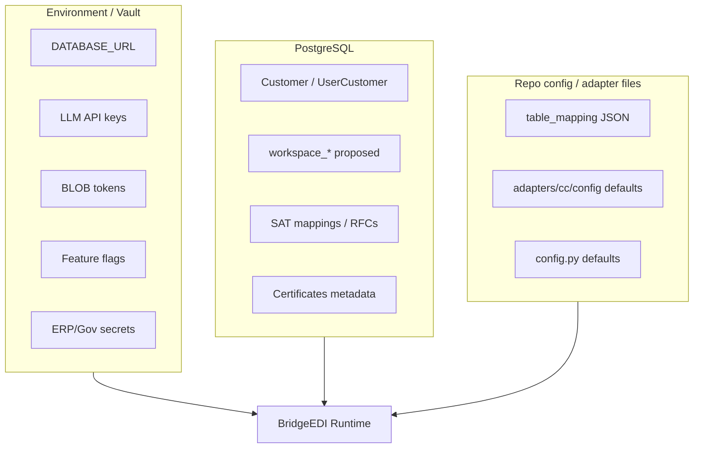

# 05 — Configuration Architecture

**Audience:** Engineers, DevOps, solution architects  
**Related:** [03_CUSTOMER_ONBOARDING.md](03_CUSTOMER_ONBOARDING.md) · [04_COUNTRY_ADAPTER_FRAMEWORK.md](04_COUNTRY_ADAPTER_FRAMEWORK.md) · [IMPLEMENTATION_ROADMAP.md](../../IMPLEMENTATION_ROADMAP.md)

This document catalogs configuration for BridgeEDI: **what exists today** and **what is proposed** for workspaces and adapters.  
It states where each setting should live: **database**, **environment / vault**, or **code/config files**.

---

## 1. Principles

| Principle | Guidance |
|-----------|----------|
| Secrets never in git | Use env or vault; store only **references** in DB |
| Customer-specific → DB | Endpoints, enabled adapters, mappings overlays |
| Deployment-specific → Env | DB URLs, LLM keys, blob tokens, feature flags |
| Country defaults → Adapter package files | Schemas, rule packs versioned with code |
| Backward compatible | Existing env vars and customer fields keep working |

---

## 2. Configuration Map Overview



---

## 3. Workspace Configuration

| Setting | Current | Proposed | Store |
|---------|---------|----------|-------|
| Workspace id | Implicit `customer_id` | Explicit workspace settings | **DB** |
| Display name / branding | Customer fields | Extend workspace settings | **DB** |
| Enabled feature flags (per customer) | None | `workspace_settings.flags` | **DB** |
| Data isolation mode | Filters by customer/user | Forced workspace guards | **Code** + **DB** flag |

---

## 4. ERP Configuration

| Setting | Current | Proposed | Store |
|---------|---------|----------|-------|
| Inbound receive URL (BridgeEDI side) | Fixed API routes | Same routes + workspace context | **Code** routes |
| ERP base URL | Shared SAP patterns | Per-workspace | **DB** + secret for auth |
| Auth type (Basic/OAuth/mTLS) | Mixed | Declared per connection | **DB** |
| Confirmation callback URL | Gap / stub delivery | Required for round-trip | **DB** |
| Idempotency policy | Limited | Explicit | **DB** / **Code** |

**Proposed table:** `workspace_erp_connections`.

---

## 5. Government Configuration

| Setting | Current | Proposed | Store |
|---------|---------|----------|-------|
| MX outbound | SAP billing URL in client (**FACT:** historically hardcoded) | Secret ref + env | **Env/Vault** + **DB** ref |
| PeppolSoft | URLs in `external_api_service` / invoices | Keep; harden to env | **Env** preferred |
| New country gov API | Not in repo | Per adapter endpoint | **DB** ref + **Env** secrets |
| Timeouts / retries | Client defaults | Policy in Core | **Code** + optional **DB** overrides |
| Async webhook URL | Not standardized | Optional | **DB** |

---

## 6. Country Configuration

| Setting | Current | Proposed | Store |
|---------|---------|----------|-------|
| Country code | Implicit “MX” via SAT modules | `country_code` | **DB** |
| Adapter enabled | Feature presence | Explicit enable list | **DB** |
| Document types | CFDI-centric | List of 3–4 types | **DB** + adapter defaults **files** |
| Rule pack version | Code | Version pin | **DB** + **files** |
| Schemas / XSD / samples | In code / fixtures | Adapter package | **Files** |

---

## 7. Authentication Configuration

| Setting | Current location | Store |
|---------|------------------|-------|
| JWT `SECRET_KEY`, expiry | Env / `config.py` | **Env** |
| API keys | User record hashed fields | **DB** (hash) |
| Supplier tokens | `supplier_tokens` + optional IP list | **DB** |
| Customer tokens | `customer_tokens` | **DB** |
| Password hashing | bcrypt via passlib | **Code** |

---

## 8. Certificates / mTLS

| Setting | Current | Store |
|---------|---------|-------|
| Customer certificates PEM / encrypted keys | `customer_certificates` | **DB** (encrypted material) |
| Renewal / revocation | Related tables + API | **DB** |
| Proxy cert headers | `middleware/mtls_auth.py` | **Code** + infra |
| Cert monitor schedule | CLI task | **Ops/Cron** |

---

## 9. API Keys · OAuth · Secrets

| Kind | Current | Proposed | Store |
|------|---------|----------|-------|
| User API keys | Implemented | Per-workspace optional | **DB** hash |
| LLM keys | `OPEN_AI_KEY` etc. in env | Same | **Env/Vault** |
| SAP Basic Auth | Client implementation | Move to env/vault refs | **Env/Vault** |
| OAuth for gov/ERP | Not a general framework | Connector auth strategies | **Env** tokens + **DB** client ids |
| Secret rotation | Manual | Runbook + dual-read | **Ops** |

**Rule:** Database may store `secret_ref` strings like `vault:erp/acme/client_secret` — never the secret value in plaintext application tables when avoidable.

---

## 10. Business Rules & Mapping Configuration

| Kind | Current | Proposed | Store |
|------|---------|----------|-------|
| RFC allow-list | `CustomerReceiverRfc` | Keep / link to workspace | **DB** |
| Supplier → GL mapping | `SATSupplierAccountMapping` | Keep for MX; analogs per country | **DB** |
| Merge mode | Canonical vs simple (ops choice) | Adapter + workspace preference | **DB** |
| Country fiscal rules | Hardcoded in MX services | Versioned rule modules | **Files** (+ **DB** toggles) |
| Field maps for new country | N/A | Mapping JSON/YAML | **Files** or **DB** JSON |

---

## 11. Feature Flags

| Flag (proposed names) | Purpose | Store |
|-----------------------|---------|-------|
| `WORKSPACE_PIPELINE_ENABLED` | Global kill switch for new pipeline | **Env** |
| `workspace_settings.pipeline_enabled` | Per-customer opt-in | **DB** |
| `workspace_settings.ai_scoped` | Force AI tenant filters | **DB** |
| `USE_BLOB_STORAGE` / `DEPLOY_ENV` | Storage mode | **Env** (exists) |
| `AI_CONTEXT_SOURCE` | App vs SAP-shaped context | **Env** (exists) |

Legacy paths ignore new flags (default off).

---

## 12. AI / Analytics Configuration

| Setting | Current | Store |
|---------|---------|-------|
| LLM provider keys & models | `config.py` / env | **Env** |
| `AI_CONTEXT_SOURCE` | Env | **Env** |
| Table knowledge | `table_mapping/*.json`, knowledge JSON | **Files** |
| Chat persistence | Runtime-ensured tables | **DB** |

---

## 13. Database vs Files vs Env — Decision Matrix

| If the value… | Put it in… |
|---------------|------------|
| Differs per customer and is non-secret | **Database** |
| Is a secret or rotation-sensitive | **Env / Vault** (+ DB ref) |
| Is identical for all deployments of a country adapter version | **Adapter files in repo** |
| Changes per environment (dev/stage/prod) | **Env** |
| Is a temporary rollout control | **Env flag** and/or **DB flag** |

---

## 14. Example Proposed Records (Illustrative)

```text
workspace_settings
  customer_id=ACME
  pipeline_enabled=true
  ai_scoped=true

workspace_erp_connections
  customer_id=ACME
  callback_url=https://erp.acme.example/api/invoice-status
  auth_type=oauth2
  client_id_ref=vault:acme/erp/client_id
  client_secret_ref=vault:acme/erp/client_secret

workspace_adapter_config
  customer_id=ACME
  country_code=india
  enabled=true
  endpoint_url_ref=vault:acme/gov/base_url
  document_types=["INV","CN","DN"]
  rules_version="2026.1"
```

*Illustrative only — tables are Proposed, not implemented.*

---

## 15. Hardening Note (Existing Outbound Clients)

Roadmap security section: do **not** drive-by rewrite `sap_api_client` / Peppol credentials during framework introduction. Use a **dedicated hardening task** with dual-read (env first, legacy fallback) so production MX/V1 keep working ([Task 10.5](../../IMPLEMENTATION_TASKS.md)).

---

*Document: `docs/architecture/05_CONFIGURATION_ARCHITECTURE.md`*
