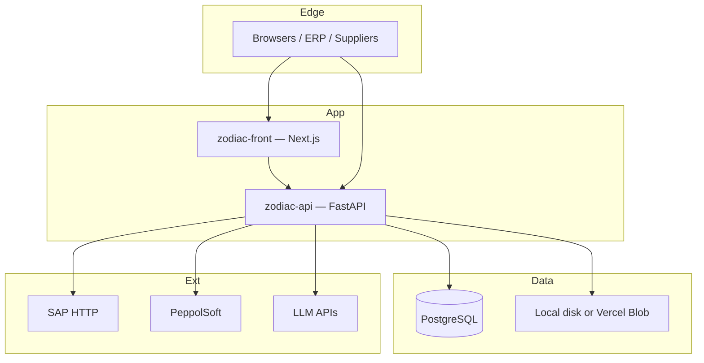
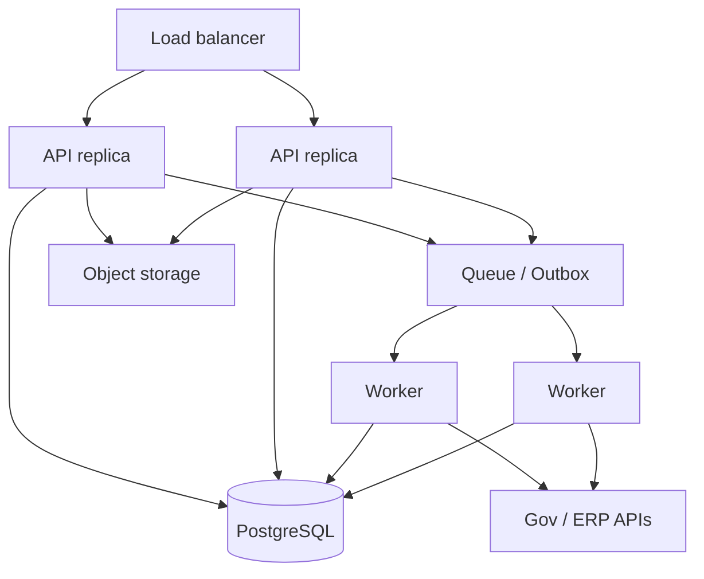
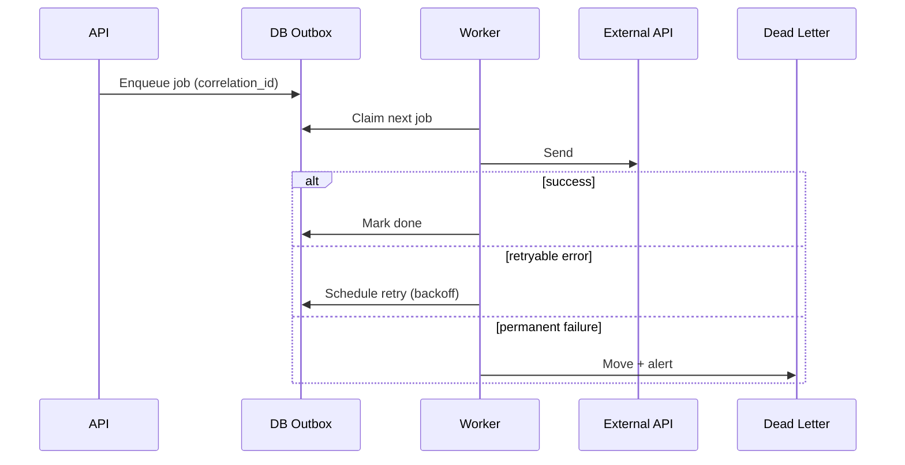
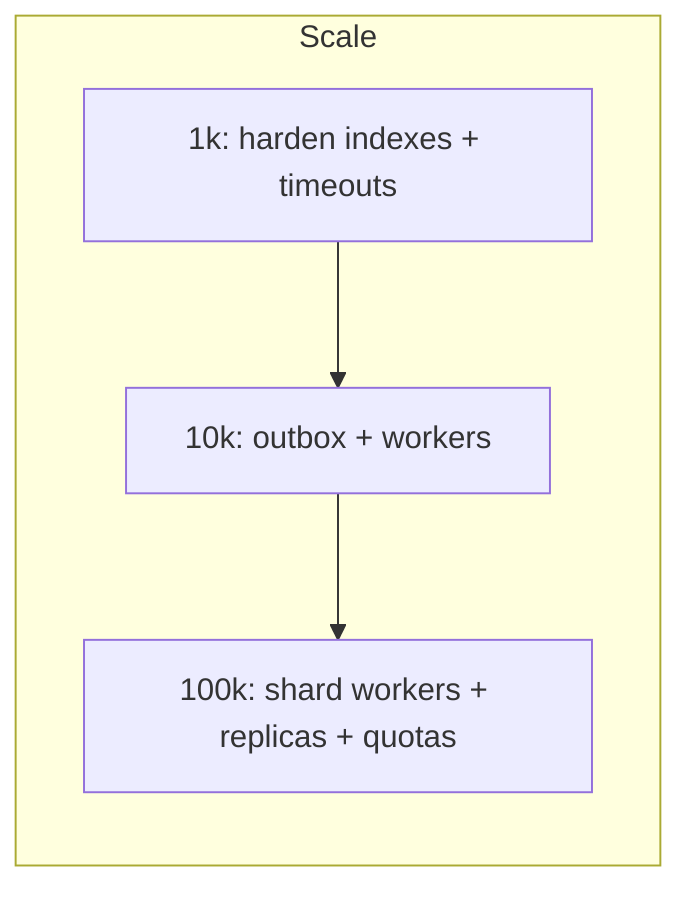

# 06 — Deployment and Scalability

**Audience:** Engineers, DevOps, solution architects  
**Related:** [01_SYSTEM_ARCHITECTURE.md](01_SYSTEM_ARCHITECTURE.md) · [IMPLEMENTATION_ROADMAP.md](../../IMPLEMENTATION_ROADMAP.md) · [IMPLEMENTATION_TASKS.md](../../IMPLEMENTATION_TASKS.md) Phase 10

---

## 1. Deployment Architecture

### Current (implemented)

| Component | Typical deploy |
|-----------|----------------|
| Frontend | Node/Next hosting (e.g. Vercel-style) |
| Backend | Single or few FastAPI workers/processes |
| Database | Shared PostgreSQL |
| Files | Local `uploads/`/`converted/` or Blob when `DEPLOY_ENV=PROD` + token |
| Background | FastAPI `BackgroundTasks` / asyncio — **no Celery** (FACT) |
| Cert monitor | Separate CLI process/cron |

### Proposed

Additive: **do not** remove in-process V1 status tracking on day one; introduce durable processing for the **new** pipeline first.

---

## 2. Load Balancing

| Aspect | Current | Proposed |
|--------|---------|----------|
| Stateless HTTP | Mostly yes, except in-memory status | Fully stateless API tier |
| Sticky sessions | May be relied on for V1 `tracking_id` status | Avoid — store status in DB/Redis |
| LB health | `/health` exists | Keep + readiness (DB/queue) |

**Bottleneck:** In-memory `status_tracker` breaks correctness under multiple API instances.

---

## 3. Queues · Workers · Retry · DLQ

### Current

| Mechanism | Behavior |
|-----------|----------|
| `BackgroundTasks` | Process-local |
| Async background (V1) | Process-local |
| `status_tracker` | In-memory dict |
| Celery/Redis broker | **Not present** |

### Proposed (new pipeline)

| Concept | Proposal |
|---------|----------|
| Outbox table | Source of truth for pipeline jobs |
| Workers | Separate processes consuming outbox/queue |
| Retry | Exponential backoff, max attempts, jitter |
| DLQ | Failed jobs for ops replay |
| Broker options | Redis / SQS / Azure Service Bus / Postgres skip-locked |

---

## 4. Monitoring & Logging

| Layer | Current | Proposed |
|-------|---------|----------|
| Product monitoring | Dashboard V2, SAT UI statuses | + workspace transaction timeline |
| App logs | Standard server logging | Structured logs with `correlation_id`, `workspace_id` |
| Certs | Expiration monitor task | Keep |
| Alerts | Partial / TODO in places | Email/Slack for pipeline DLQ |

---

## 5. Caching

| Cache | Current | Notes |
|-------|---------|-------|
| Schema / AI caches | Various in-memory helpers | Per-process; refresh admin endpoints exist |
| `redis_cache` name | In-process dict in performance helpers — **not** Redis broker | Do not confuse with durable queue |
| Proposed | Redis for hot config, rate limits, distributed locks | Optional |

---

## 6. Scaling Targets

Meeting: handle **1,000–10,000** invoices smoothly; architecture should contemplate growth to **100,000**.

### ~1,000 invoices / period

| Concern | Assessment | Action |
|---------|------------|--------|
| DB | PostgreSQL OK | Indexes on status, customer_id, created_at |
| API | Single instance often OK | Watch upload size / timeouts |
| Background | In-process may OK for low concurrency | Still risky if multi-instance |
| Externals | Gov/SAP latency dominates | Timeouts + retry |

### ~10,000 invoices

| Bottleneck | Why | Proposed solution |
|------------|-----|-------------------|
| In-memory status | Lost/inconsistent across workers | Durable outbox |
| Sync HTTP to gov in request thread | Timeouts / worker exhaustion | Async workers |
| Blob/local disk | I/O | Object storage |
| DB locks on hot tables | Contention | Partition by customer/date; batch writes |
| LLM if misused in pipeline | Cost/latency | **AI stays off the critical invoice path** |

### ~100,000 invoices

| Bottleneck | Proposed solution |
|------------|-------------------|
| Single DB | Read replicas for dashboards/AI; careful write primary |
| Worker throughput | Horizontal workers; shard by workspace |
| External rate limits | Token bucket per endpoint; backlog queue |
| Storage growth | Lifecycle policies on blob; archive cold txs |
| Multi-tenant noisy neighbor | Per-workspace quotas / concurrency caps |

---

## 7. Bottlenecks Summary

| Bottleneck | Current severity | Mitigation |
|------------|------------------|------------|
| In-memory V1 status | High (multi-instance) | DB status for new path; optional V1 migration later |
| No broker | High at 10k+ | Outbox/queue ([Task 10.4](../../IMPLEMENTATION_TASKS.md)) |
| Hardcoded/slow external calls | Medium–High | Config + connection pools + backoff |
| Delivery stub | Functional gap | ERP connector |
| AI on large schemas | Medium | Workspace filters; don’t run AI inline with send |
| Single-region app | Ops choice | Standard HA patterns |

---

## 8. Deployment Strategy (Additive Rollout)

1. Deploy new tables (idle).  
2. Deploy Core/Adapter packages (unused).  
3. Enable pilot workspace flag in staging.  
4. Load test pilot path.  
5. Production pilot customer.  
6. Expand countries/customers.  
7. Rollback = disable flags; legacy routes untouched.

Details: Roadmap § Deployment / Backward Compatibility.

---

## 9. SLOs (Suggested Targets — Proposed)

| Metric | Pilot target |
|--------|--------------|
| Intake accept latency (p95) | < 2s (async process after accept) |
| Time to confirmation (external-bound) | Dominated by gov SLA |
| Failed job visibility | < 1 min to monitor |
| Cross-tenant leak | Zero tolerance |

Exact numbers must be agreed with the customer relative to prior **direct** integration latency (meeting: platform must not cause unacceptable delay).

---

*Document: `docs/architecture/06_DEPLOYMENT_AND_SCALABILITY.md`*
