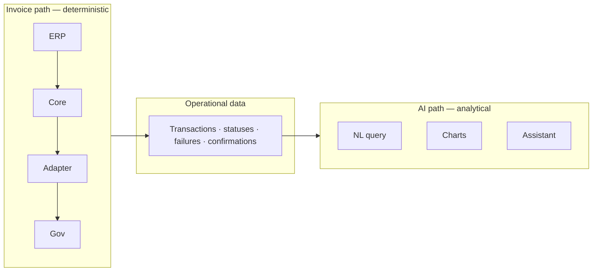
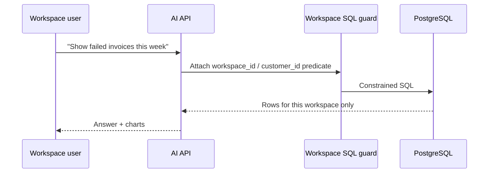
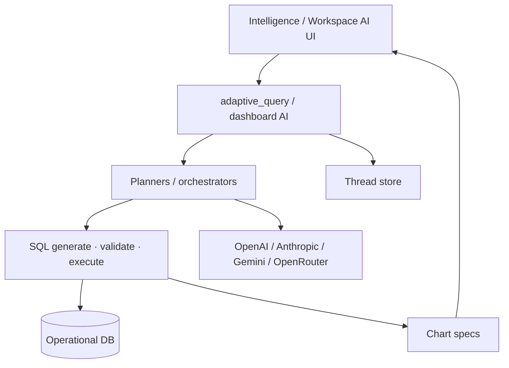

# 07 — AI Architecture

**Audience:** Engineers, solution architects, product  
**Related:** [01_SYSTEM_ARCHITECTURE.md](01_SYSTEM_ARCHITECTURE.md) · [02_INVOICE_PROCESSING_PIPELINE.md](02_INVOICE_PROCESSING_PIPELINE.md) · [IMPLEMENTATION_ROADMAP.md](../../IMPLEMENTATION_ROADMAP.md) · [IMPLEMENTATION_TASKS.md](../../IMPLEMENTATION_TASKS.md) Phase 9

---

## 1. Guiding Principle

> **AI does not process invoices.**  
> The platform pipeline (Core + Country Adapter) validates, maps, formats, and sends documents.  
> **AI consumes operational data** produced by that pipeline for analysis, insight, and assistance.

This matches the meeting intent: realtime analysis of **what is already there** for the customer’s exclusive space.

---

## 2. Current AI Integration (Implemented)

| Capability | Entry | Engine |
|------------|-------|--------|
| Adaptive NL→SQL | `POST /api/query/adaptive` | Schema + LLM + sanitizers + orchestrator fallback |
| Dashboard AI chat | `/api/v1/dashboard/ai-analysis/*` | SQL agent / multi-model / schema-chat |
| Charts | `ai_chart_generator`, frontend Recharts | Specs from LLM/heuristics |
| Threads | `chat_thread_store` | `ai_chat_threads` / turns |
| Voice | `/voice-transcribe` | Transcription → analysis |
| Knowledge | `table_mapping/*.json`, SAP knowledge JSON | Schema context |
| Memory | `ai_query_memory*` | Training / feedback |

**FACT:** AI today often sees broad schema (app and/or SAP-shaped tables via `AI_CONTEXT_SOURCE`). Strict per-workspace SQL enforcement is **Proposed**, not fully guaranteed.

---

## 3. Proposed AI Role in BridgeEDI

| Feature | Description | Data source |
|---------|-------------|-------------|
| **Natural language search** | Ask questions about volumes, statuses, customers, periods | Workspace-filtered operational tables |
| **Operational analytics** | Trends, throughput, confirmation rates | Pipeline events + invoice/SAT facts |
| **Failure analysis** | Why documents failed validation/send | Error codes, failed tables, DLQ reasons |
| **Recommendations** | Ops suggestions (e.g. mapping gaps) — advisory only | Aggregates; **no auto-send to government** |
| **Reports** | Narrative + chart summaries | Same as analytics |
| **Predictive monitoring** | Early warning on failure spikes / backlog | Time-series of pipeline metrics (**proposed**) |
| **AI Assistant** | Chat UI inside workspace | Adaptive + charts + threads |

**Hard rule:** AI must **not** mutate government payloads or bypass adapter validation without a controlled human workflow (roadmap).

---

## 4. Workspace / Customer Scoping

| Mode | Behavior |
|------|----------|
| **Legacy admin AI** | Current behavior (global/ops) — remains |
| **Workspace AI (proposed)** | Forced tenant predicate; optional separate endpoint or `workspace_id` param ignored when absent |

Leak tests are P0 ([Task 10.3](../../IMPLEMENTATION_TASKS.md)).

---

## 5. Architecture Components

**Reuse:** Do not rewrite `sap_sql_agent` — add guards/wrappers ([Task 9.1](../../IMPLEMENTATION_TASKS.md)).

---

## 6. Data AI May Consume

| Allowed | Examples |
|---------|----------|
| Transaction statuses | Accepted, rejected, sent, confirmed |
| Counts and amounts | Where present in ops/BI tables |
| Failure reasons | Validation/send errors |
| Pipeline events | **Proposed** outbox/event projections |
| SAP-shaped analytics tables | When configured — still must respect workspace scope for customer mode |

| Forbidden without control | Reason |
|---------------------------|--------|
| Direct government send | AI is not the adapter |
| Cross-workspace rows | Isolation |
| Secret values | Security |

---

## 7. Feeding Realtime Operational Data (Proposed)

1. Core orchestrator writes **pipeline events** (stage, status, latency, error code).  
2. Optional BI projection tables for fast aggregates.  
3. Adaptive schema includes those tables for workspace sessions.  
4. UI shows AI beside monitoring — same truth.

---

## 8. Security & Governance

| Control | Requirement |
|---------|-------------|
| Auth | JWT; workspace membership |
| SQL allow-list / sanitizer | Keep existing sanitizers; add tenant injection |
| Audit | Store questions/answers in thread tables |
| PII | Follow customer data policies |
| Prompt injection | Treat external doc text as untrusted if ever included |

---

## 9. Current vs Proposed Summary

| Topic | Current | Proposed |
|-------|---------|----------|
| Invoice processing | Deterministic services | Unchanged — AI stays out |
| Analytics | Strong admin AI surfaces | + customer workspace AI |
| Scoping | User / partial customer | Strict workspace filters |
| Event model | Mostly existing tables | First-class pipeline events |
| Predictive monitoring | Limited | Metrics-based alerts + NL |

---

*Document: `docs/architecture/07_AI_ARCHITECTURE.md`*
