# 08 — Sequence Diagrams

**Audience:** Engineers, solution architects  
**Related:** [02_INVOICE_PROCESSING_PIPELINE.md](02_INVOICE_PROCESSING_PIPELINE.md) · [04_COUNTRY_ADAPTER_FRAMEWORK.md](04_COUNTRY_ADAPTER_FRAMEWORK.md) · [07_AI_ARCHITECTURE.md](07_AI_ARCHITECTURE.md)

Unless labeled **Current (FACT)**, diagrams describe the **Proposed** target architecture. Existing V1/V2/SAT sequences remain valid for today’s traffic.

---

## 1. Invoice Processing (Proposed Happy Path)

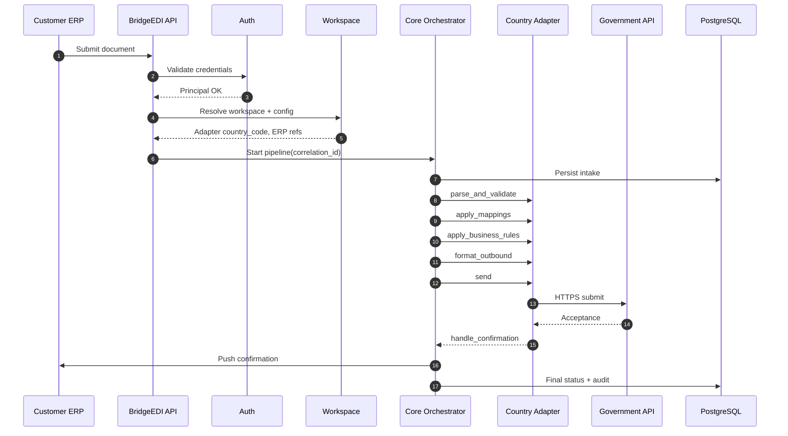

---

## 2. ERP Integration

### 2.1 Inbound (Current capabilities reused)

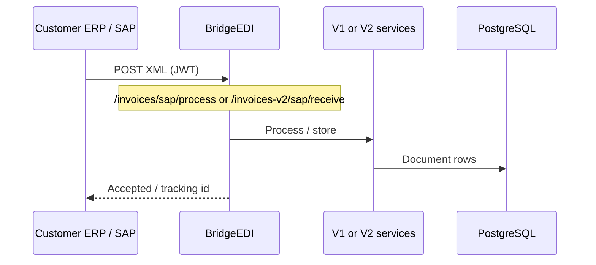

### 2.2 Confirmation push (Proposed)

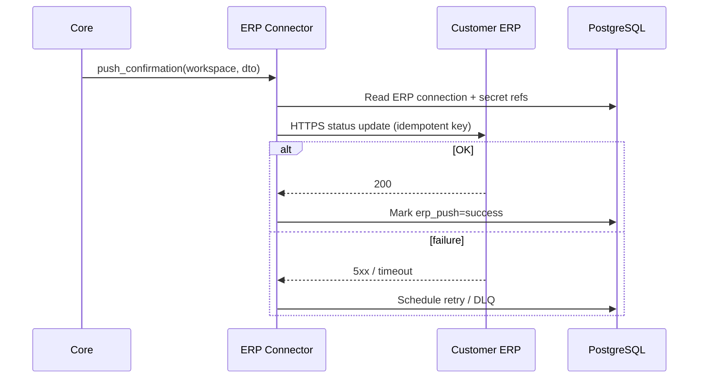

---

## 3. Government Integration (Proposed)

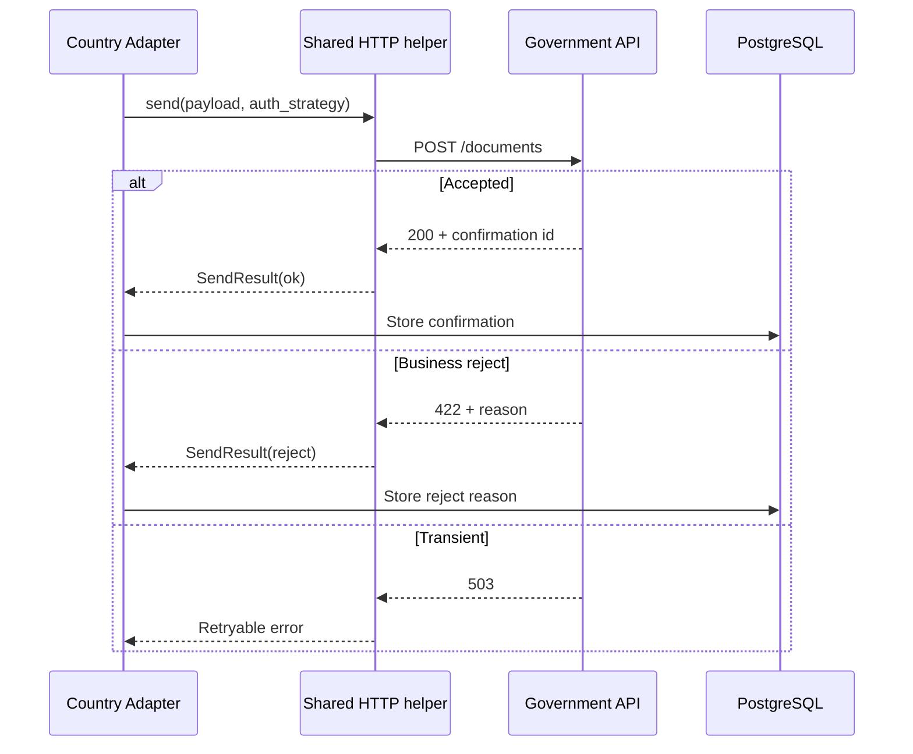

### 3.1 Current Mexico outbound (FACT) — SAP billing, not SAT.gov PAC

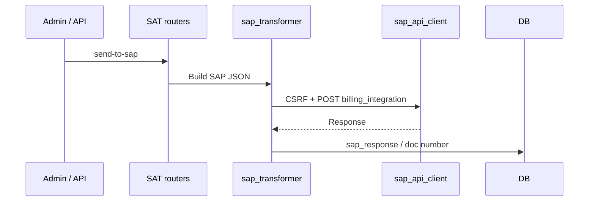

---

## 4. Customer Workspace

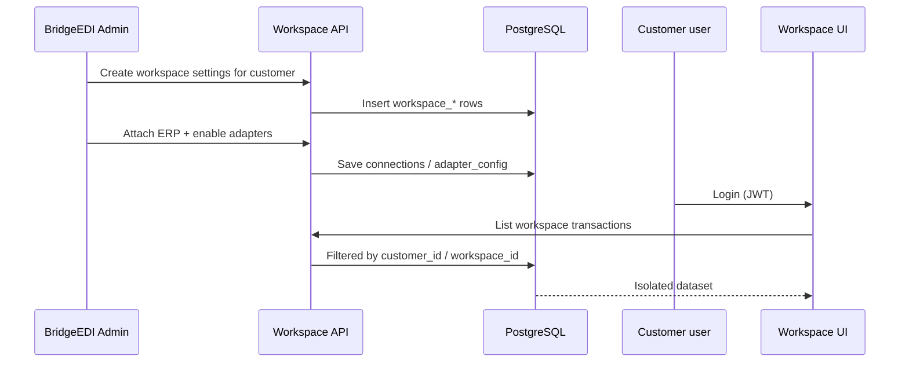

---

## 5. Adapter Selection

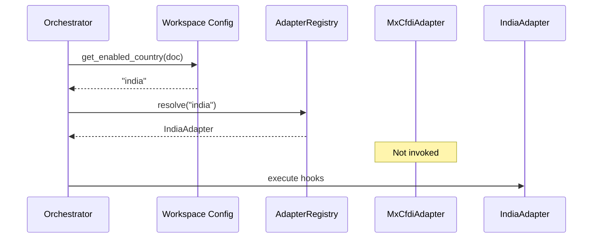

---

## 6. AI Analytics

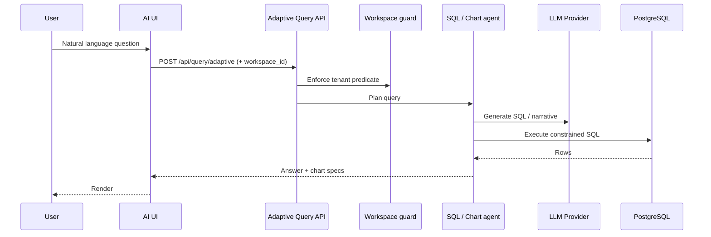

**Note:** AI reads operational data; it does not call Government send APIs.

---

## 7. Error Handling

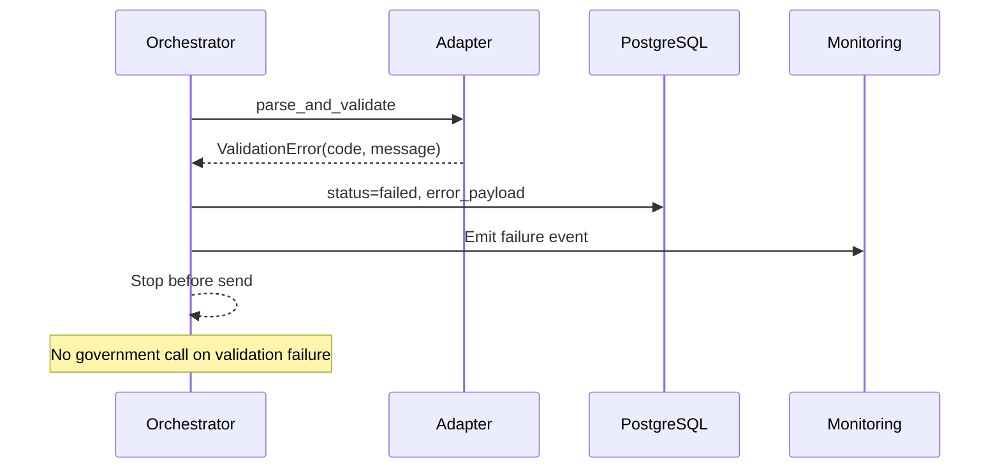

---

## 8. Retry

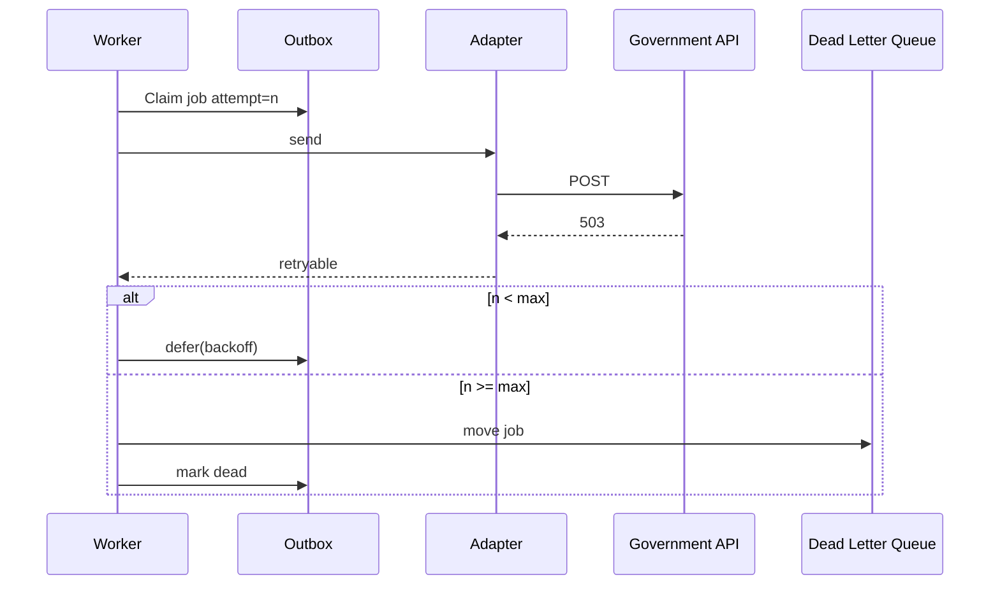

**Current:** Many retries are manual (UI send-all / reprocess). Durable worker retry is **Proposed**.

---

## 9. Confirmation Flow (End-to-End Proposed)

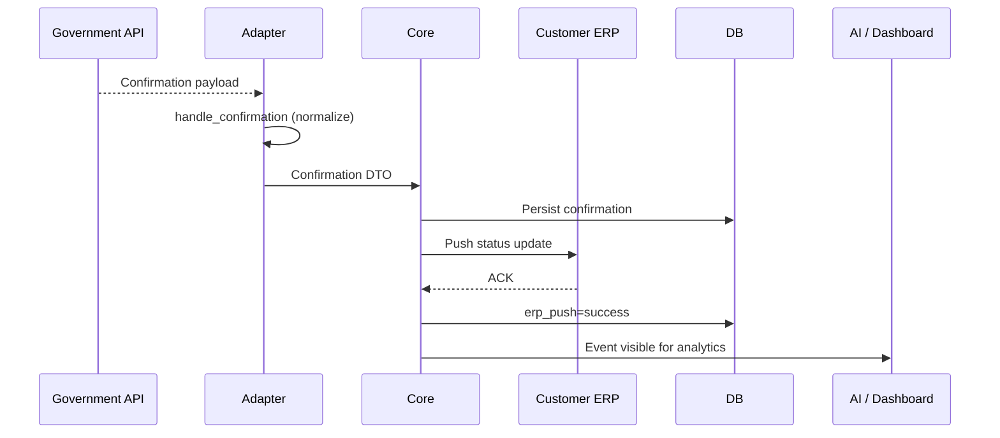

---

## 10. Current V1 EDI Path (FACT) — Reference

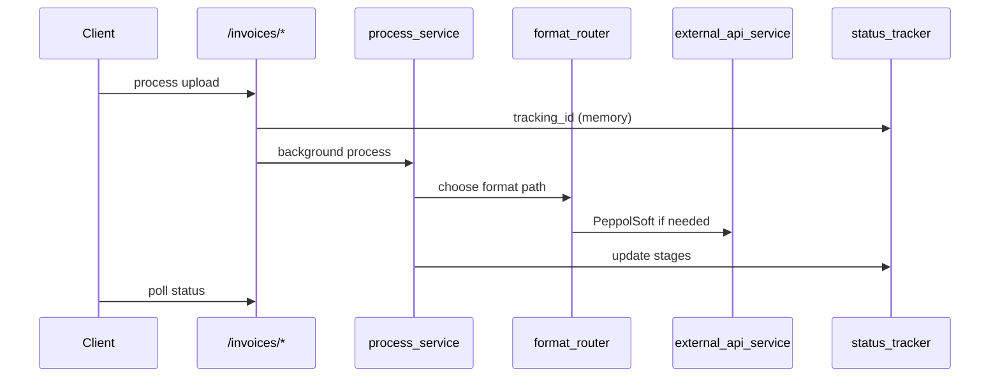

---

*Document: `docs/architecture/08_SEQUENCE_DIAGRAMS.md`*
