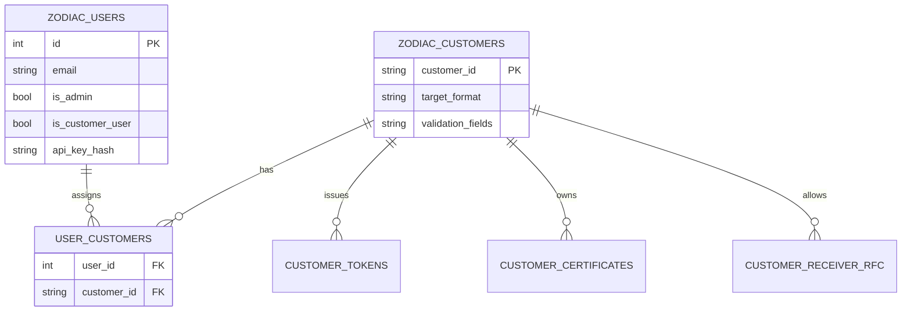
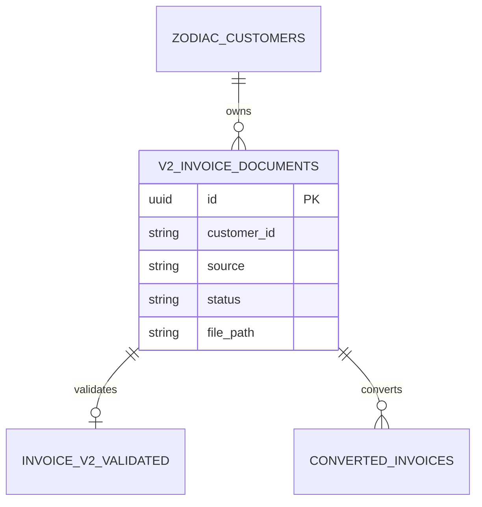
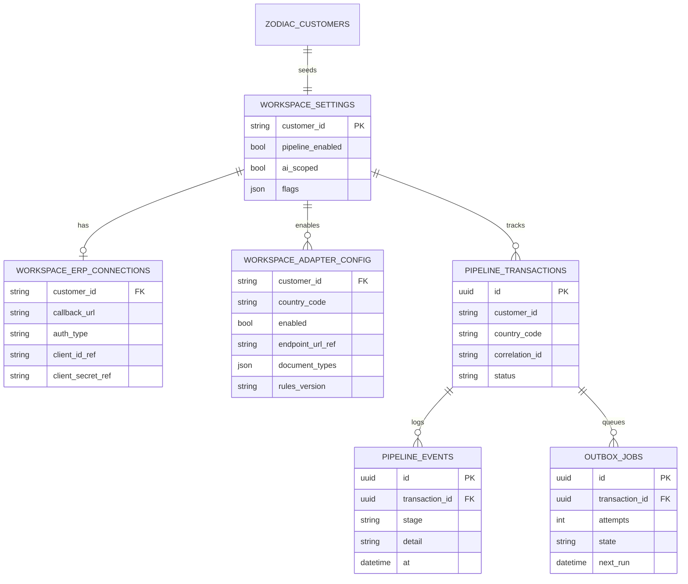

# 09 — Database Architecture

**Audience:** Engineers, data architects  
**Related:** [05_CONFIGURATION_ARCHITECTURE.md](05_CONFIGURATION_ARCHITECTURE.md) · [IMPLEMENTATION_ROADMAP.md](../../IMPLEMENTATION_ROADMAP.md) · [IMPLEMENTATION_TASKS.md](../../IMPLEMENTATION_TASKS.md)

This document summarizes the **current schema** (from models in `zodiac-api/app/models`) and **proposed additive tables**.  
No destructive migrations. Existing tables remain for production traffic.

---

## 1. Current Schema (Implemented)

### 1.1 Identity & customers



### 1.2 Invoices V1

| Table / model | Role |
|---------------|------|
| `zodiac_invoice_success_edi` | Successful V1 EDI results |
| `zodiac_invoice_failed_edi` | Failed V1 results |
| Invoice business data / correction cache | BI and AI correction support |

### 1.3 Invoices V2



Also: `InvoiceV2BusinessData`, `InvoiceV2CorrectionCache` (`v2_correction_cache`).

### 1.4 SAT / CFDI (Mexico)

```mermaid
erDiagram
  SAT_DOCUMENTS ||--o{ SAT_CANONICAL_MERGED : merges
  SAT_DOCUMENTS ||--o{ SAT_SIMPLE_MERGED : merges
  ZODIAC_CUSTOMERS ||--o{ SAT_SUPPLIER_ACCOUNT_MAPPING : maps

  SAT_DOCUMENTS {
    id PK
    string uuid
    string rfc_emitter
    string rfc_receiver
    string source
    string sap_document_number
  }
  SAT_CANONICAL_MERGED {
    id PK
    json sap_response
  }
  SAT_SIMPLE_MERGED {
    id PK
    json sap_response
  }
```

### 1.5 Certificates & suppliers

- `customer_certificates`, renewal/revocation tables  
- `supplier_tokens`  

### 1.6 AI

- `ai_query_memory` (model)  
- `ai_chat_threads` / `ai_chat_turns` (ensured by `chat_thread_store` at runtime)  

### 1.7 Storage paths

Document rows commonly store local path and optional `blob_*_path` when Blob mode is on.

---

## 2. Problems Relative to Multi-Customer / Multi-Country

| Gap | Impact |
|-----|--------|
| No `workspace_*` tables | Exclusive customer space is policy/UI, not a first-class config store |
| No adapter config tables | Country endpoints/rules not data-driven |
| No pipeline outbox | Status durability weak for scale |
| Confirmation→ERP not modeled | Gap vs meeting flow |
| AI events not first-class | Harder realtime operational AI |

---

## 3. Proposed Additions (Additive Only)



*Table names are indicative — finalize in migration design.*

### Optional AI event projection

| Proposed table | Purpose |
|----------------|---------|
| `workspace_ai_facts` / projections | Fast aggregates for NL analytics |
| Reuse existing BI tables | Prefer reuse where V2/SAT already store facts |

---

## 4. Relationships — Target Mental Model

```text
Customer (existing)
  └── Workspace settings (1:1 proposed)
        ├── ERP connection
        ├── Adapter configs (1:N countries)
        └── Pipeline transactions (1:N)
              ├── Events
              └── Outbox jobs
```

Existing SAT/V1/V2 rows continue to store **current** production documents.  
Proposed pipeline tables initially serve **new** workspace traffic; optional later linking columns are expand-only.

---

## 5. Migration Strategy

| Rule | Detail |
|------|--------|
| Expand only | ADD TABLE / ADD nullable COLUMN only |
| No drops/renames | Protect production clients |
| Deploy order | Migrations → idle code → feature flags |
| Backfill | Optional; not required for empty workspace tables |
| Rollback | Stop writing new tables; old paths unaffected |

Alembic or SQL migration files as **new** artifacts under API project conventions.

---

## 6. Indexing Guidance (Proposed)

| Table | Indexes |
|-------|---------|
| `pipeline_transactions` | `(customer_id, created_at)`, `correlation_id`, `status` |
| `outbox_jobs` | `(state, next_run)` for workers |
| Existing SAT/V2 | Ensure `(customer_id, status)` exists or add if missing (careful online index) |

---

## 7. Data Isolation

| Mechanism | Current | Proposed |
|-----------|---------|----------|
| Application filters | `customer_id`, `user_id`, RFC lists | + workspace guards |
| DB RLS | Not evidenced as standard | Optional later if compliance requires |
| Schema-per-tenant | Not used | Only if mandated — not current requirement |

---

## 8. What Must Remain Untouched

- All existing V1/V2/SAT/certificate/AI memory tables and columns in active use  
- No migration that rewrites SAT merge JSON shapes  
- Chat thread tables continue as today for admin AI  

---

*Document: `docs/architecture/09_DATABASE_ARCHITECTURE.md`*
