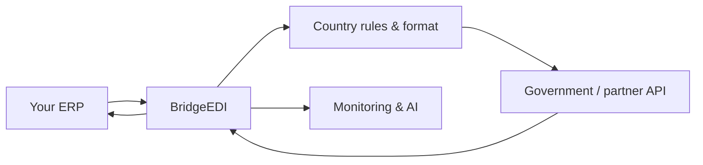
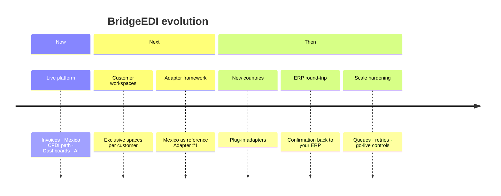

# 10 — Client Presentation

**Audience:** Customers and business stakeholders (non-technical)  
**Purpose:** Meeting-ready narrative for BridgeEDI  
**Related technical detail:** [01_SYSTEM_ARCHITECTURE.md](01_SYSTEM_ARCHITECTURE.md) · [IMPLEMENTATION_ROADMAP.md](../../IMPLEMENTATION_ROADMAP.md)

---

## What is BridgeEDI?

BridgeEDI is a secure **integration platform** that sits between your **ERP** (for example SAP) and the **external systems** that must receive your electronic invoices or tax documents — such as government endpoints or partner networks.

Instead of building a one-off, fragile connection for every country or every project, BridgeEDI gives you a **stable middle layer** that:

- Receives documents from your systems  
- Applies the right checks and formatting  
- Sends them to the correct destination  
- Brings confirmations back  
- Shows you what happened — including through **AI-assisted analysis**

---

## Why use a platform (and not only a direct connection)?

Direct integrations can work quickly. The platform exists to add **safety and lasting value**:

| Direct connection | With BridgeEDI |
|-------------------|----------------|
| Built per project | Reused across countries and document types |
| Harder to monitor centrally | One place for status, failures, and history |
| Limited analytics | AI over **your** operational data |
| Changes risk breaking everything | New countries plug in as **adapters** |
| Shared or mixed demo data risk | **Your exclusive customer workspace** |

The goal is clear: the platform should **add value**, not delay. Once the framework is in place, connecting a new country should focus on that country’s rules and endpoint — not rebuilding the whole stack.

---

## Benefits for your organization

1. **Exclusive workspace** — Your transactions, credentials, and monitoring stay in your space.  
2. **Country flexibility** — Each country uses its own adapter (rules, mapping, format, government API).  
3. **End-to-end visibility** — From ERP submit to government confirmation and back.  
4. **Security** — Authentication, certificates/mTLS options, controlled access for your users.  
5. **AI insight** — Ask questions about volumes, failures, and trends based on real platform data (AI does not silently “invent” invoice processing).  
6. **Scalability path** — Designed to grow from thousands toward tens of thousands of invoices with proper queuing and monitoring.  
7. **Continuity** — Existing BridgeEDI customers keep their current flows while new capabilities are added alongside.

---

## How the platform works (simple view)

**In plain language**

1. Your ERP sends a document to BridgeEDI.  
2. BridgeEDI authenticates the request and opens **your workspace**.  
3. The correct **country adapter** validates, maps, applies business rules, and formats the document.  
4. BridgeEDI sends it to the **government or partner endpoint**.  
5. The confirmation returns to BridgeEDI and is **pushed back to your ERP**.  
6. Monitoring and AI use this history so your team can see and ask about what happened.

---

## Security (business view)

- Named users and roles; customer users only see assigned data  
- API tokens and optional certificate-based (mTLS) channels for machine links  
- Secrets handled as protected configuration (not mixed into casual documents)  
- Audit trail of important processing steps (expanded further in the roadmap)  
- Isolation so one customer’s workspace is not another customer’s data  

---

## Scalability (business view)

BridgeEDI is already used for live invoice and tax-document processing. For larger volumes, the roadmap adds durable queues and workers so processing remains reliable when many documents arrive at once — without asking you to manage a custom one-off engine per country.

---

## AI — what it is (and is not)

| AI is | AI is not |
|-------|-----------|
| An assistant over **your operational results** | A replacement for legal validation rules |
| Useful for search, failure insight, reports | An unsupervised sender to government APIs |
| Scoped to **your workspace** (target design) | A shared pool of other customers’ transactions |

You keep control: the platform processes documents through defined adapters; AI helps you **understand** outcomes.

---

## Monitoring

Your operations team can track:

- What was received  
- What failed and why  
- What was sent and confirmed  
- Trends over time — including via AI questions  

---

## Future roadmap (high level)

We build **beside** what already works — so current services continue while your scenario is prepared.

---

## What we need from you to proceed

To configure your workspace and country connection, we typically need:

1. Target **country** and government API documentation  
2. Sample messages for each **document type** (often three or four)  
3. Your **ERP** interfaces for sending documents and receiving status  
4. Preferred authentication method (API key, OAuth, certificates, etc.)  
5. Volume and timing expectations  

---

## Closing message for the meeting

BridgeEDI gives you a **safe middle layer** between ERP and government or partner networks: reusable for new countries, exclusive for your data, observable through monitoring and AI — without discarding the proven platform already running for existing customers.

**Next step after this presentation:** review technical roadmap (`IMPLEMENTATION_ROADMAP.md`) and phased tasks (`IMPLEMENTATION_TASKS.md`), then agree the pilot workspace and country inputs.

---

*Document: `docs/architecture/10_CLIENT_PRESENTATION.md`*  
*Suitable for customer meetings — non-technical*
