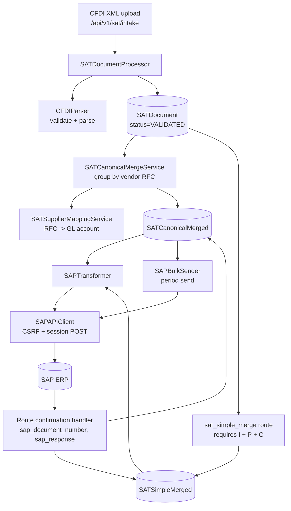
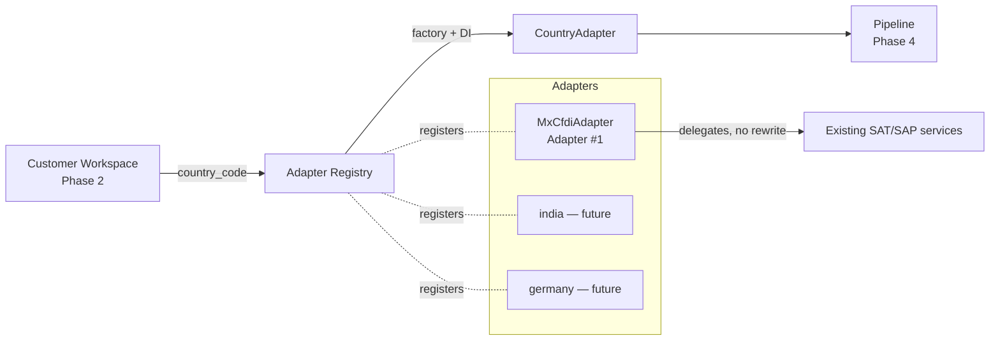

# Phase 3 — Country Adapter Framework

**Status:** Complete, awaiting review
**Scope:** Task 3.1 (CountryAdapter contract), Task 3.2 (Adapter #1 façade), Task 4.1 (Adapter Registry, pulled forward per Phase 3 brief)
**Production files modified:** none
**Production behaviour changed:** none

---

## 1. Executive summary

The Country Adapter Framework is in place and Mexico CFDI is registered as Adapter #1.

Everything added is new code under `app/adapters/`. No SAT or SAP service was moved, copied, renamed or edited, and no existing route calls the adapter, so the running platform is bit-for-bit unchanged. The adapter reaches the same production services the existing `/api/v1/sat/*` routes reach, and 51 new tests prove the outputs and the call arguments match.

The registry resolves `country_code → adapter` through a factory map. Adding India, Germany or UAE later is a registration call plus a new `app/adapters/<country>/` package — no pipeline edit, no conditional.

---

## 2. Existing Mexico CFDI implementation — dependency map

This is the analysis that the design was built from. Every concern below is a *delegation target*, not something reimplemented.

| # | Concern | Where it lives today | Entry point |
|---|---------|----------------------|-------------|
| 1 | Parsing | `app/utils/cfdi_parser.py` | `CFDIParser.parse_cfdi(xml) -> Dict` (static) |
| 2 | Validation | `app/utils/cfdi_parser.py` | `CFDIParser.validate_cfdi_structure(xml) -> (bool, err)` |
| 2b | Duplicate / persistence validation | `app/services/sat_processor.py` | `SATDocumentProcessor.process_cfdi_document(user_id, xml_content, source)` |
| 3 | Mapping (RFC → GL account) | `app/services/sat_supplier_mapping_service.py` | `get_mapping_by_rfc()`, `get_or_create_default_mapping()` |
| 4 | Business rules — canonical merge | `app/services/sat_canonical_merge_service.py` | `merge_documents_for_period(user_id, company_code, fiscal_year, fiscal_period)` |
| 4b | Business rules — simple merge | `app/api/sat_simple_merge.py` (inline in the route) | `merge_documents()` — **no service class** |
| 5 | Transformation | `app/services/sap_transformer.py` | `transform_canonical_to_sap_format()`, `transform_simple_to_sap_format()` |
| 6 | Formatting | same | JSON list is the wire shape; `transform_canonical_to_sap_xml()` for XML download |
| 7 | Government communication | **absent** | CFDIs arrive already stamped; no SAT/PAC call exists in the codebase |
| 8 | Confirmation handling | `app/api/sat_canonical.py`, `app/api/sat_simple_merge.py` | reads `sap_response.document_number` / `.sap_document_number`, writes `sap_document_number`, `sent_to_sap_at`, `sap_response` |
| 9 | SAP communication | `app/services/sap_api_client.py`, `app/services/sap_send_all.py` | `sap_client.send_json_to_sap_with_session(payload, document_type, portal_reference)`; `SAPBulkSender.send_all_to_sap(...)` |
| 10 | Logging | per-module `zodiac-api.*` loggers | unchanged |
| 11 | Error handling | services return `{"success": False, "error", "status"}`; routes raise `HTTPException` | statuses: `VALIDATION_FAILED`, `PARSING_FAILED`, `DUPLICATE`, `PROCESSING_ERROR`, `RFC_MISMATCH` |
| 12 | Retry | **absent** | no automatic retry; resend is blocked once `sent_to_sap` / `SAP_SENT` is set |

### How they interact today

Two findings from the analysis are recorded in §8 (Known limitations). Neither was changed.

---

## 3. Architecture

**Country-owned (abstract, every adapter must implement):** `parse`, `validate`, `map`, `apply_business_rules`, `transform`, `format`, `submit`, `receive_confirmation`.

**Platform-owned (concrete defaults on the base class, adapters may override):** `update_erp` defers to the Core ERP connector (Phase 6); `generate_monitoring_event` builds a structured event for the shared monitoring layer (Phase 8) and persists nothing. This split follows the brief: ERP connectivity and monitoring are shared platform responsibilities, so a country should not have to reimplement them.

**Stages never raise for expected failures.** Each returns a `StageResult` with a stable `error_code` (`VALIDATION_FAILED`, `SUBMIT_FAILED`, …) so the platform can decide stop / retry / dead-letter without knowing the country.

**Context.** `AdapterContext` carries `customer_id`, `country_code`, `correlation_id`, `user_id`, the existing SQLAlchemy `db` session, the payload, per-stage outputs and an event trail. Adapters reuse the caller's session rather than opening their own.

---

## 4. Files created

| File | Purpose |
|------|---------|
| `app/adapters/__init__.py` | Public surface; import has no side effects |
| `app/adapters/base.py` | `CountryAdapter` ABC, `AdapterContext`, `StageResult`, `AdapterStage`, `AdapterCapability`, error codes |
| `app/adapters/registry.py` | `AdapterRegistry` (thread-safe factory map, aliases, DI), `AdapterNotRegisteredError` |
| `app/adapters/bootstrap.py` | `ensure_builtin_adapters()` — explicit, idempotent registration |
| `app/adapters/mx_cfdi/__init__.py` | Adapter #1 package surface |
| `app/adapters/mx_cfdi/config.py` | `MxCfdiConfig` + country constants; reads `workspace_adapter_config` rows from Phase 2 |
| `app/adapters/mx_cfdi/adapter.py` | `MxCfdiAdapter` façade + `build_mx_cfdi_adapter` factory |
| `app/tests/test_adapter_registry.py` | 21 tests — registry, DI, aliases, bootstrap, no-country-conditionals guard |
| `app/tests/test_mx_cfdi_adapter_parity.py` | 30 tests — façade parity and delegation |

## 5. Files modified

**None.** `git status` after Phase 3 shows only the untracked `app/adapters/` tree and the two new test files; the modified-file list is unchanged from the Phase 2 snapshot.

Notably **not** modified: `app/server.py` (no router mounted — the framework is not reachable over HTTP yet), `app/database.py`, every `app/api/sat*.py`, every `app/services/sat_*` and `sap_*`, `app/utils/cfdi_parser.py`.

---

## 6. Delegation table — façade ↔ production service

| Adapter stage | Delegates to | Notes |
|---------------|--------------|-------|
| `parse()` | `CFDIParser.parse_cfdi` | Accepts `str`, `bytes`, or `{"xml_content"/"xml": …}` |
| `validate()` | `CFDIParser.validate_cfdi_structure` | Duplicate detection stays in `ingest()` — it is a storage concern |
| `ingest()` | `SATDocumentProcessor.process_cfdi_document` | Same call `/api/v1/sat/intake` makes; statuses passed through verbatim |
| `map()` | `SATSupplierMappingService.get_mapping_by_rfc` → `get_or_create_default_mapping` | Same fallback order as `SATCanonicalMergeService` |
| `apply_business_rules()` | `SATCanonicalMergeService.merge_documents_for_period` | Simple merge reported as unsupported (see §8) |
| `transform()` | `SAPTransformer.transform_canonical_to_sap_format` / `transform_simple_to_sap_format` | Target chosen from the ORM class name, never from the country |
| `format()` | pass-through (JSON) / `transform_canonical_to_sap_xml` (XML) | JSON transformer output is already the wire shape |
| `submit()` | `sap_client.send_json_to_sap_with_session` | Same singleton, same kwargs |
| `submit_period()` | `SAPBulkSender.send_all_to_sap` | Bulk period send |
| `receive_confirmation()` | normalizes the SAP response dict | Same keys the routes read (see §8 on the synthetic reference) |

Service imports are **lazy** — inside each method. Importing `app.adapters` pulls in no SAT/SAP module, no `httpx` and no SAP configuration; this was verified at runtime.

---

## 7. Regression analysis

| Area | Impact | Why |
|------|--------|-----|
| Invoices V1 / V2 | None | No file touched; adapter unreachable |
| SAT pipeline (`/api/v1/sat/*`) | None | Routes and services byte-identical; adapter only calls them |
| SAP send / CSRF flow | None | Uses the existing `sap_client` singleton unchanged |
| Dashboard, AI, Intelligence | None | No import path into those modules |
| Authentication / workspace | None | Adapter performs no auth; tenancy stays in `core.workspace` |
| Database | None | No model, no migration, no schema change |
| Frontend | None | No UI change |
| App startup | None | `server.py` untouched; nothing auto-registers at import |

**Rollback:** delete `app/adapters/` and the two test files. Nothing else references them.

---

## 8. Known limitations and observations

1. **Simple merge is not delegable.** The rules live inside the `/api/v1/sat/simple-merge` route, not a service, so `apply_business_rules(strategy="simple")` returns an explicit `BUSINESS_RULES_FAILED` rather than duplicating the logic. Extracting it into a service is a Phase 4 candidate.
2. **No government stage.** There is no SAT/PAC integration to wrap, so `MxCfdiAdapter` does not advertise the `GOVERNMENT_API` capability. `submit()` targets SAP, matching today's behaviour.
3. **Synthetic SAP references not reproduced.** When SAP returns no document number the existing routes invent `SM{7 digits}` / `TB{7 digits}`. `receive_confirmation()` returns `document_number: None` instead — inventing an identifier is a persistence decision, not a country rule. Any future pipeline that persists confirmations must decide this explicitly.
4. **Pre-existing bug observed, not fixed.** `CFDIParser.parse_cfdi` rebinds `logger` locally at line ~64, so its `except` handler raises `UnboundLocalError` instead of the intended `ValueError("Invalid CFDI XML")` on malformed XML. The façade surfaces this as `PARSING_FAILED` either way. Left untouched per the no-production-change rule — recommend a one-line fix in a separate PR.
5. **Three disagreeing canonical JSON shapes** exist today (`preview-sap-json`, the inline builder in `send_canonical_to_sap`, and `transform_canonical_to_sap_format`). The adapter uses the transformer. Reconciling them is a Phase 4/5 decision.
6. **`send_canonical_to_sap` calls `sap_client.send_json_to_sap`**, which does not exist on `SAPAPIClient`. Pre-existing; reported, not changed.

---

## 9. Tests performed

`python -m unittest app.tests.test_adapter_registry app.tests.test_mx_cfdi_adapter_parity app.tests.test_workspace_access app.tests.test_workspace_isolation`

**66 tests, all passing** (51 new in Phase 3, 15 from Phase 2 re-run as a regression check). No DB and no network required.

| Group | Tests | What is proven |
|-------|-------|----------------|
| Parse/validate parity | 7 | `adapter.parse(...)` equals `CFDIParser.parse_cfdi(...)` on a real CFDI 4.0 document; validate matches on valid *and* invalid input |
| Transform parity | 3 | `adapter.transform(...)` equals `SAPTransformer.transform_canonical_to_sap_format(...)` field for field (the two `datetime.utcnow()` stamps are compared for presence, not value) |
| Delegation | 11 | Ingest, mapping, merge, bulk send and submit are called with byte-identical arguments; duplicate/error statuses pass through unchanged |
| Confirmation | 5 | Extraction matches the `/send-to-sap` handlers' key order |
| Format | 3 | JSON output is the same object the transformer produced; XML delegates |
| Platform stages | 2 | `update_erp` defers to Phase 6; monitoring events are built, never persisted |
| Registry | 18 | Aliases, case-insensitivity, DI, fresh instances, duplicate protection, type checking, unknown-country error, bootstrap idempotency |
| Architecture guard | 1 | Static scan of `app/adapters/` and `app/core/` finds no `country == "…"` comparison (comments and docstrings excluded via tokenizer) |

Additional runtime check: importing `app.adapters` and running `ensure_builtin_adapters()` registers `mx_cfdi` and leaks **zero** SAT/SAP service imports into `sys.modules`.

---

## 10. Future extension points

**Adding a country** — create `app/adapters/<code>/adapter.py` implementing `CountryAdapter`, then add one line to `bootstrap.register_builtin_adapters`. No change to the registry, the base class, or any pipeline.

**Per-workspace configuration** — `MxCfdiConfig.from_workspace()` already accepts a Phase 2 `WorkspaceAdapterConfig` row. Secret material stays as `vault:`/`env:` references, validated by `core.workspace.context.is_valid_secret_ref`.

**Reserved for later phases:**
- Phase 4 — orchestrator drives the stage sequence and owns retry/queueing; `registry.describe()` can back a read-only `/api/v1/adapters` catalog for the workspace settings UI.
- Phase 6 — Core ERP connector implements `update_erp` centrally.
- Phase 7 — countries with a real government API add a `GOVERNMENT_API` capability and their own `submit()`.
- Phase 8 — monitoring layer consumes `generate_monitoring_event()` output; `correlation_id` is already threaded through every event.

---

## 11. Recommendation

Phase 3 is complete and carries no regression risk: nothing in production imports it. Suggested Phase 4 sequence — extract simple-merge into a service so the last business rule becomes delegable, build the orchestrator on top of the registry, then expose it behind a feature flag alongside (never replacing) `/api/v1/sat/*`.

**Awaiting approval before Phase 4.**
