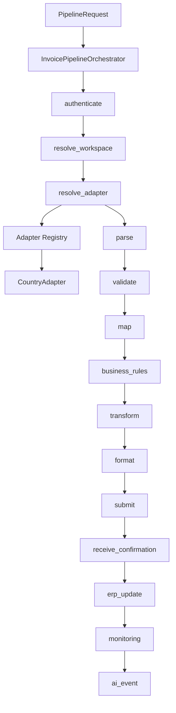

# Phase 4 — Invoice Processing Orchestrator

**Status:** Complete, awaiting review  
**Scope:** Task 4.2 (Core pipeline orchestrator), Task 4.3 (Opt-in pipeline API). Task 4.1 (Adapter Registry) was delivered in Phase 3 and is reused unchanged.  
**Production behaviour of `/api/v1/sat/*`:** unchanged  
**Default customers:** unaffected (`pipeline_enabled` defaults to `false`; API gated by `ENABLE_PIPELINE_API`)

---

## 1. Executive summary

The shared Invoice Processing Orchestrator is the country-neutral execution engine for BridgeEDI. It sequences platform stages and adapter stages; it never contains country logic and never names Mexico, India, Germany, UAE, or any other country in executable code.

Existing SAT routes continue to work exactly as they do today. The orchestrator is reached only through a new, opt-in API that is off by default at both the deployment level (`ENABLE_PIPELINE_API`) and the workspace level (`workspace_settings.pipeline_enabled`).

---

## 2. Architecture

```text
Receive Request
    ↓
Authenticate
    ↓
Resolve Workspace
    ↓
Resolve Country Adapter   ← registry.resolve(opaque country_code)
    ↓
Parse → Validate → Map → Business Rules → Transform → Format
    ↓
Submit → Receive Confirmation
    ↓
ERP Update                ← platform hook (Phase 6)
    ↓
Monitoring                ← always runs
    ↓
AI Event                  ← always runs
```



**Country neutrality rule:** the only place a country code is touched is `resolve_adapter`, and it is treated as an opaque registry key. A static tokenizer scan of `app/core/pipeline/*.py` fails the build if any forbidden country identifier appears in executable tokens.

**Stage replaceability:** every stage is a `StageSpec` on a `StagePlan`. Callers can `replace`, `configure`, `insert_before`, `insert_after`, or `remove` without editing the engine.

**Dependency injection:** `PlatformServices` holds Protocols for authentication, workspace resolution, adapter resolution, ERP update, monitoring, AI events, and audit. Defaults are safe; later phases swap the real implementations.

---

## 3. Files created / modified

### Created

| File | Purpose |
|------|---------|
| `app/core/pipeline/__init__.py` | Public surface |
| `app/core/pipeline/types.py` | `PipelineRequest`, `PipelineExecution`, `PipelineResult`, stage outcomes |
| `app/core/pipeline/stages.py` | Default stage plan + handlers (no country logic) |
| `app/core/pipeline/hooks.py` | `PlatformServices` + Protocol defaults |
| `app/core/pipeline/retry.py` | Platform-owned retry policy |
| `app/core/pipeline/orchestrator.py` | `InvoicePipelineOrchestrator` |
| `app/api/pipeline.py` | Opt-in HTTP API |
| `app/schemas/pipeline.py` | Request/response DTOs |
| `app/tests/test_pipeline_orchestrator.py` | Engine tests (40) |
| `app/tests/test_pipeline_api.py` | API / feature-flag tests (12) |
| `implementation_logs/PHASE_4.md` | This document |

### Modified

| File | Change | Why |
|------|--------|-----|
| `app/server.py` | `include_router(pipeline_router)` inside try/except | Mount additive API the same way Phase 2 mounted workspace |
| `app/core/pipeline/stages.py` | Dedicated `stage_receive_confirmation` | Pass SUBMIT output into `receive_confirmation(ctx, response)` |

**Not modified:** any `app/api/sat*.py`, any `app/services/sat_*` / `sap_*`, `cfdi_parser.py`, dashboard, AI, auth routers, workspace tables.

---

## 4. Stage responsibilities

| Stage | Owner | Behaviour |
|-------|-------|-----------|
| `authenticate` | Platform | Asserts a principal is present and active (HTTP auth already ran upstream) |
| `resolve_workspace` | Platform | Phase 2 `resolve_workspace`; fails with `PIPELINE_DISABLED` if not opted in |
| `resolve_adapter` | Platform | Opaque `country_code` → Adapter Registry → `CountryAdapter` + `AdapterContext` |
| `parse` … `format` | Adapter | Delegated via `adapter_stage("…")` |
| `submit` | Adapter | Async; skipped on `dry_run`; optionally retried via `TRANSPORT_RETRY` |
| `receive_confirmation` | Adapter | Receives SUBMIT output explicitly |
| `erp_update` | Platform (Phase 6) | Skipped until a Core ERP connector is injected |
| `monitoring` | Platform | Always runs; respects `monitoring_enabled` |
| `ai_event` | Platform | Always runs; respects `ai_scoped` |

Failures halt subsequent business stages but **not** the finalizers (`monitoring`, `ai_event`).

---

## 5. Opt-in API

Base path: `/api/v1/pipeline`

| Method | Path | Auth | Notes |
|--------|------|------|-------|
| GET | `/health` | No | Reports whether `ENABLE_PIPELINE_API` is on |
| GET | `/stages` | Yes | Default stage plan (country-neutral) |
| GET | `/adapters` | Yes | Registry catalog |
| POST | `/run` | Yes | Execute one document |

**Gates (both required for `/run`):**

1. `ENABLE_PIPELINE_API=true` (deployment). When off, endpoints return HTTP 404.
2. `workspace_settings.pipeline_enabled=true` (workspace). When off, orchestrator fails with `PIPELINE_DISABLED` → HTTP 403.

Auth/tenancy failures (`UNAUTHENTICATED`, `WORKSPACE_*`, `COUNTRY_NOT_ENABLED`, `ADAPTER_NOT_RESOLVED`) become HTTP errors. Processing failures (validation, mapping, submit, …) stay in a **200** body so clients can inspect the stage report.

`dry_run=true` runs local stages and skips submit / confirmation / ERP update.

---

## 6. Regression analysis

| Area | Impact | Why |
|------|--------|-----|
| SAT `/api/v1/sat/*` | None | No file touched; no call path into the orchestrator |
| Invoices V1 / V2 | None | Unrelated routers |
| Dashboard / AI | None | Pipeline AI sink is a logging stub until Phase 9 |
| Auth | None | Reuses `get_current_user`; no auth changes |
| Workspace | None | Reads existing settings; no schema change |
| App startup | Additive | Router mount in try/except; failure to load does not kill the app |
| Default traffic | None | API off by default; workspace flag defaults false |

**Rollback:** unset `ENABLE_PIPELINE_API`, or remove the pipeline router mount and delete `app/core/pipeline/`, `app/api/pipeline.py`, `app/schemas/pipeline.py`. SAT paths are unaffected either way.

---

## 7. Tests performed

```text
python -m unittest app.tests.test_pipeline_orchestrator \
                   app.tests.test_pipeline_api \
                   app.tests.test_adapter_registry \
                   app.tests.test_mx_cfdi_adapter_parity -v
```

**102 tests, all passing** (40 orchestrator + 12 API + 51 Phase 3). No DB, no network.

Coverage highlights:

- Documented stage order end-to-end with a fake country (`atlantis`)
- Failure halt + finalizer execution
- Dry-run skips external stages
- Retry with backoff on `SUBMIT_FAILED`
- Stage replace / insert / remove
- Injected ERP connector used when present
- Two different countries produce the identical stage sequence
- Static scan: no country names in pipeline executable code
- Real `MxCfdiAdapter` via `RegistryAdapterResolver` (parse + validate dry-run)
- API feature flag off → 404; on → stages/adapters/run
- Tenancy codes → HTTP; processing failures → 200 body
- Confirmation stage receives SUBMIT output

---

## 8. Known limitations

1. **ERP update is a stub.** Phase 6 will inject the Core ERP connector; until then the stage is `SKIPPED`.
2. **Monitoring / AI sinks log only.** Persistence arrives in Phases 8 and 9.
3. **Simple-merge business rules** remain undelegable from Adapter #1 (documented in Phase 3); the orchestrator will surface that as a stage failure if invoked with that strategy.
4. **No durable outbox / queue yet.** Retry is in-process per stage; durable retry is a later enhancement.
5. **Frontend does not call the pipeline yet.** Discovery endpoints exist for a future settings UI.

---

## 9. Future extension points

| Phase | Extension |
|-------|-----------|
| 5 | New country adapter — register only; orchestrator untouched |
| 6 | Inject `ErpUpdater` into `PlatformServices` |
| 7 | Government connectors live inside adapters; orchestrator still only calls `submit` |
| 8 | Replace `LoggingMonitoringSink` with a persisting sink |
| 9 | Replace `LoggingAiEventSink` with workspace-scoped AI ingestion |
| Later | Wire selected SAT entry points into the orchestrator behind a flag, without removing `/sat/*` |

---

## 10. Recommendation

Phase 4 is complete and carries no regression risk for production SAT traffic. Suggested next step after approval: Phase 5 (scaffold a second country adapter) once country requirements are available, or Phase 6 (Core ERP connector) if ERP confirmation push is the higher priority.

**Awaiting approval before Phase 5.**
