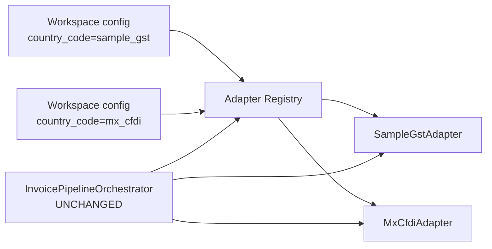

# Phase 5 — Sample Non-Mexico Country Adapter

**Status:** Complete, awaiting review  
**Scope:** Scaffold Adapter #2 (`sample_gst`) to prove multi-country support without a full production country build  
**Pipeline / orchestrator / registry design changes:** none  
**Production SAT behaviour changes:** none

---

## 1. Executive summary

BridgeEDI now has two registered country adapters:

| Adapter | Code | Role |
|---------|------|------|
| #1 Mexico CFDI | `mx_cfdi` | Production façade over existing SAT/SAP services |
| #2 Sample GST | `sample_gst` | Configurable **scaffold** proving a second country plugs in cleanly |

Adding Adapter #2 required exactly three things:

1. **New package** — `app/adapters/sample_gst/`
2. **Registration** — one block in `app/adapters/bootstrap.py`
3. **Workspace configuration** — enable `country_code=sample_gst` on a workspace (no schema change)

No modifications were made to the pipeline, orchestrator, workspace module, ERP hooks, monitoring, or AI. A static test fails the build if `sample_gst` appears in pipeline executable code.

---

## 2. Architecture proof



The orchestrator still only knows “a `CountryAdapter` was resolved.” Mexico and the sample country produce the same stage sequence with different country-owned behaviour inside each adapter.

---

## 3. How the sample differs from Mexico

| Concern | Mexico (`mx_cfdi`) | Sample (`sample_gst`) |
|---------|--------------------|------------------------|
| Document format | CFDI XML | JSON e-invoice |
| Tax id | RFC | GSTIN (15-char) |
| Document id | CFDI UUID / TimbreFiscalDigital | 64-hex IRN |
| Validation | XML structure + UUID | schema_version, GSTIN, IRN, HSN lines, currency |
| Mapping | `SATSupplierMappingService` (RFC → SAP GL) | Workspace `tax_id_ledger_map` (GSTIN → ledger) |
| Business rules | Canonical / simple merge by period | Interstate e-way bill threshold; credit-note `original_irn`; line-sum check |
| Formatting | SAP uppercase JSON **list** | camelCase government **envelope** |
| Submit target | Existing `sap_client` | Mock gov acknowledgement (optional live HTTPS) |
| Endpoint config | SAP URL in production client | `endpoint_url_ref` / `auth_secret_ref` on workspace adapter config |

No code is shared with `mx_cfdi`. A test scans the sample package and fails if any SAT/SAP/Mexico import path appears.

---

## 4. Files created

| File | Purpose |
|------|---------|
| `app/adapters/sample_gst/__init__.py` | Package surface |
| `app/adapters/sample_gst/config.py` | Country code, aliases, `SampleGstConfig` |
| `app/adapters/sample_gst/validation.py` | JSON parse + GSTIN/IRN validation |
| `app/adapters/sample_gst/mapping.py` | GSTIN → ledger mapping |
| `app/adapters/sample_gst/rules.py` | E-way / credit-note / totals rules |
| `app/adapters/sample_gst/formatting.py` | Transform + wire envelope |
| `app/adapters/sample_gst/connector.py` | Mock (default) / optional live submit |
| `app/adapters/sample_gst/adapter.py` | `SampleGstAdapter` + factory |
| `app/tests/test_sample_gst_adapter.py` | Behaviour + architecture proof tests |
| `implementation_logs/PHASE_5.md` | This document |

## 5. Files modified

| File | Change | Why |
|------|--------|-----|
| `app/adapters/bootstrap.py` | Register `sample_gst` (+ aliases); harden `ensure_builtin_adapters` with `WeakSet` + re-register when empty | Registration step; fix id-reuse idempotency bug exposed by more registry instances in tests |
| `app/tests/test_adapter_registry.py` | Expect both builtins; add dual-registration assertion | Bootstrap now ships two adapters |

**Not modified:** `app/core/pipeline/**`, `app/core/workspace/**`, `app/api/**`, `app/server.py`, any SAT/SAP service, Mexico adapter package.

---

## 6. Workspace enablement (config only)

For a pilot customer, upsert adapter config (existing Phase 2 API):

```json
{
  "country_code": "sample_gst",
  "enabled": true,
  "endpoint_url_ref": "https://gov.example/sample-gst/ack",
  "auth_secret_ref": "vault:pilot/sample-gst/token",
  "extra_config": {
    "eway_threshold": 50000,
    "default_ledger": "GST-PILOT-LEDGER",
    "tax_id_ledger_map": {
      "27AAPFU0939F1ZV": "LEDGER-WEST-27"
    },
    "expected_currency": "INR",
    "live_submit": false
  }
}
```

Then set `workspace_settings.pipeline_enabled=true` and (for HTTP) `ENABLE_PIPELINE_API=true`. No migration, no orchestrator flag, no registry redesign.

Aliases accepted by the registry: `sample_gst`, `sample`, `demo_gst`, `gst_sample`.

---

## 7. Verification — “nothing else required”

| Check | Result |
|-------|--------|
| Pipeline knows about `sample_gst`? | **No** — tokenizer scan of `core/pipeline` is clean |
| Orchestrator code changed? | **No** |
| Registry class / design changed? | **No** — only a new `register(...)` call |
| Mexico façade still matches `CFDIParser`? | **Yes** — parity tests + dedicated regression in Phase 5 suite |
| Both adapters resolve from one registry? | **Yes** — `mx` and `sample` |
| Same `default_stage_plan()` runs sample end-to-end? | **Yes** — completes with mock `SAMPLE-ACK-*` confirmation |

If a future real country needed pipeline changes, that would be a design defect. Phase 5 did not encounter that.

---

## 8. Tests performed

```text
python -m unittest app.tests.test_sample_gst_adapter \
                   app.tests.test_adapter_registry \
                   app.tests.test_mx_cfdi_adapter_parity \
                   app.tests.test_pipeline_orchestrator \
                   app.tests.test_pipeline_api
```

**118 tests, all passing.**

Phase 5 suite covers:

- JSON-only parse (XML rejected)
- GSTIN / IRN validation
- Workspace ledger mapping
- Interstate e-way threshold vs intrastate exemption
- Credit-note `original_irn` rule
- camelCase government envelope (no `DS_UUID` / `GL_ACCOUNT`)
- Mock submit + ack confirmation
- No Mexico/SAT imports in the sample package
- Pipeline package has zero `sample_gst` tokens
- Registry resolves both adapters
- Unchanged orchestrator runs sample to completion
- `RegistryAdapterResolver` + workspace row selects sample with config injection
- Mexico still parses/validates after sample registration

---

## 9. Known limitations

1. **Not a production country.** Rules and GSTIN checks are illustrative; replace with a real spec (e.g. India) in a later phase without touching the engine.
2. **Submit defaults to mock.** `live_submit=true` only posts when `endpoint_url_ref` is a literal `http(s)` URL; vault/env resolution waits on a shared secret service.
3. **No DB persistence** of sample documents — the scaffold proves adapter stages, not a parallel SAT document store.
4. **ERP update** still deferred to Phase 6 for both adapters.

---

## 10. Recommendation

Phase 5 meets the goal: the platform supports another country through package + registration + workspace config alone. After approval, Phase 6 (Core ERP connector) can proceed, or a real country adapter can replace/extend this scaffold using the same package layout.

**Awaiting approval before Phase 6.**
