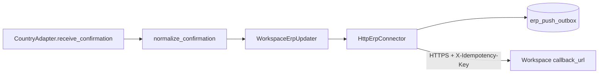

# Phase 6 — ERP Integration (Confirmation Round-Trip)

**Status:** Complete, awaiting review  
**Contract:** [`ERP_INTEGRATION_CONTRACT.md`](../ERP_INTEGRATION_CONTRACT.md)  
**Production SAT routes:** unchanged  

---

## 1. Executive summary

Phase 6 closes the opt-in pipeline loop **confirmation → customer ERP** behind a country-neutral Core ERP connector. The connector never branches on Mexico/India/Germany; adapters never embed SAP/Oracle/Dynamics clients.

Existing `/api/v1/sat/*` send-to-SAP behaviour is untouched. Unconfigured workspaces still **skip** the `erp_update` stage (same user-visible outcome as Phase 4).

---

## 2. Architecture



| Component | Role |
|-----------|------|
| `CanonicalConfirmation` | Standard DTO from the contract |
| `normalize_confirmation` | Maps `document_number` / `ack_number` aliases |
| `HttpErpConnector` | Generic HTTP POST; idempotent via outbox |
| `WorkspaceErpUpdater` | Default `PlatformServices.erp_updater` |
| `erp_push_outbox` | Expand-only idempotency table |

---

## 3. Files created

| File | Purpose |
|------|---------|
| `zodiac/ERP_INTEGRATION_CONTRACT.md` | Boundary contract (8 sections) |
| `app/core/erp/__init__.py` | Package exports |
| `app/core/erp/models.py` | DTOs + error codes + DocumentStatus |
| `app/core/erp/normalize.py` | Acknowledgement normalization |
| `app/core/erp/connector.py` | `HttpErpConnector` + in-memory outbox for tests |
| `app/models/erp_outbox.py` | `ErpPushOutbox` SQLAlchemy model |
| `app/core/erp/outbox.py` | Outbox persistence helpers |
| `app/core/erp/hooks.py` | `WorkspaceErpUpdater` |
| `app/migrations/phase6_erp_outbox.sql` | Expand-only DDL |
| `app/tests/test_erp_contract_models.py` | Normalization tests |
| `app/tests/test_erp_connector.py` | Connector / idempotency / error codes |
| `implementation_logs/PHASE_6.md` | This document |

## 4. Files modified

| File | Change |
|------|--------|
| `app/core/pipeline/hooks.py` | Default `erp_updater` → `WorkspaceErpUpdater` |
| `app/core/pipeline/stages.py` | `erp_update` uses `TRANSPORT_RETRY` |
| `app/core/pipeline/retry.py` | `ERP_TIMEOUT` added to retryable codes |
| `app/database.py` | Register `models.erp_outbox.ErpPushOutbox` in `init_models()` |
| `app/migrations/README.md` | List Phase 6 migration |
| `app/tests/test_pipeline_orchestrator.py` | ERP skip rename + WorkspaceErpUpdater integration test |

**Not modified:** any `api/sat*.py`, SAT/SAP services, `customer_delivery_service.py`, Mexico/sample adapter business logic.

---

## 5. Behaviour

1. After `receive_confirmation`, orchestrator calls `erp_updater.update(execution, confirmation)`.
2. If workspace has no active `workspace_erp_connections` row → `NotImplementedError` → stage **SKIPPED**.
3. Otherwise normalize → `ErpPushRequest` → POST JSON `{ event, confirmation }` with `X-Idempotency-Key`.
4. Prior SUCCESS outbox row → short-circuit success (`duplicate=true`).
5. Retryable failures (`ERP_UPDATE_FAILED`, `ERP_TIMEOUT`) retried up to 3 times by the stage plan.

---

## 6. Regression analysis

| Area | Impact |
|------|--------|
| SAT `/api/v1/sat/*` | None |
| Pipeline dry-run | `erp_update` still skipped |
| Workspace without ERP | `erp_update` SKIPPED (unchanged outcome) |
| Mexico / sample adapters | Unchanged; normalizer accepts their confirmation dicts |
| DB | Additive table only |

**Rollback:** remove `app/core/erp/`, revert pipeline default `erp_updater` to `None`, drop `erp_push_outbox` if created.

---

## 7. Tests

```text
python -m unittest app.tests.test_erp_contract_models \
                   app.tests.test_erp_connector \
                   app.tests.test_pipeline_orchestrator \
                   app.tests.test_sample_gst_adapter \
                   app.tests.test_adapter_registry \
                   app.tests.test_mx_cfdi_adapter_parity \
                   app.tests.test_pipeline_api
```

---

## 8. Known limitations

1. Secret refs (`vault:` / `env:`) are not resolved to bearer tokens yet — tests may pass `extra_config.bearer_token` as a non-ref literal.
2. Single generic HTTP connector; no Oracle/Dynamics-specific subclasses.
3. Outbox persistence requires applying `phase6_erp_outbox.sql` (or `create_all`); without DB the connector uses an in-memory store when constructed that way by the updater.

---

## 9. Stop

Phase 6 complete. Do not proceed to Phase 7 without approval.
