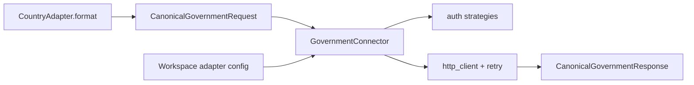

# Phase 7 — Government Connector Framework

**Status:** Complete, awaiting review  
**Contract:** [`GOVERNMENT_CONNECTOR_CONTRACT.md`](../GOVERNMENT_CONNECTOR_CONTRACT.md)  
**Stable components left untouched:** Workspace, Adapter Framework, Orchestrator, ERP Contract/Connector, Registry, Pipeline stage plan  

---

## 1. Executive summary

Phase 7 introduces a reusable **Government Connector** that owns HTTP, authentication, retries, idempotency headers, and canonical response normalization. Country adapters no longer perform government HTTP directly.

**Mexico:** Still has **no live government submission** (CFDI arrives pre-stamped). `AlreadyStampedGovernmentConnector` represents that fact; `MxCfdiAdapter.submit()` continues to target SAP (ERP) unchanged.

**Sample GST:** Local `httpx` removed; `submit()` calls `GovernmentConnector.submit()` via the shared factory (mock by default).

---

## 2. Analysis (government communication today)

| Location | Role after Phase 7 |
|----------|-------------------|
| CFDI parser / SAT processor | Country adapter (parse/store) — not government HTTP |
| `sap_api_client` | ERP (Phase 6), not government |
| `mx_cfdi.submit` | Still SAP ERP path; government port = AlreadyStamped |
| `sample_gst.connector` (old) | **Moved** to `app/core/government` |
| Workspace `endpoint_url_ref` | Feeds `GovernmentEndpointConfig` |

---

## 3. Architecture



---

## 4. Files created

| File | Purpose |
|------|---------|
| `zodiac/GOVERNMENT_CONNECTOR_CONTRACT.md` | Official contract + analysis |
| `app/core/government/base.py` | Protocol, request/response DTOs, endpoint config |
| `app/core/government/auth.py` | API key, bearer/JWT, basic, OAuth2 static, mTLS hooks |
| `app/core/government/http_client.py` | Shared async HTTP helper |
| `app/core/government/retry.py` | Backoff / retryable classification |
| `app/core/government/normalization.py` | HTTP → canonical response |
| `app/core/government/health.py` | Endpoint health evaluation |
| `app/core/government/response.py` | Re-exports |
| `app/core/government/connector.py` | Mock, AlreadyStamped, Http connectors |
| `app/core/government/factory.py` | Workspace → connector factory |
| `app/core/government/__init__.py` | Package surface |
| `app/tests/test_government_connector.py` | Framework + integration tests |
| `implementation_logs/PHASE_7.md` | This document |

## 5. Files modified

| File | Change |
|------|--------|
| `app/adapters/sample_gst/connector.py` | Thin bridge to `GovernmentConnector` (no httpx) |
| `app/adapters/sample_gst/adapter.py` | Passes workspace ids; optional DI of connector |
| `app/adapters/mx_cfdi/adapter.py` | Optional `AlreadyStampedGovernmentConnector` accessor; submit unchanged |

**Not modified:** orchestrator stage plan, registry design, ERP package, SAT production routes/services.

---

## 6. Government communication flow

1. Adapter formats country payload.  
2. Adapter builds `CanonicalGovernmentRequest` (sample GST) or uses AlreadyStamped (Mexico stamp check).  
3. Connector resolves workspace URL/auth, sends `X-Idempotency-Key: submission_id`.  
4. Retries on transient failures; returns `CanonicalGovernmentResponse`.  
5. Adapter maps response into its confirmation dict → ERP Phase 6 path unchanged.

---

## 7. Regression analysis

| Area | Impact |
|------|--------|
| `/api/v1/sat/*` | None |
| Mexico SAP submit via façade | Unchanged |
| Sample GST dry/mock submit | Still succeeds (mock ack prefix `SAMPLE-ACK`) |
| Pipeline / ERP | Unchanged |
| Orchestrator | Unchanged |

---

## 8. Tests

```text
python -m unittest app.tests.test_government_connector \
                   app.tests.test_sample_gst_adapter \
                   app.tests.test_mx_cfdi_adapter_parity \
                   app.tests.test_pipeline_orchestrator \
                   app.tests.test_erp_connector \
                   app.tests.test_adapter_registry
```

Covers: mock + idempotency, already-stamped Mexico, auth strategies, workspace sandbox URL, HTTP retry, factory selection, sample adapter DI, no httpx in sample package, Mexico façade parity.

---

## 9. Known limitations

1. OAuth2 does not yet perform live token endpoint exchange (static/access_token only).  
2. Vault/env secret refs are not resolved without a future secret service.  
3. No durable government outbox table yet (in-memory duplicate cache on connector instance).  
4. Mexico cancel/download via government API remain `GOV_NOT_SUPPORTED` by design.

---

## 10. Future extension points

- Real India/UAE/Germany connectors = new adapter + workspace URL/auth; reuse `HttpGovernmentConnector`.  
- Inject vault `SecretResolver` into `build_auth`.  
- Persist government submissions alongside ERP outbox (Phase 8 monitoring).  

**Awaiting approval before Phase 8.**
