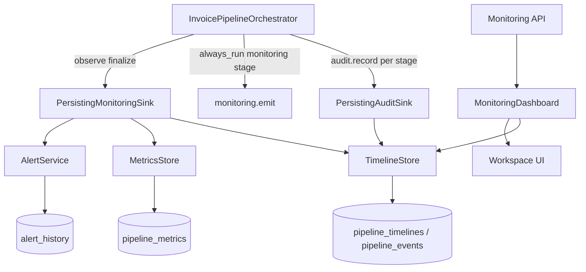

# Phase 8 — Enterprise Monitoring & Observability

**Status:** Complete, awaiting review  
**Stable components left untouched (no redesign):** Customer Workspace, Country Adapter Framework, Invoice Processing Orchestrator stage plan, ERP Connector, Government Connector, Registry, Pipeline business stages  

---

## 1. Executive summary

Phase 8 adds a country-/ERP-/government-agnostic monitoring framework that **observes** the invoice pipeline. Every run keeps a correlation ID, stage timeline, metrics, and optional alerts. Persistence uses **new tables only**. AI is not modified; structured `ai-facts` are exposed for Phase 9.

Defaults swap Phase 4 log-only sinks for persisting sinks via DI. Orchestrator gains a non-mutating `_observe_complete` finalize hook when the monitoring sink supports it.

---

## 2. Analysis — what already existed

| Area | Pre–Phase 8 | Reuse |
|------|-------------|-------|
| Logging | `LoggingMonitoringSink` / `LoggingAuditSink` | Kept; persisting sinks still log |
| Audit | Per-stage `services.audit.record` in orchestrator | Feeds `TimelineStore` |
| Status tracking | `PipelineStatus` / `StageStatus` on result | Mapped to `TransactionStatus` |
| Invoice history | SAT success/failed EDI tables | Unchanged (legacy path) |
| Dashboard metrics | Existing Dashboard V2 / invoice counts | Unchanged; workspace monitoring is additive |
| AI data sources | `stage_ai_event` → `LoggingAiEventSink` | Unchanged; monitoring adds `to_ai_fact` / `/ai-facts` |
| Correlation ID | `PipelineRequest.correlation_id` (UUID) | Retained; helpers in `correlation.py` |
| Workspace flag | `monitoring_enabled` (skips monitoring stage) | Honored |

---

## 3. Architecture



Monitoring never changes adapter / ERP / government business logic.

---

## 4. Monitoring flow

1. Request enters orchestrator with `correlation_id`.  
2. Each stage outcome is audited → timeline stage row (timestamp, duration, status, message).  
3. Monitoring stage emits adapter events (log + optional summary finalize).  
4. On run complete, `finalize_pipeline_result` sets status, latency, refs, metrics, and evaluates alerts.  
5. Workspace API reads only `customer_id`-scoped rows.

---

## 5. Database (expand-only)

Migration: `app/migrations/phase8_monitoring_tables.sql`

| Table | Purpose |
|-------|---------|
| `pipeline_timelines` | One row per correlation_id / transaction |
| `pipeline_events` | Append-only stage events |
| `pipeline_metrics` | Point metrics (latency, run counts) |
| `alert_history` | Alert framework deliveries |

No production SAT / invoice / workspace table alterations.

---

## 6. Timeline model

Per transaction: workspace, customer, country, adapter, document type, status, current stage, retry count, latency, submission/completion times, failure reason, government/ERP references.

Per stage: timestamp, duration_ms, status, message, attempt, error_code.

Statuses: `RUNNING`, `PENDING`, `RETRYING`, `COMPLETED`, `FAILED`, `DRY_RUN`.

---

## 7. Metrics model

| Name | Unit | Notes |
|------|------|-------|
| `pipeline.run` | count | Tags include status |
| `pipeline.latency_ms` | ms | End-to-end duration |

Workspace dashboard aggregates counts, average latency, success rate, top errors.

---

## 8. Alert model

Types: `pipeline_failure`, `government_unavailable`, `erp_unavailable`, `repeated_retry`, `high_latency`, `queue_growth`.

Channels: `log` (live), `email` / `slack` / `webhook` (stubs — no external I/O).

---

## 9. Files created

| File | Purpose |
|------|---------|
| `app/core/monitoring/*.py` | events, timeline, metrics, audit, correlation, status, dashboard, alerts, sinks |
| `app/models/monitoring.py` | ORM for new tables |
| `app/migrations/phase8_monitoring_tables.sql` | DDL |
| `app/api/monitoring.py` | Workspace-scoped API |
| `app/schemas/monitoring.py` | Response models |
| `app/tests/test_monitoring.py` | Unit + API + pipeline observe tests |
| `zodiac-front/.../monitoring/page.tsx` | Workspace monitoring UI |
| `implementation_logs/PHASE_8.md` | This document |

---

## 10. Files modified

| File | Change |
|------|--------|
| `app/core/pipeline/hooks.py` | Default sinks → Phase 8 shared persisting bundle |
| `app/core/pipeline/orchestrator.py` | `_observe_complete` + document_type on audit |
| `app/api/pipeline.py` | DB-backed monitoring bundle on `/run` |
| `app/database.py` | Register monitoring models |
| `app/migrations/README.md` | List phase8 migration |
| `app/server.py` | Mount monitoring router |
| `zodiac-front/.../WorkspaceShell.tsx` | Monitoring tab |
| `zodiac-front/src/lib/api.ts` | `monitoringApi` |

**Not redesigned:** adapter contracts, registry, ERP/government packages, SAT routes, AI services.

---

## 11. API surface

| Method | Path | Notes |
|--------|------|-------|
| GET | `/api/v1/monitoring/health` | Flag probe |
| GET | `/api/v1/monitoring/workspaces/{id}/summary` | Dashboard |
| GET | `/api/v1/monitoring/workspaces/{id}/timelines/{corr}` | Full timeline |
| GET | `/api/v1/monitoring/workspaces/{id}/transactions` | Latest |
| GET | `/api/v1/monitoring/workspaces/{id}/alerts` | Alert history |
| POST | `/api/v1/monitoring/workspaces/{id}/alerts` | Framework raise (log) |
| GET | `/api/v1/monitoring/workspaces/{id}/ai-facts` | Phase 9 readiness |

Flag: `ENABLE_MONITORING_API` (default **true**). Access via `require_workspace_access`.

---

## 12. Regression analysis

| Area | Impact |
|------|--------|
| `/api/v1/sat/*` | None |
| Adapter / ERP / Government code paths | None (observe only) |
| Orchestrator stage plan | Unchanged |
| Pipeline tests using `CollectingSink` | Unaffected (explicit DI) |
| Default `PlatformServices()` | Now persists to memory/DB; logging retained |
| Dashboard V2 / AI adaptive query | Unchanged |

---

## 13. Tests

```text
python -m unittest app.tests.test_monitoring \
                   app.tests.test_pipeline_orchestrator \
                   app.tests.test_pipeline_api \
                   app.tests.test_government_connector \
                   app.tests.test_erp_connector \
                   app.tests.test_sample_gst_adapter \
                   app.tests.test_mx_cfdi_adapter_parity \
                   app.tests.test_adapter_registry \
                   app.tests.test_workspace_access \
                   app.tests.test_workspace_isolation
```

Covers: correlation IDs, timeline generation, metrics, workspace isolation, alert creation, pipeline observe + CollectingSink regression, API gates.

---

## 14. Future enhancements (not Phase 8)

1. Wire email / Slack / webhook channels to real transports.  
2. Queue-depth / backlog collectors for `QUEUE_GROWTH`.  
3. Phase 9 AI consumption of `/ai-facts` and timeline facts.  
4. Optional OpenTelemetry exporters behind DI.  
5. Richer frontend drill-down for stage waterfall.

---

## 15. Stop

Phase 8 complete. **Do not proceed to Phase 9** until this phase is reviewed and approved.
