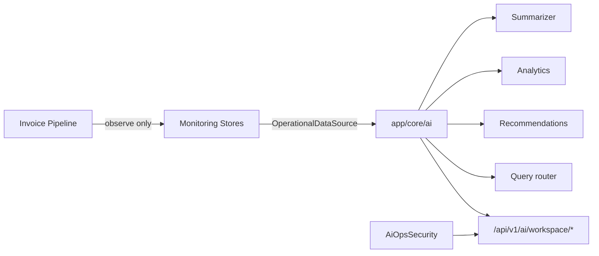

# Phase 9 — AI Operational Intelligence

**Status:** Complete, awaiting review  
**Contract:** [`AI_OPERATIONAL_DATA_CONTRACT.md`](../AI_OPERATIONAL_DATA_CONTRACT.md)  
**Stable components left untouched (no redesign):** Workspace, Pipeline, Country Adapter, Government Connector, ERP Connector, Monitoring  

---

## 1. Executive summary

Phase 9 introduces an **operational intelligence** layer that answers workspace ops questions and produces recommendations **only** from Phase 8 monitoring facts. AI is **not** part of the invoice processing pipeline and does not query production invoice tables. Existing adaptive query / dashboard AI remain unchanged.

---

## 2. Architecture



---

## 3. Data flow

1. Authenticated caller hits AI Ops endpoint with `workspace_id`.  
2. `resolve_ai_workspace` → `require_workspace_access` + `assert_ai_workspace_scope`.  
3. `MonitoringOperationalDataSource` reads timelines / metrics / alerts / `ai_facts`.  
4. Analytics / summarizer / recommendations / ask compute answers.  
5. `AiOpsSecurity.audit` logs action metadata (no document payloads).  

Cross-workspace questions require **admin** + `authorize_cross_workspace=true`.

---

## 4. Security & workspace isolation

| Rule | Enforcement |
|------|-------------|
| Active workspace scope | All `/ai/workspace/{id}/*` paths |
| `ai_scoped` | `assert_ai_workspace_scope` |
| Cross-workspace | Admin + explicit flag (`/ask` intents or `/ai/admin/compare`) |
| No invoice table reads | Datasource protocol + static test |
| Kill switch | `ENABLE_AI_OPS_API` (default true) |

---

## 5. Files created

| File | Purpose |
|------|---------|
| `zodiac/AI_OPERATIONAL_DATA_CONTRACT.md` | Allowed / forbidden data + isolation |
| `app/core/ai/datasource.py` | Monitoring-only data interface |
| `app/core/ai/query.py` | Ops question classifier + answers |
| `app/core/ai/analytics.py` | Metrics / failures / retries / outages |
| `app/core/ai/recommendations.py` | Rule-based recommendations |
| `app/core/ai/summarizer.py` | Narrative workspace summary |
| `app/core/ai/security.py` | Isolation + audit |
| `app/core/ai/workspace.py` | AI workspace context helper |
| `app/core/ai/__init__.py` | Package surface |
| `app/api/ai_ops.py` | Additive API |
| `app/schemas/ai_ops.py` | Request/response models |
| `app/tests/test_ai_ops.py` | Isolation, metrics, recommendations, API |
| `zodiac-front/.../ai/page.tsx` | Workspace AI Ops UI (Task 9.3) |
| `implementation_logs/PHASE_9.md` | This document |

---

## 6. Files modified

| File | Change |
|------|--------|
| `app/server.py` | Mount AI Ops router under `/api/v1` |
| `zodiac-front/.../WorkspaceShell.tsx` | AI Ops tab |
| `zodiac-front/src/lib/api.ts` | `aiOpsApi` client |

**Not modified:** pipeline stage plan, monitoring package design, adapters, ERP/government connectors, `adaptive_query`, `sap_sql_agent`, dashboard AI routes.

---

## 7. API surface

| Method | Path | Notes |
|--------|------|-------|
| GET | `/api/v1/ai/health` | Flag probe |
| GET | `/api/v1/ai/workspace/{id}/summary` | Narrative + key stats |
| GET | `/api/v1/ai/workspace/{id}/analytics` | Full ops analytics |
| GET | `/api/v1/ai/workspace/{id}/recommendations` | Advisory actions |
| POST | `/api/v1/ai/workspace/{id}/ask` | Natural-language ops Q&A |
| POST | `/api/v1/ai/admin/compare` | Explicit admin cross-workspace |

---

## 8. Regression analysis

| Area | Impact |
|------|--------|
| Invoice pipeline | None — AI does not run inside stages |
| Monitoring | Read-only consumer |
| `/api/query/adaptive` | Untouched |
| Dashboard AI | Untouched |
| SAT / ERP / Government | Untouched |

---

## 9. Tests

```text
python -m unittest app.tests.test_ai_ops \
                   app.tests.test_monitoring \
                   app.tests.test_pipeline_orchestrator \
                   app.tests.test_pipeline_api \
                   app.tests.test_government_connector \
                   app.tests.test_erp_connector \
                   app.tests.test_sample_gst_adapter \
                   app.tests.test_mx_cfdi_adapter_parity \
                   app.tests.test_adapter_registry \
                   app.tests.test_workspace_access \
                   app.tests.test_workspace_isolation
```

Covers: question classification, analytics, recommendations, datasource isolation, cross-workspace security, API gates, no forbidden imports in `app/core/ai`.

---

## 10. Future improvements

1. Optional LLM narrative over monitoring facts (still no invoice SQL).  
2. Persist AI Ops audit rows to a dedicated table.  
3. Workspace AI UI page composing these endpoints (Task 9.3).  
4. Wire global adaptive query with optional `workspace_id` guard (separate from this ops layer).  
5. Streaming / websocket ops briefings.

---

## 11. Stop

Phase 9 complete. **Do not proceed to Phase 10** until this phase is reviewed and approved.
